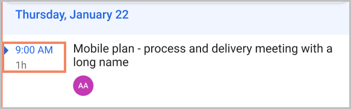
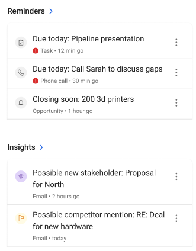

---
title: View agenda in the Dynamics 365 Sales mobile app
description: Instruction to view agenda in the Dynamics 365 Sales mobile app
ms.date: 11/03/2020
ms.topic: article
ms.service: dynamics-365-sales
author: sbmjais
ms.author: shjais
manager: shujoshi
---

# View agenda

[!INCLUDE [cc-beta-prerelease-disclaimer](../../includes/cc-beta-prerelease-disclaimer.md)]

On the home page, you can see resources that can help you plan your day better. For example, quickly see one past and one upcoming meeting in the **Meetings** section.

To see more items on the agenda, go to the **Agenda** view by tapping **Meetings** in the navigation bar or the chevron. This shows meetings from Microsoft Outlook and Dynamics 365 Sales.

1.  From the navigation bar, tab **Meetings**.

    The **Agenda** view opens.

The current meeting is highlighted with Blue color and a triangle icon is shown besides it. To see the details of a meeting, tap the meeting item.

1.  To see meetings for a specific date, tap on the date.

    

If there are no meetings scheduled for a day, you will see a message like "You don't have any meetings today."

> [!NOTE]
> You can't create a meeting from the Dynamics 365 Sales mobile app.

## See the meeting details

To see details of a specific meeting, tap the meeting item.

You'll see important details such as:

-   Meeting time

-   Meeting description. When you tap on it, the detailed description of the meeting is shown.

-   Location

-   List of attendees. The list of attendees shows up to 5 attendees. When you tap an attendee, it opens the contact record in the Quick view form. If the attendee is an unknown contact (not a record stored in Dynamics 365 Sales), you'll see an option to create a contact. More information: [Create a contact](create-a-contact.md)

-   Regarding. Indicates the record the meeting is regarding. From the More menu, you can do the following:

    -   Open the connected record in an edit mode

    -   Choose a different record to connect with the meeting

    -   Remove the connected record.

        

> [!NOTE]
> If there's no regarding record set, you'll see a message "No connected record". Select **Set regarding**, and then from the Set regarding page, either select a recent record, or select **Search** to look for other records. You'll be able to set the regarding record only if server-side synchronization is enabled in your environment. More information: [Server-side synchronization](https://docs.microsoft.com/power-platform/admin/server-side-synchronization)

## View reminders and insights

