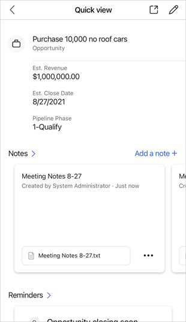

---
title: View, edit, or add a note in the Dynamics 365 Sales mobile app
description: Instructions to view, edit, or add a note in the Dynamics 365 Sales mobile app
ms.date: 11/03/2020
ms.topic: article
ms.service: dynamics-365-sales
author: sbmjais
ms.author: shjais
manager: shujoshi
---

# View, edit, or add a note

[!INCLUDE [cc-beta-prerelease-disclaimer](../../includes/cc-beta-prerelease-disclaimer.md)]

You can see the associated notes in the **Notes** section of a record detail.

## View notes

You can use the following actions from the **Notes** section:

| To                                                        | Do this                |
|-----------------------------------------------------------|------------------------|
| Open a list of notes                                      | Tap the Notes chevron. |
| See an image associated with a note in its original ratio | Tap the image name.    |
| Open or edit a note                                       | Tap a note.            |
| Take more actions like Edit or Delete                     | Tap the menu icon.     |
| Create a note                                             | Tab **Add a note**     |

## Add notes

You can take notes in the following places:

-   From the **Notes** section of the record, tap **Add a note**.

-   In the list of notes, tap .

-   From the bottom navigation bar, tap , and then tap **Add a note**.

1.  In the **Notes** box, type a title and note description, and tap **Save**.

2.  If you are creating the note from the list of notes or from the bottom navigation bar, you must define the record this note is regarding. To do so, tap **Set regarding** to select a record you want to associate the note with.

3.  Tap the Paperclip icon or the camera icon to attach a file or image to a note. Alternatively, you can open your camera to take a picture and associate it with the note.

> [!IMPORTANT]
> If your organization uses a custom entity to track notes, you can create a new note by tapping the Plus icon on the bottom navigation bar, and then select **Create.

