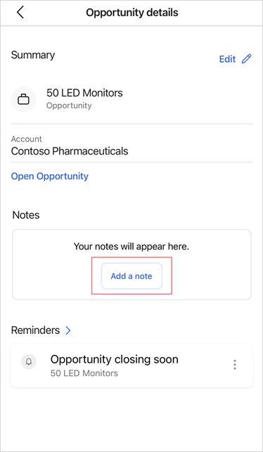
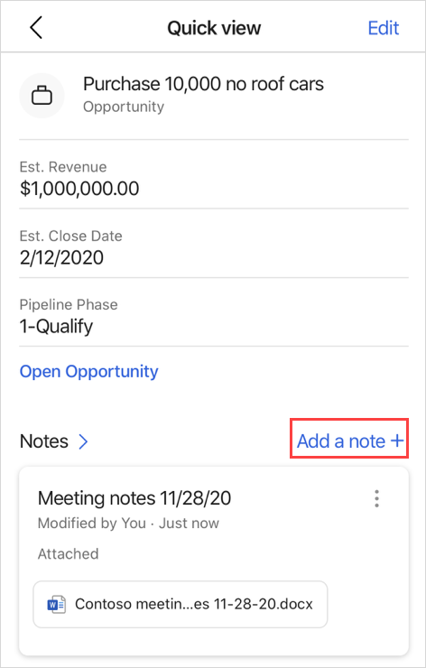
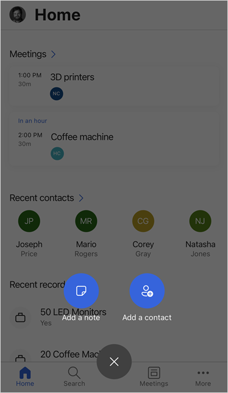
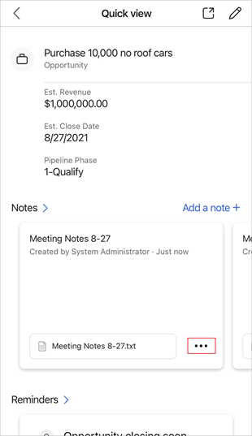
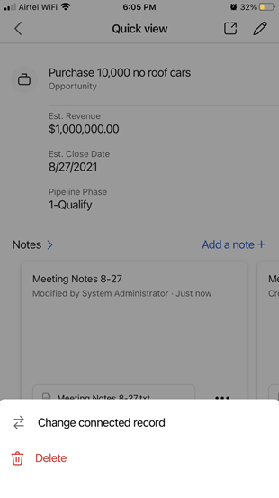

---
title: View, edit, or add a note in the Dynamics 365 Sales mobile app
description: Instructions to view, edit, or add a note in the Dynamics 365 Sales mobile app
ms.date: 11/03/2020
ms.topic: article
ms.service: dynamics-365-sales
author: sbmjais
ms.author: shjais
manager: shujoshi
---

# View, edit, or add a note

[!INCLUDE [cc-beta-prerelease-disclaimer](../../includes/cc-beta-prerelease-disclaimer.md)]

You can see the associated notes in the **Notes** section of a record detail.

You can performs the following actions in the **Notes** section:

| To                                                        | Do this                |
|-----------------------------------------------------------|------------------------|
| Open a list of notes                                      | Tap **Notes**. |
| See an image associated with a note in its original ratio | Tap the image name.    |
| Open or edit a note                                       | Tap a note.            |
| Take more actions like edit or delete                     | Tap the menu icon.     |
| Create a note                                             | Tab **Add a note**.     |

## Add a note

1.  Perform one of the following actions:

    -   When viewing details of a record, if a note is not added to a record, tap **Add a note**.

        

    -   When viewing details of a record, if notes are already added, tap **Add a note**.

        

    -   When viewing a list of notes, tap .

        

    -   On the bottom navigation bar, tap , and then tap **Add a note**.

        

2.  In the **Note** form, enter a title and description for the note.

3.  To attach a file or an image stored on your mobile device, tap .

4.  To take a photo from your mobile camera and attach it to the note, tap .

    > [!NOTE]
    > If you are adding the note from the bottom navigation bar, you must connect the note to the record that it's regarding. Tap **Next** and then select a record you want to associate the note with.

5. Tap **Save**.

## Edit a note

1. In the note card, tap .

    

2. From the bottom of the screen, select **Edit**.

    

3. Modify the note, and then tap **Save**.

## Delete a note

1. In the note card, tap .

    

2. From the bottom of the screen, select **Delete**.

    
