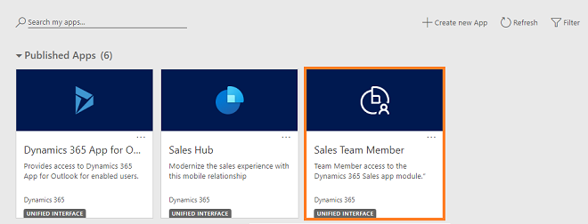

# Sales Team Member app for users with Team Member license

The new Sales Team Member app is designed for the lightweight sales scenarios where users don't need the full capabilities of an enterprise application. This app is included with the Team Member license. 

During the early access phase of the Team Member license enforcement, users with the Team Member license can use the designated app modules alongside all existing apps.

The designated app modules are:

- Customer Service Team Member
- Sales Team Member
- Project Resource Hub

At a high level, users with the Team Member license can perform the following tasks in the Sales Team Member app:

-  Customer management: work with contacts or see accounts.
-  Lead and opportunity management: see leads or opportunities linked with accounts or contacts, or see other sales-related data.
-  Add notes and activities, such as tasks.

Administrators can configure the app for additional scenarios, but not beyond those listed in the Microsoft Dynamics 365 Licensing Guide. For more information about the user rights for the Team Member license, see the [Microsoft Dynamics 365 Licensing Guide](https://go.microsoft.com/fwlink/p/?LinkId=866544).

## Access the Sales Team Member app

Users with the Team Member license can go to home.dynamics.com. They'll see the designated team member apps. 

> [!div class="mx-imgBorder"]
> 
    
> [!IMPORTANT]
> - The Sales Team Member app is available by default in all organizations. System administrators can use security roles to control the visibility of the app, if required.
> - Assign the Sales Team Member role to the users who will access the app. If you want to give customized permissions to your users, we recommend that you clone the Sales Team Member app role, and give the required permissions in alignment with the Microsoft Dynamics 365 Licensing Guide. 
  > To learn about assigning the role, see [Assign a security roles to a user](/power-platform/admin/create-users-assign-online-security-roles) in the Power Platform documentation.
    
When users open the Sales Team Member app, in the site map, they'll see the available entities. 

> [!div class="mx-imgBorder"]
> 

### See also

[Dynamics 365 Team Members license](https://docs.microsoft.com/dynamics365/get-started/team-members-license)  

[!INCLUDE[footer-include](../includes/footer-banner.md)]
