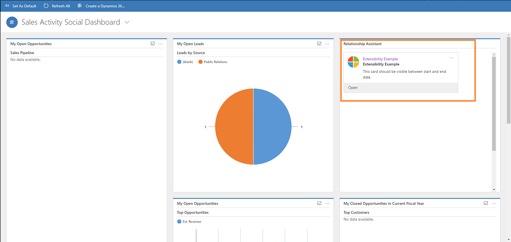

# Sample: Extend assistant card type (custom card)

## Create custom action card
The following process explains how to create a custom card:
- **Step 1:** Download the extend Assistant card type sample solution
- **Step 2:** Build the solution (ExtPkgDeployer.sln)
- **Step 3:** Import the package using the package deployer tool
- **Step 4:** Verify the new card type
- **Step 5:** Create Action card for the new card type using the Web API.
- **Step 6:** Verify the new custom card 

## Prerequisites
Review the prerequisites before you create the custom cards in your organization:

- You must have the Package Deployer tool (packagedeployer.exe) to deploy packages. To download the package deployer, see [Download tools from NuGet](/dynamics365/customer-engagement/developer/download-tools-nuget)

- To use this feature, you must purchase a **Dynamics 365 Sales Insights** license, or start a trial to use Sales Insights features.

## Step 1: Download the extend Assistant card type sample solution

[Download](https://go.microsoft.com/fwlink/?linkid=2034351) the sample custom card solution.

The samples show how to create a custom card in Assistant programmatically.

Go to the path `ExtPkgDeployer\PkgFolder\extensibility_example_sol\WebResources`. Under the **WebResources** folder, you can see three files that are required to create a custom card.

- **Schema Definition (new_cardtype_schemaxml9dd7e039-33a1-4778-9972-66536dc5e829)**

- **Command (new_commands8db43275-0291-401d-923a-90a6c373cc18)**

- **Icon (new_msicon6aa7c568-4830-4da6-89f9-18a8fd9c2285)**

### Schema Definition (new_cardtype_schemaxml9dd7e039-33a1-4778-9972-66536dc5e829)

The contains schema definition for new card type.
> [!NOTE]
> Ensure that card type ID value is greater than 10000.

```XML
<?xml version="1.0" encoding="utf-8" ?>
<entity name="cardtype" displayname="Action Card Type">
  <cardname>Extensibility Example</cardname>
  <cardtypeid>2183dfc0-3c1c-45b7-a331-1943880c25c6</cardtypeid>
  <cardtype>11000</cardtype>
  <cardtypeicon>webresources/new_msicon</cardtypeicon>
  <softtitle>Extensibility Example</softtitle>
  <summarytext>RA Card Extensibility Example</summarytext> 
  <actions>{"WebClient":{"Actions":{"Open":"Mscrm.HomepageGrid.actioncard.CardCommand"},"Default":{"Open":"Mscrm.HomepageGrid.actioncard.CardCommand"}}, "Mobile":{"Actions":{"Open":"Mscrm.HomepageGrid.actioncard.CardCommand"}}}</actions>
</entity>
```

### Command (new_commands8db43275-0291-401d-923a-90a6c373cc18)

The file contains the command for action card.

```JavaScript
function CardCommand() {
	window.open("https://aka.ms/salesai-raext");
}
```

When you execute the command, the command is invoked through the `RibbonDiff` defined in the **customization.xml** of the **ActionCard** entity.

```XML
<ImportExportXml xmlns:xsi="http://www.w3.org/2001/XMLSchema-instance">
  <Entities>
    <Entity>
      <Name LocalizedName="ActionCard" OriginalName="ActionCard">ActionCard</Name>
      <ObjectTypeCode>9962</ObjectTypeCode>
      <RibbonDiffXml>
        <CustomActions>
          <CustomAction Id="Mscrm.HomepageGrid.actioncard.CardCommand.CustomAction" Location="Mscrm.HomepageGrid.actioncard.MainTab.Actions.Controls._children" Sequence="12">
            <CommandUIDefinition>
              <Button Id="Mscrm.HomepageGrid.actioncard.CardCommand" ToolTipTitle="Open" ToolTipDescription="Open" Command="Mscrm.HomepageGrid.actioncard.CardCommand" Sequence="12" LabelText="Open" Alt="Open" Image16by16="/WebResources/new_msicon" Image32by32="/WebResources/new_msicon" TemplateAlias="o1" ModernImage="new_msicon" />
            </CommandUIDefinition>
          </CustomAction>
          <CustomAction Id="Mscrm.SubGrid.actioncard.CardCommand.CustomAction" Location="Mscrm.SubGrid.actioncard.MainTab.Actions.Controls._children" Sequence="57">
            <CommandUIDefinition>
              <Button Id="Mscrm.HomepageGrid.actioncard.CardCommand" ToolTipTitle="Open" ToolTipDescription="Open" Command="Mscrm.HomepageGrid.actioncard.CardCommand" Sequence="29" LabelText="Open" Alt="Open" Image16by16="/WebResources/new_msicon" Image32by32="/WebResources/new_msicon" TemplateAlias="o1" ModernImage="new_msicon" />
            </CommandUIDefinition>
          </CustomAction>
        </CustomActions>
        <CommandDefinitions>
          <CommandDefinition Id="Mscrm.HomepageGrid.actioncard.CardCommand">
            <EnableRules >
              <EnableRule Id="Mscrm.SelectionCountExactlyOne" />
              <EnableRule Id="Mscrm.NotOffline" />
            </EnableRules>
            <DisplayRules>
            </DisplayRules>
            <Actions>
              <JavaScriptFunction FunctionName="CardCommand" Library="$webresource:new_commands">
                <CrmParameter Value="SelectedControl" />
                <CrmParameter Value="SelectedControlSelectedItemReferences" />
              </JavaScriptFunction>
            </Actions>
          </CommandDefinition>
        </CommandDefinitions>
        <RuleDefinitions>
          <TabDisplayRules />
          <DisplayRules>
          </DisplayRules>
          <EnableRules/>
        </RuleDefinitions>    
      </RibbonDiffXml>       
    </Entity>
  </Entities>
  <Roles></Roles>
  <Workflows></Workflows>
  <FieldSecurityProfiles></FieldSecurityProfiles>
  <Templates />
  <EntityMaps />
  <EntityRelationships />
  <OrganizationSettings />
  <optionsets />
  <WebResources>
	<WebResource>
      <WebResourceId>{6aa7c568-4830-4da6-89f9-18a8fd9c2285}</WebResourceId>
      <Name>new_msicon</Name>
      <DisplayName>new_msicon</DisplayName>
      <WebResourceType>5</WebResourceType>
      <IntroducedVersion>1.0</IntroducedVersion>
      <IsEnabledForMobileClient>0</IsEnabledForMobileClient>
      <IsAvailableForMobileOffline>0</IsAvailableForMobileOffline>
      <DependencyXml>&lt;Dependencies&gt;&lt;Dependency componentType="WebResource"/&gt;&lt;/Dependencies&gt;</DependencyXml>
      <IsCustomizable>1</IsCustomizable>
      <CanBeDeleted>1</CanBeDeleted>
      <IsHidden>0</IsHidden>
      <FileName>/WebResources/new_msicon6aa7c568-4830-4da6-89f9-18a8fd9c2285</FileName>
    </WebResource>
    <WebResource>
      <WebResourceId>{8db43275-0291-401d-923a-90a6c373cc18}</WebResourceId>
      <Name>new_commands</Name>
      <DisplayName>new_commands</DisplayName>
      <WebResourceType>3</WebResourceType>
      <IntroducedVersion>1.0</IntroducedVersion>
      <IsEnabledForMobileClient>0</IsEnabledForMobileClient>
      <IsAvailableForMobileOffline>0</IsAvailableForMobileOffline>
      <DependencyXml>&lt;Dependencies&gt;&lt;Dependency componentType="WebResource"/&gt;&lt;/Dependencies&gt;</DependencyXml>
      <IsCustomizable>1</IsCustomizable>
      <CanBeDeleted>1</CanBeDeleted>
      <IsHidden>0</IsHidden>
      <FileName>/WebResources/new_commands8db43275-0291-401d-923a-90a6c373cc18</FileName>
    </WebResource>
	<WebResource>
      <WebResourceId>{9dd7e039-33a1-4778-9972-66536dc5e829}</WebResourceId>
      <Name>new_cardtype_schema</Name>
      <DisplayName>cardtype_schema</DisplayName>
      <WebResourceType>4</WebResourceType>
      <IntroducedVersion>1.0</IntroducedVersion>
      <IsEnabledForMobileClient>0</IsEnabledForMobileClient>
      <IsAvailableForMobileOffline>0</IsAvailableForMobileOffline>
      <DependencyXml>&lt;Dependencies&gt;&lt;Dependency componentType="WebResource"/&gt;&lt;/Dependencies&gt;</DependencyXml>
      <IsCustomizable>1</IsCustomizable>
      <CanBeDeleted>1</CanBeDeleted>
      <IsHidden>0</IsHidden>
      <FileName>/WebResources/new_cardtype_schemaxml9dd7e039-33a1-4778-9972-66536dc5e829</FileName>
    </WebResource>
  </WebResources>
  <Languages>
    <Language>1033</Language>
  </Languages>
</ImportExportXml>
```

### Icon (new_msicon6aa7c568-4830-4da6-89f9-18a8fd9c2285)

The file contains the icon that is used for the card.

## Step 2: Build the solution (ExtPkgDeployer.sln)

1. Open command prompt (cmd).

2. Go to the root folder.
`C:\<directory>\RACards Extensibility Example\RACards Extensibility Example\ExtPkgDeployer\PkgFolder`

3. Execute the command to build the solution.
`msbuild ExtPkgDeployer.sln`

The build is successful, and you can see that under the `<folder>\ExtPkgDeployer\bin\Debug`, the `PkgFolder` and the `ExtPkgDeployer.dll` are generated.

## Step 3: Import the package using the package deployer tool

1. Copy the `PkgFolder` and the `ExtPkgDeployer.dll` from the `<folder>\ExtPkgDeployer\bin\Debug` folder and paste it in the `<PackageDeployerToolLocation>\tools` location.

1. Run the tool by double-clicking the `PackageDeployer.exe` from the folder where you have saved the package deployer tool.

2. In the introduction screen of the Package Deployer tool, choose **Continue**.

3. In the authentication screen, provide authentication details to connect to the Dynamics 365 Sales instance where you want to deploy the package. If you have multiple organizations and want to select the organization where you want to deploy the Unified Service Desk package, select the Display list of available organizations check box. Choose **Login**.

4. The next screen displays detailed information about the selected package and the things that will be installed on your Dynamics 365 Sales instance. Review the information and choose **Next**. 
 
5. The **Ready to Install** screen displays the package selected for deployment and name of the Dynamics 365 Sales organization where it will be deployed to. Review the information and choose **Next**.
 
6. The next screen displays the validation status of the package selected to be deployed. After the validation completes successfully, choose **Next**.

7. The next page displays the package deployment status. Click **Next**.

8. The next screen displays the name and information about the package that you just deployed. Review the information and choose **Finish** to exit the Package Deployer tool.
 
After you deploy the package, a new card type is created with an ID - `2183dfc0-3c1c-45b7-a331-1943880c25c6`, which is defined in the schema (new_cardtype_schemaxml9dd7e039-33a1-4778-9972-66536dc5e829).

## Step 4: Verify the new card type

Verify the card type with an ID '2183dfc0-3c1c-45b7-a331-1943880c25c6'.
Send a GET method request.
### Request

```HTTP
GET [Organization URI]/api/data/v9.0/cardtype(2183dfc0-3c1c-45b7-a331-1943880c25c6) HTTP/1.1  
Accept: application/json  
OData-MaxVersion: 4.0  
OData-Version: 4.0  
``` 

### Response

```HTTP
{
"@odata.context":"https://[Organization URI]/api/data/v9.0/$metadata#cardtype/$entity",
"@odata.etag":"W/"662120\"",
"boolcardoption":false,
"clientavailability":3,
"ispreviewcard":true,
"cardname":"ExtExample",
"cardtypeid":"2183dfc0-3c1c-45b7-a331-943880c25c6",
"cardtypeicon":"webresources/new_msicon",
"intcardoption":0,
"isenabled":true,
"hassnoozedismiss":true,
"softtitle":"Extensibility Example",
"cardtype":11000,
"isliveonly":false,
"_modifiedby_value":"50673658-c5d6-e811-a98c-000d3a1df431",
"versionnumber":662120,
"isbasecard":false,
"actions":"{\"WebClient\":{\"Actions\":{\"Open\":\"Mscrm.HomepageGrid.actioncard.CardCommand\"},\"Default\":{\"Open\":\"Mscrm.HomepageGrid.actioncard.CardCommand\"}}, \"Mobile\":{\"Actions\":{\"Open\":\"Mscrm.HomepageGrid.actioncard.CardCommand\"}}}",
"publishername":"adminsocial",
"modifiedon":"2018-10-26T12:26:14Z",
"summarytext":"RA Card Extensibility Example",
"_transactioncurrencyid_value":null,
"importsequencenumber":null,
"createdon":null,
"overriddencreatedon":null,
"_modifiedonbehalfby_value":null,
"_createdonbehalfby_value":null,
"_createdby_value":null,
"scheduletime":null,
"exchangerate":null,
"grouptype":null,
"stringcardoption":null,
"lastsynctime":null
}
```
 
## Step 5: Create Action card for the new card type using the Web API

Create an Action Card for the new card type created using the package deployer.
Send a POST method request.

### Request

```HTTP
POST http://[Organization URI]/api/data/v9.0/actioncards HTTP/1.1
Content-Type: application/json  
OData-MaxVersion: 4.0  
OData-Version: 4.0  
{
"cardtypeid@odata.bind": "/cardtype(2183dfc0-3c1c-45
b7-a331-1943880c25c6)",
"startdate": "2018-10-20T01:01:01Z",
"expirydate": "2018-10-25T01:01:01Z",
"visibility": true,
"priority": 2000,
"description": "This card should be visible between
start and end date mentioned above",
"title" : "Extensibility Example",
"cardtype": 11000,
"ownerid@odata.bind" : "/systemusers({USER_ID})"
}  
```

### Response

```HTTP
HTTP/1.1 204 No Content  
OData-Version: 4.0  
OData-EntityId: http://[Organization URI]/api/data/v9.0/actioncard(2183dfc0-3c1c-45b7-a331-1943880c25c6) 
```

> [!NOTE]
> Open the browser console and run the command, `sessionStorage.clear();` to clear the session cache.

## Step 6: Verify the new custom card 

You can verify the custom cards are created in your organization as end user and as administrator.

**As end user**

1. Log in to **Dynamics 365 Sales**.
2. Under **Assistant** section, you can see your created action card.
    
    > [!div class="mx-imgBorder"]
    > 

**As administrator**

1. Log in to **Dynamics 365 Sales** and go to **Sales Hub app**.

2. Go to **Change area** and select **Sales Insights settings**.

3. On the sitemap, select **Insights cards** under **Assistant** to go to **Manage insight cards** page.

4. On the **Manage insight cards** page, you see an option to enable created custom actions cards in your organization.

To learn more on how to enable cards, see [Turn on or off insights cards](edit-insight-cards.md#turn-cards-on-or-off).


### See also

[Create custom cards in Assistant](extend-relationship-assistant-card.md)

[Configure Assistant](configure-assistant.md)

[Guide customer communications with assistant](assistant.md)
