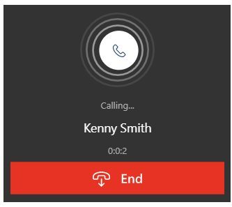

# Integrate a sample softphone with Dynamics 365 Sales

A softphone dialer provides a simple and integrated way to call customers from within Microsoft Dynamics 365 Sales. The communications that take place are captured as phone call activity in Dynamics 365 Sales.  

Organizations can integrate a softphone dialer from their telephony provider in Dynamics 365 Sales using Dynamics 365 Channel Integration Framework. Once integrated, sales reps can quickly call their contacts by selecting a phone number right from their app.  

This topic describes how to install a *sample* app and test the calling capabilities. 

> [!IMPORTANT]
> -  This sample code currently has limited availability.
> -  The sample code for softphone integration with Dynamics 365 using Dynamics 365 Channel Integration Framework is made available so customers can get early access and provide feedback. The sample code is not meant for production use and might have limited or restricted functionality.
> -  Microsoft doesn't provide support for this sample code. Microsoft Dynamics 365 Technical Support won’t be able to help you with issues or questions. This is subject to a separate [supplemental terms of use](https://go.microsoft.com/fwlink/p/?LinkId=511446).

## Integrate and configure the sample softphone dialer

To configure the sample:

1. Get Dynamics 365 Channel Integration Framework from Microsoft AppSource. For information on prerequisites and how to get Dynamics 365 Channel Integration Framework, see [Get Dynamics 365 Channel Integration Framework](../customer-service/channel-integration-framework/get-channel-integration-framework.md).

2. Import the **msdyn_CIFramework_managed.zip** managed solution from the [Download Center](https://go.microsoft.com/fwlink/p/?linkid=2104590). To learn more about importing a solution, see [Import, update, and upgrade a solution](../customize/import-update-upgrade-solution.md)

3. Integrate the sample app available on the [Download Center](https://go.microsoft.com/fwlink/p/?linkid=2104590) using Dynamics 365 Channel Integration Framework. To learn more about integrating a sample app, see [Sample softphone integration using Channel Integration Framework](../customer-service/channel-integration-framework/sample-softphone-integration.md).

    > [!IMPORTANT]
    > You must use the sample app from the [Download Center](https://go.microsoft.com/fwlink/p/?linkid=2104590) link, and not the one that's mentioned in the [Sample softphone integration using Channel Integration Framework](../customer-service/channel-integration-framework/sample-softphone-integration.md) topic.

4. Configure the channel provider for your Dynamics 365 Sales organization. More information: [How to configure a channel provider for your Dynamics 365 organization](../customer-service/channel-integration-framework/configure-channel-provider-channel-integration-framework.md)
 
After you complete the configuration, you'll see a phone icon next to any contact on an opportunity record who has a defined cell phone number.

> [!div class="mx-imgBorder"]
> 

When users select this icon, the sample softphone dialer opens and calls the number. 

> [!div class="mx-imgBorder"]
> 

All details regarding the call such as duration, phone number, and notes are automatically captured in the call summary and the phone call activity record, and the record is associated with the opportunity record the call was initiated from.

> [!div class="mx-imgBorder"]
> 

> [!div class="mx-imgBorder"]
> 

### See also

[Get Dynamics 365 Channel Integration Framework](../customer-service/channel-integration-framework/get-channel-integration-framework.md)  
[Sample softphone integration using Channel Integration Framework](../customer-service/channel-integration-framework/sample-softphone-integration.md)  
[How to configure a channel provider for your Dynamics 365 organization](../customer-service/channel-integration-framework/configure-channel-provider-channel-integration-framework.md)

[!INCLUDE[footer-include](../includes/footer-banner.md)]
