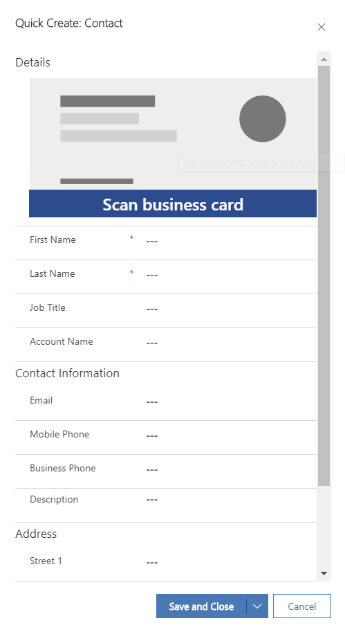
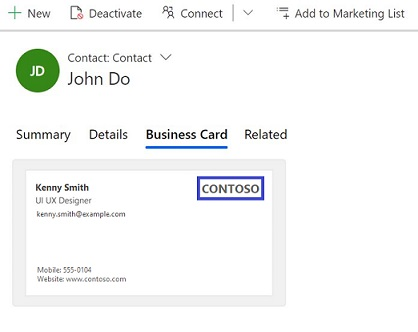

# Scan business cards

[!INCLUDE[cc-data-platform-banner](../includes/cc-data-platform-banner.md)]

The integrated business card scanner in Dynamics 365 Sales helps salespeople to quickly scan business cards of the prospective customers they’ve met in the fields. It reads basic information from the card and populates data in fields of **lead** or **contact** records in Dynamics 365 Sales, so salespeople don’t spend time on entering the data manually and can focus on more important tasks.

> [!IMPORTANT]
> - To learn about the availability of the business card feature in a region, see [Feature availability by region](https://docs.microsoft.com/ai-builder/availability-region#availability-and-release-status-of-features-by-region).
> - To know about the business card scan limits with your user license, see the [Microsoft Dynamics 365 Licensing Guide](https://go.microsoft.com/fwlink/p/?LinkId=866544).

To scan a business card:

1. Make sure you have the Common Data Service User role assigned.

2.  On the Quick Create form of a **Contact** or **Lead** form, select **Scan business card**.

    > [!div class="mx-imgBorder"]
    > 

3.  If you’re using the Dynamics 365 Sales app on a desktop, browse to the folder where the business card picture is stored, select the business card picture, and then select **Insert**.

    -OR-

    If you are using a mobile phone, use the mobile phone camera to capture the business card picture.

    The details like first name, last name, account name, job title, and email will be automatically populated from the business card.

    > [!div class="mx-imgBorder"]
    > 

4. Select **Save**.

    
    > [!NOTE]
    > - When you save the **Contact** or **Lead** records, a **Duplicate Records detected** dialog box is shown if duplicate records are found based on the available duplicate detection rules. You can choose whether you want to create a duplicate record or not.
    > - When you save the **Contact** or **Lead** record, the business card is also associated and stored in the records, so you can refer to it later. If your system administrator has set the **Always retain business card images after scanning option** option to **No**, the business card image won't be saved. 

    > [!div class="mx-imgBorder"]
    > 

### See also

[Customize the business card scanner control](customize-business-card-scan-control.md)  
[Enable or disable saving of business card image](retain-business-card-image-after-scanning.md) 

[!INCLUDE[footer-include](../includes/footer-banner.md)]
