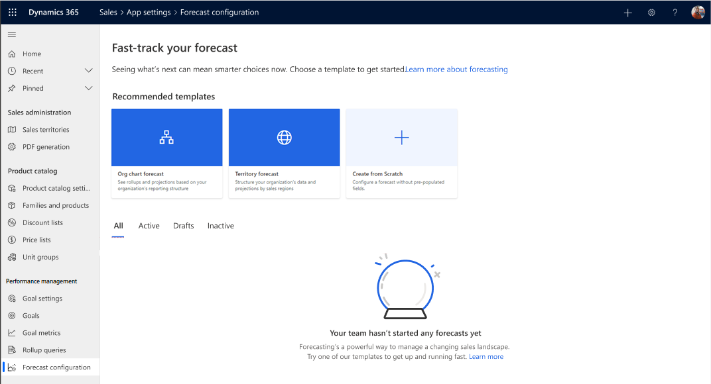

# Select a template

>[!NOTE]
> If you have opted in for early access, see [Select a template in early access](#select-a-template-in-early-access).

You must select a template to create a forecast. The selected templates populate the **Hierarchy route** field that defines the entity type in your hierarchy.

To select a template, go to the **Forecast configurations** page and select one of the following templates:

-	**Org chart forecast**: Rollup columns and projections are based on your organization's reporting structure. This template uses the **Manager** field on the **User** entity for the hierarchy.

-	**Territory forecast**: Rollup columns and projections are based on the sales territory hierarchy.

- **Create from scratch**: Allows you to create a forecast based on custom hierarchy entity on opportunity.   

> [!div class="mx-imgBorder"]
> 

## Select a template in early access 

You can select a template to create a forecast. The selected templates populate the **Hierarchy route** field that defines the entity type in your hierarchy.

To select a template, go to the **Forecast configurations** page and select one of the following templates:

-	**Org chart forecast**: Rollup columns and projections are based on your organization's reporting structure. This template uses the **Manager** field on the **User** entity for the hierarchy.

-	**Territory forecast**: Rollup columns and projections are based on the sales territory hierarchy.

- **Product forecast**: Rollup columns and projections are based on the product hierarchy. 

- **Create from scratch**: Allows you to create a forecast based on custom rollup and hierarchy entities.   

> [!div class="mx-imgBorder"]
> 

<table>
<tr><td>

> [!div class="nextstepaction"] 
> [Previous step: Review prerequisite tasks](configure-forecast.md#prerequisite-tasks)
</td><td>

> [!div class="nextstepaction"] 
> [Next step: Define general properties and scheduling](define-general-properties-scheduling-forecast.md)
</td></tr>
</table>

### See also

[Configure forecasts in your organization](configure-forecast.md)

[Configure forecast using custom rollup entity](configure-forecast-using-custom-rollup-entity.md)
