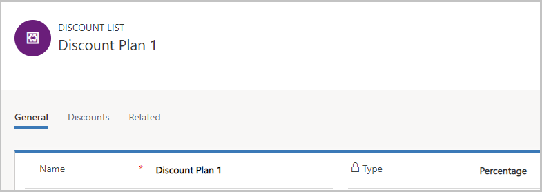
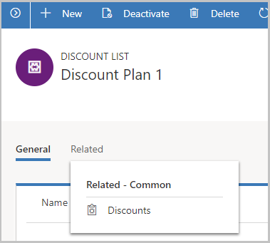
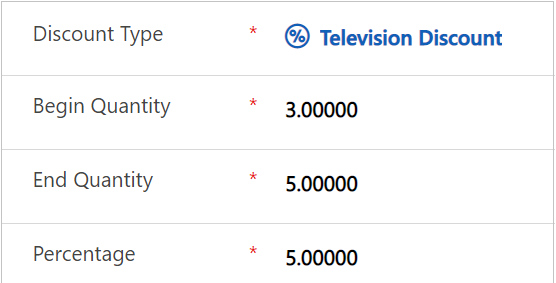
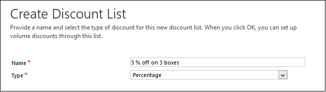
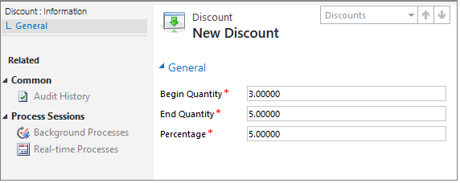

# Set up discount lists (Sales and Sales Hub)

Motivate customers to buy more by offering them discounts on bulk purchases. To offer discounts, you need to set up a discount list.  

## Set up a discount list (Sales Hub)

1. [!INCLUDE[proc_permissions_mgr_vp_ceo_busmgr_sysadmin_syscust](../includes/proc-permissions-mgr-vp-ceo-busmgr-sysadmin-syscust.md)]  
  
2. Select the site map icon , and then select **App Settings**. 
  
3. In the **Product Catalog** area, select **Discount Lists**. 

    > [!div class="mx-imgBorder"]
    > 

4.	To create a new discount list, on the command bar, select **New**.

    -OR-
  
    To edit a discount list, open a discount list from the list.

5.	Fill in the information, and select **Save**:

    a.	**Name**. Type a name that provides a good description of the kind of discount this list will include.

    b.	**Type**. To calculate the discount as a percentage of the price of the item, select Percentage or to give discount as a fixed amount, select Amount.

    c.	**Currency**. If you chose to give discount as a fixed amount, select the currency.

    > [!div class="mx-imgBorder"]
    > 
 
6.	To add discount details to the list, on select the **Related** tab, and then select **Discounts**.

    > [!div class="mx-imgBorder"]
    > 
 
7.	On the **Discounts** tab, select **Add New Discount**.

8.	In the **New Discount** form, fill in the following information, and select **Save & Close**:

    a.	**Begin quantity**. Enter the minimum quantity that if a customer purchase, they will be eligible for a discount.

    b.	**End quantity**. Enter the maximum quantity that if a customer purchase, they will be eligible for a discount.

    c.	**Percentage**. Enter the percentage of discount the customer will receive.

    For example, this discount list will offer a discount of 5% whenever the customer purchases between 3 – 5 pieces of televisions.

    > [!div class="mx-imgBorder"]
    > 
 

## Set up a discount list (Sales)
  
1. [!INCLUDE[proc_permissions_mgr_vp_ceo_busmgr_sysadmin_syscust](../includes/proc-permissions-mgr-vp-ceo-busmgr-sysadmin-syscust.md)]  
  
    #### Check your security role  
  
   - [!INCLUDE[proc_follow_steps_in_link](../includes/proc-follow-steps-in-link.md)]  
  
   - [!INCLUDE[proc_dont_have_correct_permissions](../includes/proc-dont-have-correct-permissions.md)]  
  
2. [!INCLUDE[proc_settings_prod_catalog](../includes/proc-settings-prod-catalog.md)]  
  
3. Select **Discount Lists**.  
  
4. To create a new discount list, select **New**.  
  
    -OR-  
  
    To edit a discount list, open it.  
  
5. Fill in the information:  
  
   - **Name**. Type a name that provides a good description of the kind of discount this list will include.  
  
   - **Type**. To calculate the discount as a percentage of the price of the item, select **Percentage** or to give discount as a fixed amount, select **Amount**.  
  
   - **Currency**. If you chose to give discount as a fixed amount, select the currency.  
  
     
  
6. Select **OK**.  
  
7. To set volume discounts, in the left pane, under **Common**, select **Discounts**, and then on the **Discounts** tab, in the **Records** group, select **Add New Discount**.  
  
8. Fill in the information:  
  
    Here's how:  
  
     
  
    This discount list will offer a discount of 5% whenever the customer purchases between 3 – 5 boxes.  
  
9. Select **Save** or **Save and Close**.  
  
## Typical next steps  
  [Create a unit group and add units to that group](create-unit-group-add-units-that-group.md)  
  
  [Set up a product catalog: Walkthrough](set-up-product-catalog-walkthrough.md)  
  
### See also  
 [System Settings dialog box - Sales tab](../admin/system-settings-dialog-box-sales-tab.md)
