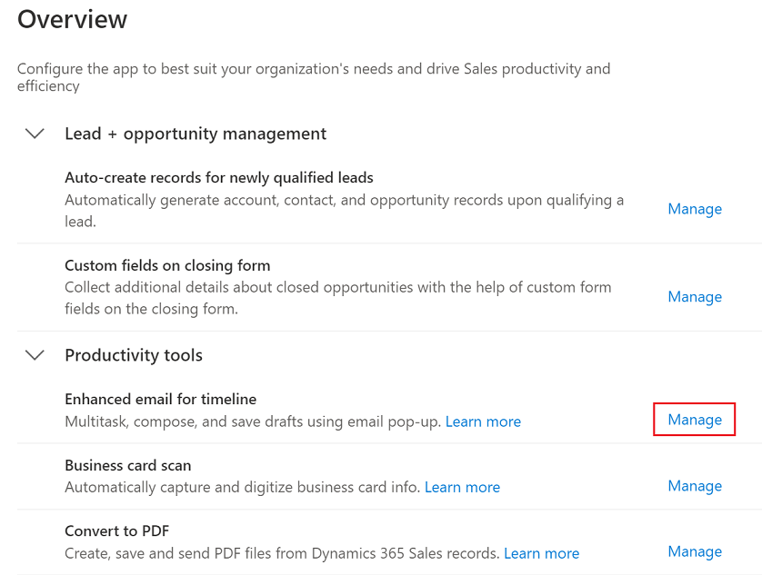
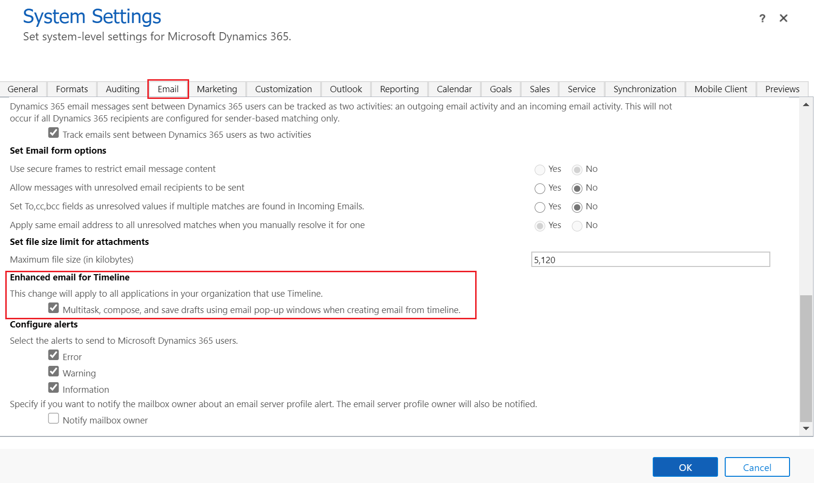

# Set up enhanced email

Before sales reps can use enhanced email, you must enable it.

> [!IMPORTANT]
> The enhanced email experience is available only for email activities created from the **Timeline** section of any model-driven app. 

## Enable enhanced email through App Settings

1. At the bottom of the site map, select **Change area**  and then select **App Settings**.

2. In the site map, select **Overview**.

3. On the **Overview** page, under **Productivity tools**, select **Manage** for **Enhanced email for timeline**.

    > [!div class="mx-imgBorder"]
    > 

4. On the **Productivity tools** page, move the **Enhanced email for timeline** toggle to **Yes**.

    > [!div class="mx-imgBorder"]
    > 

5. Select **Save**.

## Enable enhanced email through legacy web client settings

1. In your app, select the **Settings** icon, and then select **Advanced Settings**.

    > [!div class="mx-imgBorder"]
    > 

    The **Business Management** page opens in a new browser tab.

2. On the navigation bar, select **Settings**, and then under **System**, select **Administration**.

3. Select **System Settings**.

4. On the **System Settings** window, go to the **Email** tab, and select **Multitask, compose, and save drafts using email pop-up windows when creating email from timeline**.

    > [!div class="mx-imgBorder"]
    > 

5. Select **Ok**.

### See also

[Send email using the enhanced email experience](enhanced-email.md)

[!INCLUDE[footer-include](../includes/footer-banner.md)]