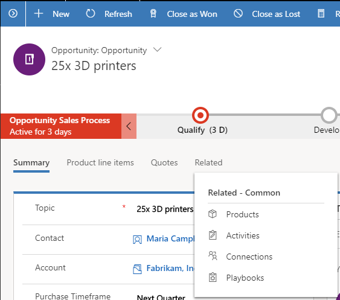
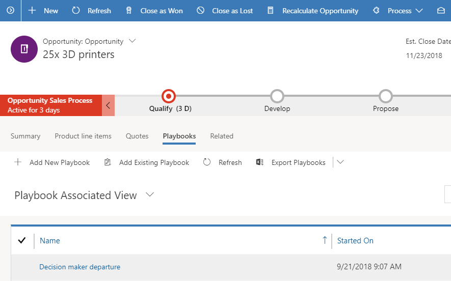
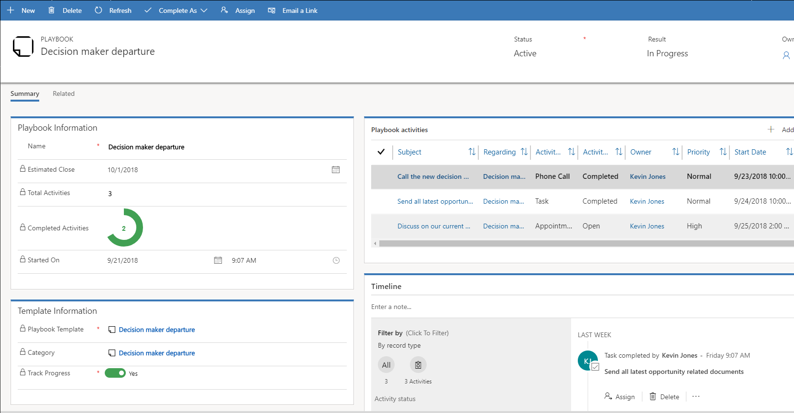
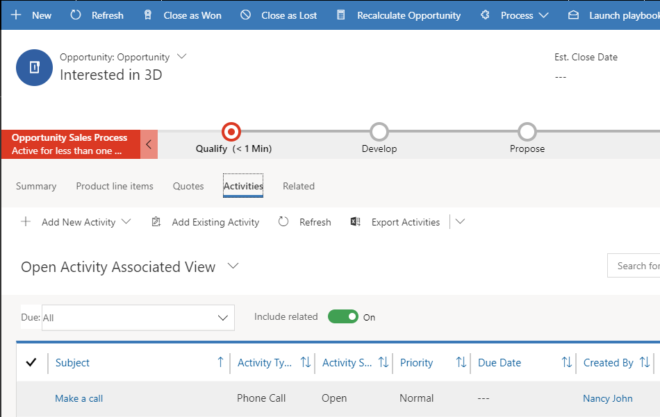
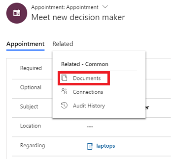

# Track playbook activities

When a playbook is launched, its related activities are created and associated with the record the playbook is launched from (also called the calling record). You must complete these activities to ensure every event is dealt with consistently.

If the playbook template used for the playbook has its **Track progress** field set to **Yes**, the activities are created under a playbook record that is under the calling record. If the **Track progress** field is set to **No**, the activities are created directly under the calling record.

To see the activities created by the playbook when the **Track progress** field in the playbook template is set to **Yes**:

1.  Go to the record you launched the playbook from. For example, if you launched the playbook from an opportunity record, go to the opportunity record.

2.  Select the **Related** tab, and then select **Playbooks**.

     > [!div class="mx-imgBorder"]
     >   

3.  In **Playbook Associated View**, the playbook launched from the record is listed.

     > [!div class="mx-imgBorder"]
     >   

4.  Select the playbook.

    The playbook record shows all the details about the playbook and its associated activities.

     > [!div class="mx-imgBorder"]
     >   

    For example, it shows when the playbook was launched, how many total activities it has, how many of the activities are completed, and the estimated close date. It also shows all the related playbook activities in the **Playbook activities** section. After you are done working on these activities, mark them as completed.

    To see the activities if the **Track progress** field of the playbook template is set to **No**, in the calling record, see the **Timeline** section.

    Alternately, in the calling record, select the **Related** tab, and then select **Activities**.

     > [!div class="mx-imgBorder"]
     >   
 
   The Open Activity Associated View lists all the activities for the calling record along with the playbook activities created since the playbook was launched. However, this view doesn't show the total number of activities that have been created in the context of a playbook. 

## View or download documents associated with an activity

If a sales manager has added sales brochures or training docs to a playbook activity, as a sales rep you can refer to these docs while you are working on the activity to ensure you can quickly access any details you need.

> [!NOTE]
> Documents are available for task, appointment, and phone call activities associated with a playbook activity. 

To view or download a document, in the activity form, select the **Related** tab, and then select **Documents**.

The **Documents** list appears.

To download a document: 
* In the **Documents** list, select a row, and then select **Download**.

To view a document:
* In the **Documents** list, select the document name.

### See also
[Launch a playbook to carry out activities consistently](launch-playbook.md)  
[Enforce best practices with playbooks](enforce-best-practices-playbooks.md)  
[Mark playbook as completed](mark-playbook-completed.md)

[!INCLUDE[footer-include](../includes/footer-banner.md)]