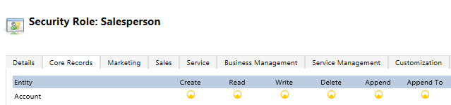

# Dynamics 365 for Sales troubleshooting guide for administrators

Use the following list of troubleshooting topics to quickly find information to solve your users' issues.

## Lead qualification issues and resolution

### Insufficient permissions or Access denied error when a user is trying to qualify a lead

How you resolve this error depends on the following ownership scenarios for the lead records. 
-  [The lead is owned by the user trying to qualify it](troubleshooting-admin.md#OwnedByUser)
-  [The lead that the user is trying to qualify is in their business unit](troubleshooting-admin.md#BusinessUnit)
-  [The lead that the user is trying to qualify is in their organization](troubleshooting-admin.md#Organization)

**Scenario. The lead is owned by the user trying to qualify it.**

**Resolution:** 
1.	Go to **Settings** > **Security Role**.
2.	Open the security role of the user.
3.	On the **Core Records** tab, assign **Create**, **Read**, **Append**, and **Append To** permissions to the Security Role at User level on the following entities:
    -  Account 
    -  Lead
    -  Contact
    -  Opportunity 

    

4.	On the **Custom Entities** tab, assign Read access to any custom entity.
5.	On the **Customizations** tab, assign **Read** access to **Attribute Map**, **Customizations**, **Entity** and **Entity Map**.

**Scenario: The lead that the user is trying to qualify is in their business unit.**

**Resolution:**
1.	Go to **Settings** > **Security Role**.
2.	Open the security role of the user.
3.	Assign **Create**, **Read**, **Append**, and **Append To** permissions to the user’s Security Role at Business Unit level on the following entities:
    -  Account 
    -  Lead
    -  Contact
    -  Opportunity 

    

4.	Assign **Read** access to any custom entity.
5.	Assign **Read** access to **Attribute Map**, **Customizations**, **Entity** and **Entity Map**

**Scenario: The lead that the user is trying to qualify is in their organization.**

**Resolution:**
1.	Go to **Settings** > **Security Role**.
2.	Open the security role of the user.
3.	Assign **Create**, **Read**, **Append**, and **Append To** permissions to the user’s Security Role at Organization level on the following entities:
    -  Account 
    -  Lead
    -  Contact
    -  Opportunity 
 
    

4.	Assign Read access to any custom entity.
5.	Assign Read access to **Attribute Map**, **Customizations**, **Entity** and **Entity Map**.

## Opportunity Close issues and resolution

### Insufficient permissions or Access denied error when a user is trying to close an opportunity

**Reason: The user trying to close the opportunity doesn’t have sufficient permissions on the opportunity they’re working on.**

**Resolution:**
1.	Go to **Settings** > **Security Role**.
2.	Open the security role of the user.
3.	Assign **Read**, **Create**, **Append**, **Append To** permissions to the user’s Security Role at User level on the Opportunity entity and custom entity.

### See Also
[Troubleshooting guide for sales people](troubleshooting.md)