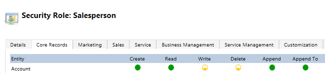

# Dynamics 365 for Sales troubleshooting guide for administrators

Use the following list of troubleshooting topics to quickly find information to solve your users' issues.

## Lead qualification issues and resolution

### Insufficient permissions or Access denied error when a user is trying to qualify a lead

How you resolve this error depends on the following ownership scenarios for the lead records. 
-  [The lead is owned by the user trying to qualify it](troubleshooting-admin.md#OwnedByUser)
-  [The lead that the user is trying to qualify is in their business unit](troubleshooting-admin.md#BusinessUnit)
-  [The lead that the user is trying to qualify is in their organization](troubleshooting-admin.md#Organization)

**Scenario:** 
The lead is owned by the user trying to qualify it.

**Resolution:** 
1.	Go to **Settings** > **Security Role**.
2.	Open the security role of the user.
3.	On the **Core Records** tab, assign **Create**, **Read**, **Append**, and **Append To** permissions to the Security Role at User level on the following entities:
    -  Account 
    -  Lead
    -  Contact
    -  Opportunity 

    

4.	On the **Custom Entities** tab, assign Read access to any custom entity.
5.	On the **Customizations** tab, assign **Read** access to **Attribute Map**, **Customizations**, **Entity** and **Entity Map**.

**Scenario:**
The lead that the user is trying to qualify is in their business unit.

**Resolution:**
1.	Go to **Settings** > **Security Role**.
2.	Open the security role of the user.
3.	Assign **Create**, **Read**, **Append**, and **Append To** permissions to the user’s Security Role at Business Unit level on the following entities:
    -  Account 
    -  Lead
    -  Contact
    -  Opportunity 

    

4.	Assign **Read** access to any custom entity.
5.	Assign **Read** access to **Attribute Map**, **Customizations**, **Entity** and **Entity Map**

**Scenario:**
The lead that the user is trying to qualify is in their organization.

**Resolution:**
1.	Go to **Settings** > **Security Role**.
2.	Open the security role of the user.
3.	Assign **Create**, **Read**, **Append**, and **Append To** permissions to the user’s Security Role at Organization level on the following entities:
    -  Account 
    -  Lead
    -  Contact
    -  Opportunity 
 
    

4.	Assign Read access to any custom entity.
5.	Assign Read access to **Attribute Map**, **Customizations**, **Entity** and **Entity Map**.

## Opportunity Close issues and resolution

### Insufficient permissions or Access denied error when a user is trying to close an opportunity

**Reason:**
The user trying to close the opportunity doesn’t have sufficient permissions on the opportunity they’re working on.

**Resolution:**
1.	Go to **Settings** > **Security Role**.
2.	Open the security role of the user.
3.	Assign **Read**, **Create**, **Append**, **Append To** permissions to the user’s Security Role at User level on the Opportunity entity and custom entity.

## Error or unexpected behavior while working on entities such as opportunities, quote, and order

While working on entities, you observe unexpected behavior or error while working on entities in [!INCLUDE[pn_sales_business_doc_name](../includes/pn-sales-business-doc-name.md)]. The following are some of the issues that you might encounter:

- Observe unexpected behavior or error while creating, activating, or closing a **Quote** 
- Observe unexpected behavior or error while opening, saving, or closing an **Opportunity**
- Observe unexpected behavior or error while creating or fulfilling an **Order**
- Error on order line item, total tax, or amount calculation is wrong 
- Error on quote line item, total tax, or amount calculation is wrong
  
These issues might occur due to improper customization of application. To resolve the issue, perform one of the following based in the error: 
- [Deactivate custom plugin](#deactivate-custom-plugin)
- [Disable custom JavaScript](#disable-custom-javascript)
- [Deactivate custom workflow process](#deactivate-custom-workflow-process)

### Deactivate custom plugin

1. Go to **Settings** > **Customizations** > **Customize the System**.
2. Select **Sdk Message Processing Steps**. 
    a list of available Sdk message processing steps is displayed.
3. Select **Filter** icon, Select column **Primary Object Type Code (Sdk Message Filter)** and select the entity for which the error is occurring.
    
    > [!div class="mx-imgBorder"]
    > 

4. Choose all the plugins that are in **Unmanaged** state. In this example, we have selected **ActivityFeeds.Plugins** with **Create** and **Update** SDK message types.
5. Select **Deactivate**.
6. Publish the customizations.
 
    > [!div class="mx-imgBorder"]
    > 

If the issue still persists, try to [Disable custom JavaScript](#disable-custom-javascript) or [Deactivate custom workflow process](#deactivate-custom-workflow-process).

### Disable custom JavaScript

1. Open form editor of the entity in which the error is occurring. In this example, we are selecting the entity as Opportunities and the default solution form.

    > [!div class="mx-imgBorder"]
    > 

2. Select **Form Properties** on the form editor.

    > [!div class="mx-imgBorder"]
    > 

    The **Form Properties** dialog opens.

3. On the **Events** tab, Select the control **OnLoad** from the **Events** dropdown and choose the custom JavaScript file.  

    > [!div class="mx-imgBorder"]
    > 

4. Select **Edit**. In this example, we have selected the custom JavaScript file **eg_opportunity** to edit.
   
    > [!div class="mx-imgBorder"]
    >  

5. Uncheck the **Enabled** option and select OK.
 
    > [!div class="mx-imgBorder"]
    >  
 
6. Publish the customizations.

If the issue still persists, try to [Deactivate custom plugin](#deactivate-custom-plugin) or [Deactivate custom workflow process](#deactivate-custom-workflow-process).

### Deactivate custom workflow process

1. Go to **Settings** > **Customizations** > **Customize the System**.
1. Select **Processes**. 
    a list of available processes is displayed.
3. Select **Filter** icon, Select column **Primary Entity** and select the entity for which the error is occurring.
    
    > [!div class="mx-imgBorder"]
    > 

4. Choose all process workflows that are in **Unmanaged** state. In this example, we have to select all the unmanaged process workflows.
5. Select **Deactivate**.
6. Publish the customizations.
 
    > [!div class="mx-imgBorder"]
    >  

If the issue still persists, try to [Deactivate custom plugin](#deactivate-custom-plugin) or [Disable custom JavaScript](#disable-custom-javascript).

## Unable to see data in certain columns in entity views

**Reason:**

## Unable to see some records in the entity views

### See Also

[Troubleshooting guide for sales people](troubleshooting.md)
