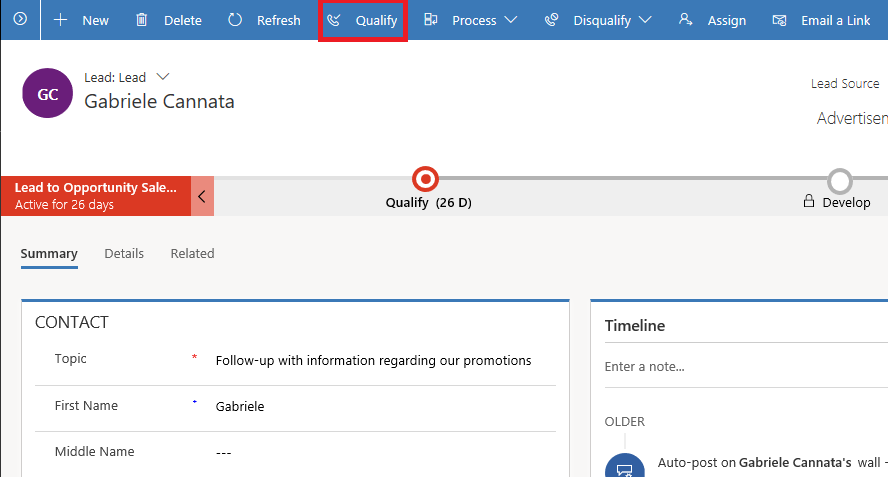
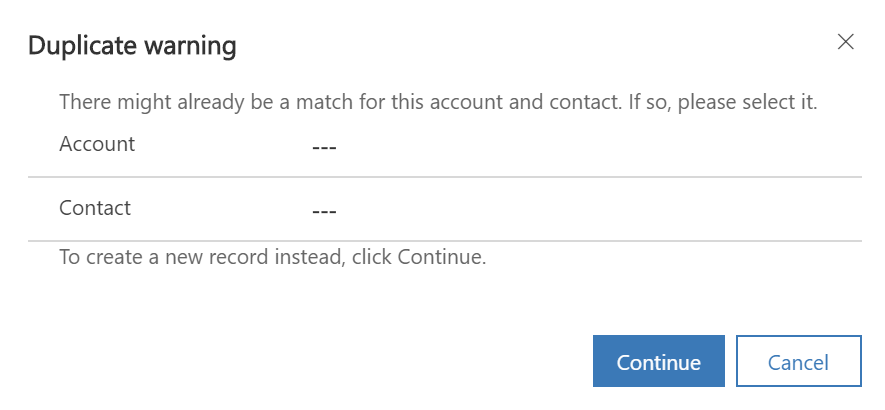
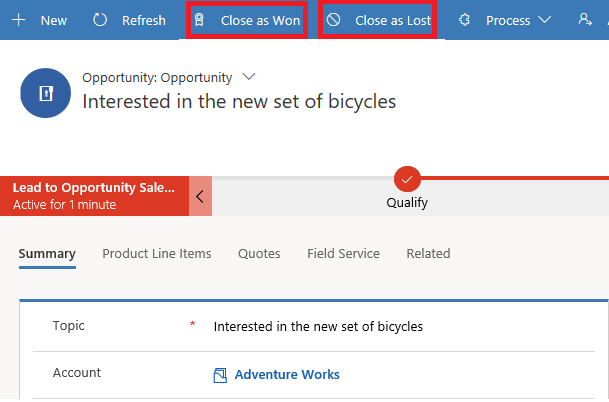

# Dynamics 365 Sales troubleshooting guide for salespeople

Use the following list of troubleshooting topics to quickly find information to solve your issue.

## Lead qualification issues and resolution

### How do I convert or qualify my leads?

You qualify a lead when you determine that the lead you've nurtured has a potential to turn into business. When you qualify a lead, it becomes an opportunity.

To qualify a lead, select **Qualify** on the command bar of the lead record.

> [!div class="mx-imgBorder"]  
> 

You can also qualify a lead from the list of leads. Go to **Sales** > **Leads**. Select the lead you want to qualify and on the command bar, select **Qualify**.

### Why am I not able to qualify a lead?
There are multiple errors you could get while qualifying a lead. 
1.  [Duplicate warning – There might already be a match for this account or contact. If so, please select it.](troubleshooting.md#duplicate)
2.  [To move to the next stage, complete the required steps](troubleshooting.md#CompleteSteps)
3.  [Active stage is not on 'lead' entity](troubleshooting.md#NoActiveStage)
4.  [Access denied or Insufficient permissions](troubleshooting.md#AccessDenied)

The following sections describe each of these errors and how you can resolve them.

#### 1. Duplicate warning – There might already be a match for this account or contact. If so, please select it.

> [!div class="mx-imgBorder"]  
> 

**Reason:**

When the lead is qualified to an opportunity, a corresponding account or contact is created. There might already be a match for this account or contact.

**Resolution:**

On the **Duplicate warning** dialog box, select the existing account or contact to avoid creating duplicates. To create a new record instead, select **Continue**.

> [!NOTE]
> When you qualify a lead through the Leads grid, the system creates an account or contact even though a duplicate record exists. By design, the rule that detects the duplicate records gets disabled. However, when you qualify a lead through the lead record form, the duplicate detection rule works. The rule prompts you with a warning to resolve the conflict if any duplicate records for account or contact are found.

#### 2. To move to the next stage, complete the required steps

**Reason:** 

You haven't filled in data in all the business-required fields in the current stage of the process stage.

**Resolution:**

Fill in data in all the mandatory fields in the current stage, save the record, and then try qualifying the lead again.

#### 3. Active stage is not on 'lead' entity

**Reason:**

The lead that you're trying to qualify isn’t in the Active state. This might happen when an already qualified lead has been reactivated.

**Resolution:**

1.	Open the lead record.
2.	On the process stage, select the **Set Active** button.

    > [!div class="mx-imgBorder"]  
    > 

 
#### 4. Access denied or Insufficient permissions

**Reason:**

You don't have sufficient permissions on the lead record. 

**Resolution:**

Ask your system administrator to grant you the necessary permissions.

If there’s no error, and you're still not able to qualify a lead, contact the technical support.

## Opportunity issues and resolution

### How do I close an opportunity?
      
Whether your customer has accepted or rejected your proposal, it's a good practice to close the opportunity as won or lost. 

When you close an opportunity, the opportunity is marked as complete, and can’t be changed. To make further changes to an opportunity, you can reopen it. 

> [!NOTE]
> At the time of closing the opportunity, enter the Actual Revenue and Actual Close Date. The Actual Revenue is used for reporting purposes in charts and reports in [!INCLUDE[pn-dyn-365-sales](../includes/pn-dyn-365-sales.md)].

To close an opportunity, open the opportunity record, and on the command bar, select **Close as Won** or **Close as Lost**.

> [!div class="mx-imgBorder"]  
> 

### Why am I not able to close an opportunity?

Here are some errors you might see when you close an opportunity: 
1.  [The opportunity cannot be closed](troubleshooting.md#CannotBeClosed)
2.  [Access denied or Insufficient permissions](troubleshooting.md#AccessDeniedOpportunity)
3.  [The opportunity has already been closed](troubleshooting.md#AlreadyClosed)

The following sections describe each of these errors and how you can resolve them.

 
#### 1. The opportunity cannot be closed

**Reason:**

There might be active or draft quotes associated with the opportunity.

**Resolution:**

1.	In the Opportunity record, go to the **Quotes** tab (or **Quotes line item** tab).
2.	Make sure none of the quotes is in the Draft or Active status.

    > [!div class="mx-imgBorder"]  
    > 

 
#### 2. Access denied or Insufficient permissions.

**Reason:**

You don't have sufficient permissions on the opportunity you're trying to close.

**Resolution:**

Ask your system administrator to grant you the necessary permissions.

#### 3. The opportunity has already been closed.

**Reason:**

The opportunity that you're trying to close is already marked as Won or Lost. 

**Resolution:**

If you want to make changes to the already closed opportunity, reopen the opportunity, make changes, and close it again.

### Why am I not able to edit an opportunity?

If you've already closed an opportunity as Won or Lost, it becomes read-only and you can't change it. To make any changes to a closed opportunity, reopen it. 

To reopen, open the opportunity, and on the command bar, select **Reopen Opportunity**.

> [!div class="mx-imgBorder"]
> 

### Why am I not able to add products to an opportunity? 

Here are some errors you might see when you add products to an opportunity: 
1.  [You must select a price list before attempting to add a product](troubleshooting.md#SelectPriceList)
2.  [You must provide a value for product description](troubleshooting.md#ProductName)
3.  [You can only add active products](troubleshooting.md#ActiveProducts)

#### 1. You must select a price list before attempting to add a product

**Reason:** 

You haven't selected a price list for the opportunity. Selecting a price list is required to add products to an opportunity. 

**Resolution:**

1.  In the Opportunity record, go to the **Product Line Item** tab.
2.  In the **Price List** field, select a price list for the opportunity.  

#### 2. You must provide a value for product description.

**Reason:** 

When creating a write-in product, you haven't entered the product name.  

**Resolution:**

Enter the product name.   

#### 3. You can only add active products.

**Reason:** 

When adding an existing product, you selected a product in the **Draft** status.  

**Resolution:**

Make sure the product you want to add is in the Active state, and then add the product.   

## Forecast definition issues and resolution

### Why am I unable to publish forecast definition? 

**Reason:**

There might be several reasons related to publishing failure. The following are examples that might cause a failure: 
- Some users under the selected hierarchy might not be assigned the forecast manager or forecast user role. 
- Some users are disabled under the selected hierarchy when you publish the forecast definition.  

**Resolution:**

1. Go to **Settings** > **System Jobs**.

    > [!div class="mx-imgBorder"]
    > 
    
    The system jobs page opens.

2. Identify the forecast definition publishing job that failed. If it's difficult to identify the job in the list of system jobs, use the **Regarding** column to find the failed job with the forecast definition's title. In this example, the failed forecast definition title is **Bert FY'19**.

    > [!div class="mx-imgBorder"]
    > 
    
3. Select the System Job Name to view the error details. In this example, the system job name that corresponds to **Bert FY'19** is selected.

    > [!div class="mx-imgBorder"]
    > 

4. In the **information** page, you can see the error message highlighted in **Yellow** with the reason why the forecast definition publishing failed. Select the **Details** section to see more details about the error. In this example, you can see that the error occurred because of insufficient user privileges in Bert's hierarchy. 

    > [!div class="mx-imgBorder"]
    > 

5. Take the necessary actions to resolve the error and republish the forecast definition. 
    
    To resolve the error in this example, assign Forecast manager or Forecast user roles to all the users under Bert's hierarchy as required, and republish the forecast definition.

### Why am I unable to recalculate the forecast?

**Reason:**

There might be several reasons related to the failure of recalculation of the forecast. The following are some examples that might cause a failure: 
- User roles (forecast manager or forecast user) might have been removed under the selected hierarchy after the forecast was created. 
- In the **Forecast metric** value, for the **Revenue** field, the **Rollup Fields** value has changed.

**Resolution:**

1. Go to **Change area** and select **Sales** > **Forecasts**. 

    > [!div class="mx-imgBorder"]
    > 

    A list of published forecasts is displayed.

2. The **Last recalculated on** column displays an error icon corresponding to the recalculation failed forecast. Place your cursor over the icon and a message or reason for the error is displayed.
 
    > [!div class="mx-imgBorder"]
    > 

4. Take the necessary actions to resolve the error and recalculate the forecast. 

## Issues related to Unified Interface

### Out-of-the-box or custom entities appear as read-only in Unified Interface apps

Some out-of-the-box and custom entities are appearing as read-only in the Sales Hub app (Unified Interface). However, these entities are editable in the legacy web client. Some out-of-the-box buttons are also unavailable on the forms in Unified Interface.

**Reason:**

This could happen when an entity is set to be read-only in mobile. 

**Resolution:**

To resolve this: 

1.	On the navigation bar in your app, select the **Settings** icon and then select **Advanced Settings**.

    

    The **Business Management** page opens in a new browser tab.

2.	On the navigation bar, select **Settings** and then select **Customizations**.

    
 
3.	On the **Customization** page, select **Customize the System**.

4.	In the solution explorer, under **Components**, expand **Entities** and then select the specific entity that’s appearing as read-only.

5.	On the **General** tab, under **Outlook & Mobile**, clear the **Read-only in mobile** check box.

    
 
6.	Save and publish the customizations.

7.	In the Sales Hub app, refresh the window. 

All the out-of-the-box actions will be available and entities will be editable. 

### See also

[Dynamics 365 Sales troubleshooting guide for administrators](troubleshooting-admin.md)
