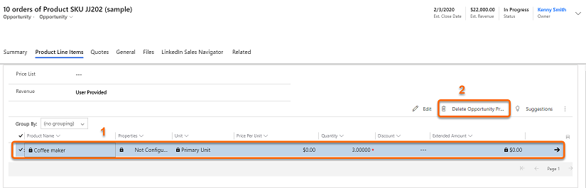
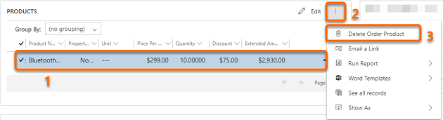

# Troubleshooting currency and price lists

This article helps you troubleshoot and resolve issues related to currency and price lists.

## Issue: I can't update the currency or price list for an opportunity, quote, order, or invoice

**Reason**

When I change and try to save the currency or price list for an existing opportunity, quote, order, or invoice that's already associated with a product record or quote record, an error message is displayed.

The error occurs because the associated product record or quote record is already linked with a price list that was created by using a different transaction currency.

The following are the few error messages that will be displayed depending on the entity:

- For an opportunity, the error message is "The currency cannot be changed because the opportunity has opportunity products, quotes, orders, or invoices associated with it. Remove the associated records and then change the currency."

- For a quote, the error message is "The currency cannot be changed because the quote has quote products associated with it. Remove the associated records and then change the currency."

**Resolution**

To resolve this issue, you must remove the product records or quote records, change the currency, and then add back the product records or quote records.

You can change the currency and price list for the entities in the following states only.

<table>
<tr><th>Entity</th><th>Status</th><th>Change currency value?</th><th>Change price list value?</th></tr>
<tr><td valign="top" rowspan="3"><b>Opportunity</b></td><td>Open</td><td>Yes, but only if there are no associated Opportunity Product, Order, Quote, or Invoice records.</td><td>Yes, but this can cause an error with the Opportunity record if the associated Opportunity Product records aren't part of the selected price list.</td></tr>
<tr><td>Won</td><td>No</td><td>No</td></tr>
<tr><td>Lost</td><td>No</td><td>No</td></tr>
<tr><td valign="top" rowspan="4"><b>Quote</b></td><td>Draft</td><td>Yes, but only if there are no associated Quote Product records. </td><td>Yes, but this can cause an error with the Quote record if the associated Quote Product records aren't part of the selected price list.</td></tr>
<tr><td>Active</td><td>No</td><td>No</td></tr>
<tr><td>Won</td><td>No</td><td>No</td></tr>
<tr><td>Close</td><td>No</td><td>No</td></tr>
<tr><td valign="top" rowspan="5"><b>Order</b></td><td>Active</td><td>No </td><td>Yes, but this can cause an error with the Order record if the associated Order Product records<!--Edit okay?--> aren't part of the selected price list. </td></tr>
<tr><td>Submitted</td><td>No</td><td>No</td></tr>
<tr><td>Canceled</td><td>No</td><td>No</td></tr>
<tr><td>Fulfilled</td><td>No</td><td>No</td></tr>
<tr><td>Invoiced</td><td>No</td><td>No</td></tr>
<tr><td valign="top" rowspan="3"><b>Invoice</b></td><td>Active</td><td>Yes, but only if there are no associated Quote Product records. </td><td>Yes, but this can cause an error with the Invoice record if the associated Order Product records aren't part of the selected price list.</td></tr>
<tr><td>Paid</td><td>No</td><td>No</td></tr>
<tr><td>Canceled</td><td>No</td><td>No</td></tr>
</table>

**To update the currency or price list**

1. Open the opportunity, quote, order, or invoice for which you want to change the currency or price list.

2. For an opportunity: go to the **Product Line Items** tab, and then delete the products from the list.

    > [!div class="mx-imgBorder"]
    > 

    For a quote, order, or invoice: On the **Summary** tab, go to the **PRODUCTS** section, and delete the products from the list.

    > [!div class="mx-imgBorder"]
    > 

3. On the **Summary** tab, change the currency to the value you want, and then save the form. 

4. Add back the product records or quote records, and then save the form.

> [!NOTE]
> You can change currency by using the entity attribute. To learn more, see [Transaction Currency (currency) entity](../customerengagement/on-premises/developer/transaction-currency-currency-entity.md).

### See also

[Dynamics 365 Sales troubleshooting guide](troubleshooting.md)  

[!INCLUDE[footer-include](../includes/footer-banner.md)]
