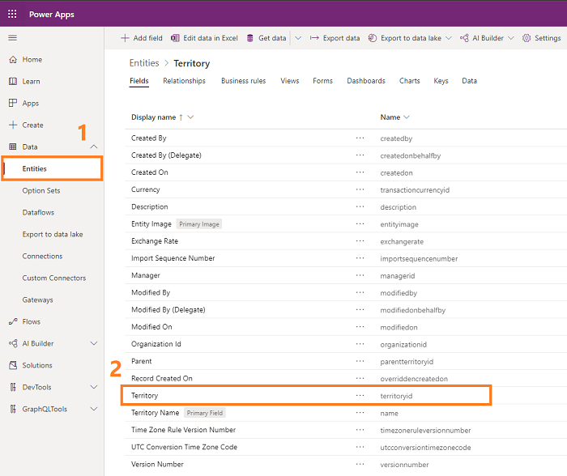
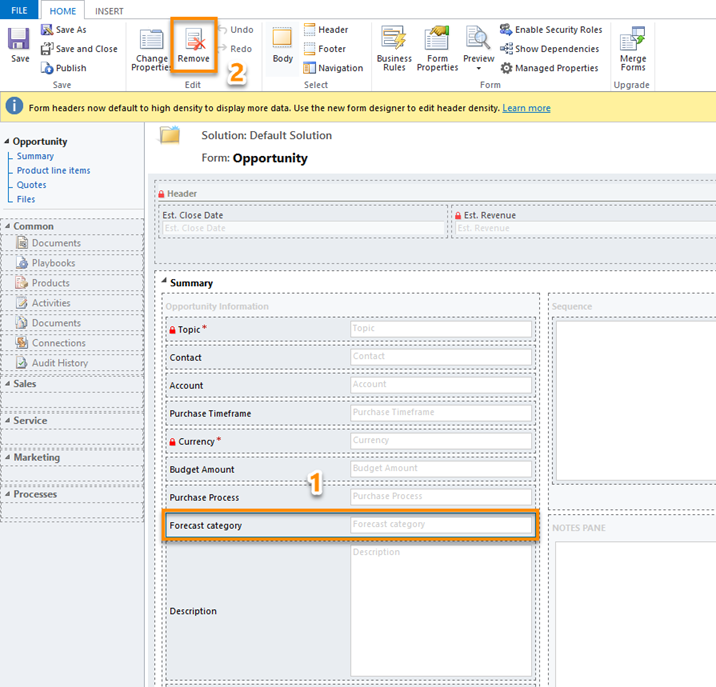
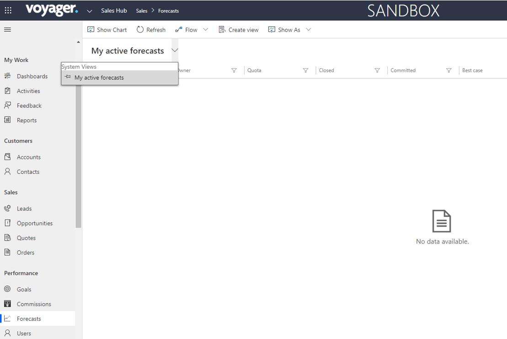
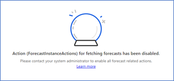
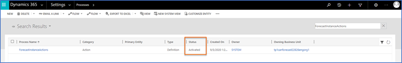
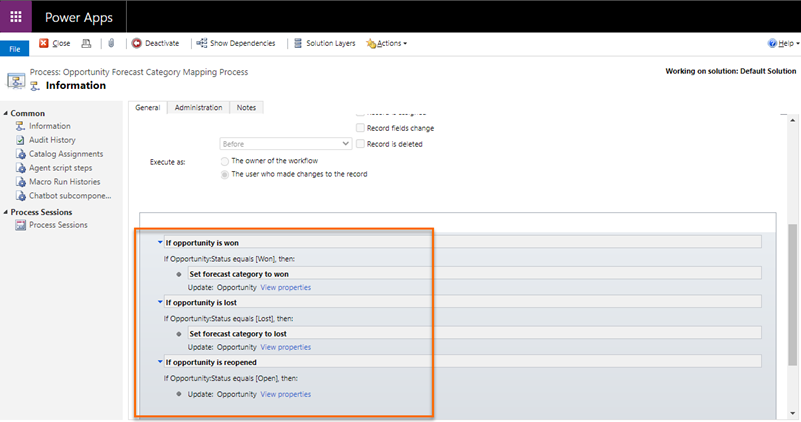

# Troubleshooting forecasting 

This article helps you troubleshoot and resolve issues related to forecasting.

## Territory-based forecast issues and resolution

### Issue: An error is displayed when I try to create a territory-based forecast. 
### -Or-
### The data in a territory-based forecast is not refreshing.

**Reason:**

When system updates are performed, the territory entity's hierarchy is disabled (though you've enabled it earlier), which causes this error. 

**Resolution:**

To resolve this error, you must enable hierarchy in the **territory_parent_territory** relationship definition from **Relationships**. Follow these steps:

1.	Go to **Advance settings**.   
    The advance settings page opens in a tab.   
2.	Select **Settings** > **Customization** > **Customizations**.  
    The **Power Apps** settings page opens.   
3.	Select **Data** > **Entities**, and then select **Territory**.  
    > [!div class="mx-imgBorder"]
    >   
4.	On the **Territory** page, select the **Relationships** tab, and then select **Parent**.  
    > [!div class="mx-imgBorder"]
    >   
5.	In the **Many-to-one** dialog box, select the **Hierarchical** check box, and then select **Done**.  
    > [!div class="mx-imgBorder"]
    >    
6.	Save and close the entity.

## Unable to hide the forecast category field in opportunity forms

**Reason**

Sometimes, the app displays the **Forecast category** field in opportunity forms, even after it has been configured as invisible by default through form customizations.

**Resolutions**

To resolve this error, you must delete the **Forecast category** field from the form. Follow these steps:  
1.  In your app, on the nav bar, select the **Settings** icon, and then select **Advanced Settings**.  
    > [!div class="mx-imgBorder"]
    >    
    The **Business Management** settings page opens in a new browser tab.   
2. On the nav bar, select **Settings**, and then under **Customization**, select **Customizations**.   
3. Select **Customize the System**.   
4. Under **Components** in the solution explorer, expand **Entities**, expand **Opportunity**, and then select **Forms**.   
5. Open the **Opportunity** form of form type **Main**.    
    The opportunity form opens in a new window.     
6. In the **Summary** section, select the **Forecast category** field, and then select **Remove**.     
    > [!div class="mx-imgBorder"]
    >      
7. Save and publish the configuration.

## Unable to view forecasts

**Reason**

If you were using the previous version of forecasting and updated to the latest, the forecasting site map might not be updated. This can be caused by the presence of an unmanaged layer of the Sales Hub app, which would allow the forecasting site map to open the previous version of forecasting.    
The following image is an example of the previous version of forecasting home page.     
> [!div class="mx-imgBorder"]
> 

**Resolution**

To resolve this issue, update the forecasting site map entry to the latest forecast entry grid. More information: [Add forecast grid and configuration options in site map](add-forecast-site-map.md)   

## Unable to load the forecast grid, and an error is displayed

**Reason**

The **ForecastInstanceActions** process is deactivated. The reason might be that the owner of an organization has changed, which is causing the failure to load the forecast grid. The error shown in the following image is displayed.   
> [!div class="mx-imgBorder"]
> 

**Resolution**

To resolve this error, activate the **ForecastInstanceActions** process. Follow these steps:   
1. Go to **Advanced settings**, and then select **Settings** > **Process Center** > **Processes**.    
2. In the search box, enter **ForecastInstanceActions**. You can see that the process is in the **Draft** state.     
    > [!div class="mx-imgBorder"]
    >       
3. Select the process, and then select **Activate**.    
    > [!div class="mx-imgBorder"]
    >      
4. On the confirmation message, select **Activate**.    
    > [!div class="mx-imgBorder"]
    >     
5. Verify that the process state is **Activated**, and then close **Settings**.   

## Unable to view drill down data in a forecast grid

**Reason**

You don’t have enough privileges for **Forecast Configuration** entity to view drill down data in the forecast grid. The error shown in the following image is displayed.  
> [!div class="mx-imgBorder"]
> 

**Resolution**

To resolve this error, your administrator must provide read privileges on **Forecast Configuration** entity to your security role. Follow these steps:  
1. Go to **Advanced settings**, and then select **Settings** > **Security** > **Security Roles**.   
2. Select the security role for which you want to apply the privileges.  
3. On the security role page, select **Custom Entities** tab and go to **Forecast Configuration** row.   
4. Select and provide the read privileges.   
    > [!div class="mx-imgBorder"]
    >   
5. Close the settings.   

## Unable to view drill down data in a forecast grid

**Reason**

You don’t have enough privileges for **Forecast Configuration** entity to view drill down data in the forecast grid. The error shown in the following image is displayed.  
> [!div class="mx-imgBorder"]
> 

**Resolution**

To resolve this error, your administrator must provide read privileges on **Forecast Configuration** entity to your security role. Follow these steps:  
1. Go to **Advanced settings**, and then select **Settings** > **Security** > **Security Roles**.   
2. Select the security role for which you want to apply the privileges.  
3. On the security role page, select **Custom Entities** tab and go to **Forecast Configuration** row.   
4. Select and provide the read privileges.   
    > [!div class="mx-imgBorder"]
    >   
5. Close the settings.   

## Forecast category fields are not getting updated

**Reason**      
In a forecast, after updating the forecast category field to Won or Lost, the opportunities are still appearing in the previous pipeline bucket. This error is occurring due to the **Opportunity Forecast Category Mapping Process** workflow is disabled in your organization.    

**Resolution**     
To resolve the error, activate the **Opportunity Forecast Category Mapping Process** workflow. Follow these steps:    
1. Go to **Advanced settings**, and then select **Settings** > **Customizations** > **Customize the System**.    
2. From the sitemap, select **Processes**.    
3. Select the **Opportunity Forecast Category Mapping Process** workflow and select **Activate**.    
    > [!div class="mx-imgBorder"]
    >   
    The forecast categories in the opportunities will be updated properly. For opportunities that were changed before activating the workflow must be manually changed.
    Also, open the **Opportunity Forecast Category Mapping Process** workflow and verify that the conditions are properly defined for each forecast category.   
    > [!div class="mx-imgBorder"]
    >     
4. Save and close the settings.    

### See also

[Dynamics 365 Sales troubleshooting guide](troubleshooting.md)  

[!INCLUDE[footer-include](../includes/footer-banner.md)]