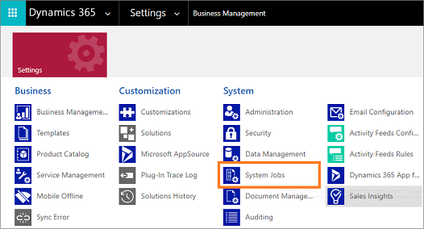
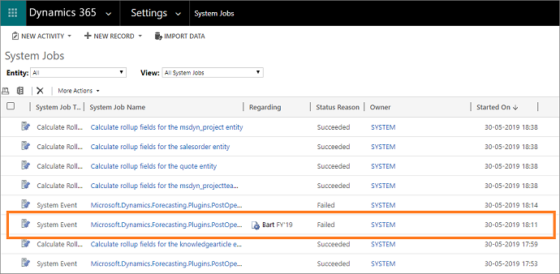
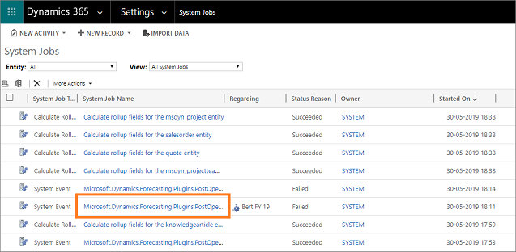
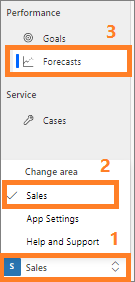
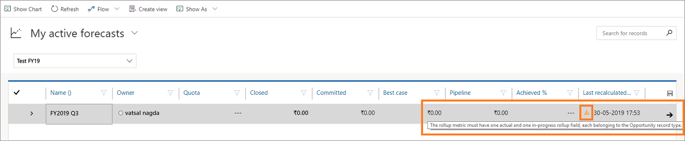

# Troubleshooting forecasting 

This article helps you troubleshoot and resolve issues related to forecasting.

## Forecast definition issues and resolution

### Issue: I can't publish forecast definition 

**Reason:**

There might be several reasons related to publishing failure. The following are examples that might cause a failure: 
- Some users under the selected hierarchy might not be assigned the forecast manager or forecast user role. 
- Some users are disabled under the selected hierarchy when you publish the forecast definition.  

**Resolution:**

1. Go to **Settings** > **System Jobs**.

    > [!div class="mx-imgBorder"]
    > 
    
    The system jobs page opens.

2. Identify the forecast definition publishing job that failed. If it's difficult to identify the job in the list of system jobs, use the **Regarding** column to find the failed job with the forecast definition's title. In this example, the failed forecast definition title is **Bert FY'19**.

    > [!div class="mx-imgBorder"]
    > 
    
3. Select the System Job Name to view the error details. In this example, the system job name that corresponds to **Bert FY'19** is selected.

    > [!div class="mx-imgBorder"]
    > 

4. In the **information** page, you can see the error message highlighted in **Yellow** with the reason why the forecast definition publishing failed. Select the **Details** section to see more details about the error. In this example, you can see that the error occurred because of insufficient user privileges in Bert's hierarchy. 

    > [!div class="mx-imgBorder"]
    > 

5. Take the necessary actions to resolve the error and republish the forecast definition. 
    
    To resolve the error in this example, assign Forecast manager or Forecast user roles to all the users under Bert's hierarchy as required, and republish the forecast definition.

### I can't recalculate the forecast

**Reason:**

There might be several reasons related to the failure of recalculation of the forecast. The following are some examples that might cause a failure: 
- User roles (forecast manager or forecast user) might have been removed under the selected hierarchy after the forecast was created. 
- In the **Forecast metric** value, for the **Revenue** field, the **Rollup Fields** value has changed.

**Resolution:**

1. Go to **Change area** and select **Sales** > **Forecasts**. 

    > [!div class="mx-imgBorder"]
    > 

    A list of published forecasts is displayed.

2. The **Last recalculated on** column displays an error icon corresponding to the recalculation failed forecast. Place your cursor over the icon and a message or reason for the error is displayed.
 
    > [!div class="mx-imgBorder"]
    > 

4. Take the necessary actions to resolve the error and recalculate the forecast. 

## Territory-based forecast issues and resolution

### Issue: An error is displayed when I try to create a territory-based forecast. 
### -OR-
### The data in a territory-based forecast is not refreshing.

**Reason:**

When system updates are performed, territory entity's hierarchy is disabled (though you've enabled it earlier) and causing this error. 

**Resolution:**

To resolve this error, you must enable hierarchy in the **territory_parent_terrioty** relationship definition from **Relationships**. Follow these steps:

1.	Go to **Advance settings**. 
    
    The advance settings page opens in a tab.

2.	Select **Settings** > **Customization** > **Customizations**.
    
    The **Power Apps** settings page opens. 

3.	Select **Data** > **Entities** and then select **Territory**.

    > [!div class="mx-imgBorder"]
    >     

4.	On the **Territory** page, select **Relationships** tab and then select **Parent**.

    > [!div class="mx-imgBorder"]
    > 
    
5.	On the **Many-to-one** dialog box, select to enable **Hierarchical**, and then select **Done**.

    > [!div class="mx-imgBorder"]
    > 
    
6.	Save and close the entity.

### See also

[Dynamics 365 Sales troubleshooting guide](troubleshooting.md)  