# Troubleshooting in-app marketing

This article helps you troubleshoot and resolve issues related to in-app marketing.

## When I open the Marketing List form, the Members view isn't available

**Reason**

The error is occurring due to the customization of views for each subgrid in the Marketing List form, causing the member list to appear empty.
> [!div class="mx-imgBorder"]
> 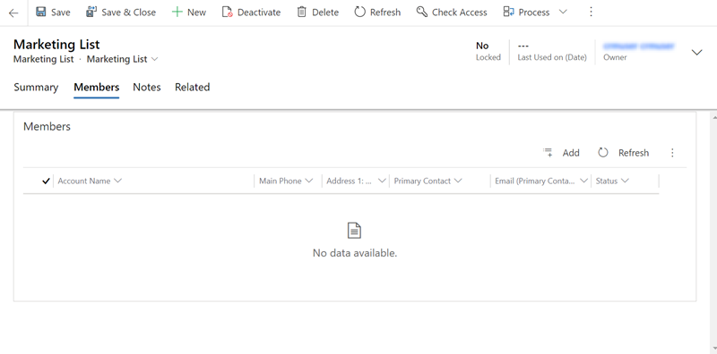

**Resolution**

1. Go to **Advanced Settings** > **Settings** > **Customizations** > **Customize the System**. 
2. From the site map, open **Entities** > **Marketing List** > **Forms**.
3. From the list of forms, select the **Marketing List** form. 
    > [!div class="mx-imgBorder"]
    > 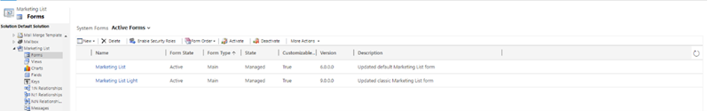
4. On the **Marketing List** form, from the **Marketing List** site map, select **Members**.
    > [!div class="mx-imgBorder"]
    > 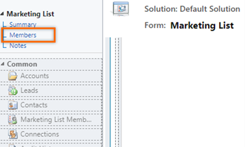
5. Select **Contacts**, and then select **Change Properties**. The **Set Properties** window opens.
    > [!div class="mx-imgBorder"]
    > 
6. In the **Additional Options** section, from the **View Selector** drop-down list, select **Show Selected Views**.
    The list of additional options appears.
7. Select the **My Active Contacts** view, and from the **View Selector** drop-down list, select **Off**.
    > [!div class="mx-imgBorder"]
    > 
8. In the **Name** section, clear the **Display the label on the Form** check box.
    > [!div class="mx-imgBorder"]
    > 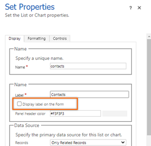
9. Select **OK**.
10. Repeat steps 5 through 9 for **Accounts** and **Leads**.
11. Save and publish the form.

## I can't associate a campaign created from the Marketing List form with a Marketing List record in Unified Interface

**Reason**

The error occurs because the attribute **TmpRegardingObjectId** has been removed from the Campaigns form.
> [!div class="mx-imgBorder"]
> 

**Resolution**

1. Go to **Advanced Settings** > **Settings** > **Customizations** > **Customize the System**.
2. From the site map, open **Entities** > **Campaign** > **Forms**.
3. From the list of forms, select the **Campaign** form.
   > [!div class="mx-imgBorder"]
   > 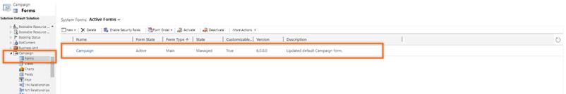       
4. From the **Field Explorer** pane displayed on the right side of the page, add the field **TmpRegardingObjectId** to the form.
   > [!div class="mx-imgBorder"]
   > 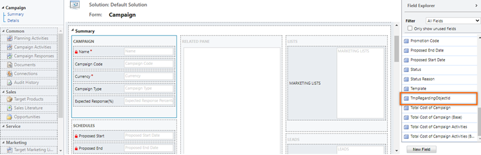
5. Select the **TmpRegardingObjectId** field, and then select **Change Properties**.
    The Set Properties window opens.
6. In the **Label** section, clear the **Display label on the Form** check box, and in the **Visibility** section, clear the **Visible by default** check box.     
 
   > [!div class="mx-imgBorder"]
   > 
7. Save and publish the form.

## I can't find a related account field for a member account by using advanced find in Unified Interface

**Reason**

The error occurs because the Contact or Account display name has been changed in the application, and the **Company Name (RELATED_TYPE)** picks the related type from the changed display name.

**Resolution**

In Unified Interface, the company name entity is available as **Company Name (Account)**. For example, if you rename the **Account** as **Organization**, the entity will be renamed as **Company Name (Organization)**.

## I can't send emails by using the email quick campaign distribution list

**Reason**

The issue occurs because of one of the following reasons:

- The users don't have permissions to send emails on behalf of other users.
- The owner of the record (marketing list members) hasn't allowed other Dynamics 365 users to send emails on the owner's behalf.

**Resolution**

To resolve the issue, do one of the following:

- For the user who's creating the quick campaign, the **Send Email as Another User** privilege must be assigned to at least one role assigned to the user. More information: [Create a security role with team member's privilege inheritance](/power-platform/admin/security-roles-privileges#create-a-security-role-with-team-members-privilege-inheritance)
    > [!div class="mx-imgBorder"]
    >    
- For the owner of the record, the **Allow other Microsoft Dynamics 365 users to send email on your behalf** check box must be selected under **Select whether other users can send email for you** on the **Set Personal Options** dialog box.
    > [!div class="mx-imgBorder"]
    > 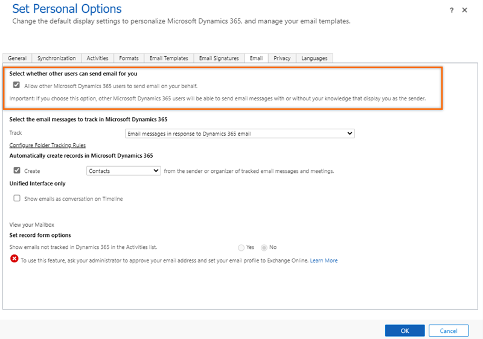

## I can't change the form field in the email within the quick campaign wizard

**Reason**

The issue is caused by insufficient permissions for the **Send Email as another User** option for your role.

**Resolution**

Provide sufficient permissions for the **Send Email as another User** option to one of your roles.

## I can't see email templates in the distribute dialog box

**Reason**

The Unified Interface implementation of the email template selector used during campaign distribution relies on certain access levels for different entities.

**Resolution**

To resolve the issue, users require access to system user records. Provide the access to system users by assigning them security roles in your Dynamics 365 organization. More information: [Configure user security to resources in an environment](/power-platform/admin/database-security)

## Campaign activity distribution issues

### The campaign distribution process is stuck with a status of Pending or Failed

**Reason**

The campaign distribution process requires a workflow to run in the background. When the workflow is disabled, campaign distribution won't be completed and will be stuck in a **Pending** or **Failed** state.

**Resolution**

To resolve this issue, enable the workflow background process and then activate the **ActivityPropagation** process.

#### Enable the workflow background process

1. Go to **Advanced Settings** > **Settings** > **System** > **System Jobs**.     
2. Go to **ActivityPropagation** jobs and under **Process Sessions**, select the job that matches&mdash;or approximately matches&mdash;the date and time at which the quick campaign was run.    
3. Verify that an error message is displayed under the details section, stating that the async operation was skipped because the org is in **Disable Background Processing** mode. Update the settings for your environment by doing the following:
   1. Go to the Dynamics 365 admin center, select your instance, and then select **Admin Settings**.
    > [!div class="mx-imgBorder"]
    >    
   1. Clear the **Disable background operations** check box.
    > [!div class="mx-imgBorder"]
    > 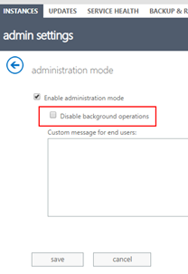
4. Save your settings, and exit.

#### Activate the ActivityPropagation process

1.	Go to **Advanced Settings** > **Settings** > **Customizations** > **Customize the System**.
2.	From the site map, go to **Processes**.
3.	In the view selector, select **All**.
    All the available processes are displayed.
    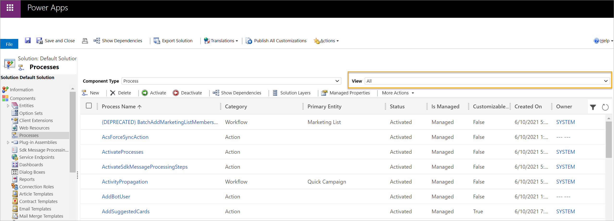   
4.	Select the **ActivityPropagation** process, and then select **Activate**.
    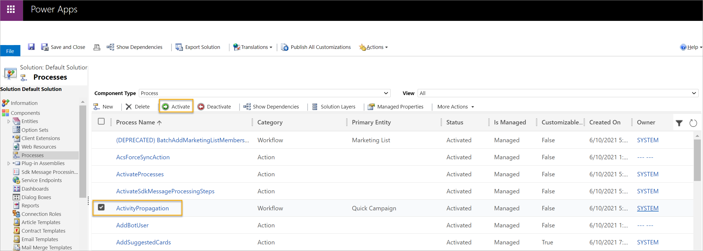  

### My quick campaign failed and is set to Aborted

**Reason**

The issue is caused by the failure of a stack trace that's related to the custom plug-ins in the workflow process.

**Resolution**

1. Go to **Advanced Settings** > **Settings** > **System** > **System Jobs**.
2. Go to **ActivityPropagation** jobs and under **Process Sessions**, select the job that matches&mdash;or approximately matches&mdash;the date and time at which the quick campaign was run.

The system job contains information that includes the stack trace that has the failure. Resolve the failure as mentioned in the stack trace failure documentation.

### The quick campaign is executing an unstoppable loop and generating thousands of failure records

**Reason**

Due to unknown conditions, when a workflow fails to create campaign activities, it goes into an unstoppable loop and keeps creating campaign activities, which all fail. You'll observe that the number of failures keeps increasing until it exceeds the number of members in the targeted marketing list.

**Resolution**

Deactivate the **ActivityPropagation** workflow, and then activate it again.

1.	Go to **Advanced Settings** > **Settings** > **Customizations** > **Customize the System**.
2.	From the site map, go to **Processes**.
3.	In the view selector, select **All**.
    All the available processes are displayed.
    > [!div class="mx-imgBorder"]
    >    
4.	Select the **ActivityPropagation** workflow, and then select **Deactivate**.
    > [!div class="mx-imgBorder"]
    > 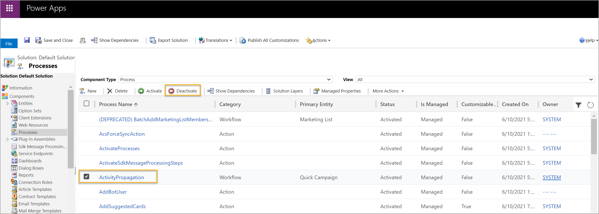   
5.	Wait 24 hours, and then reactivate the **ActivityPropagation** workflow.

### Campaign distribution doesn't create activities on target entities

Target records (account, contact, and lead) can identify their preferences for receiving marketing materials through campaign distribution: these include emails, phones, fax, and bulk mail.
Campaign activities are created for members of the Marketing List only when their preferences are set to **Allow** or **Send**.

> [!div class="mx-imgBorder"]
> 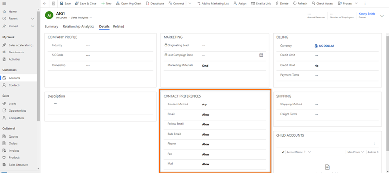

### Campaign distribution is failing for some members

**Reason**

Campaign distribution is based on the members in the marketing list. The member can be an account, contact, or lead. A campaign distribution can fail for members due to one of the following reasons:

- There's no email address associated with the member.
- The email address associated with the member is invalid.
- The member has configured the **Send Marketing Material** field in the member record as **Do not send**.

**Resolution**

Review the detailed reason for the failure in the **Excluded members** grid, and take any necessary action.  

## The Campaign tab isn't available in account, contact, or lead forms in Unified Interface

**Reason**

Because there's no direct relationship between the campaign table and accounts, contacts, or leads, the **Campaign** tab isn't available in those forms. The only way to view the campaign list is through a distributed campaign activity, because a distributed campaign activity is the true indication that a target entity is being used in a campaign.

**Resolution**

To resolve the issue, add the **Campaign Activities** tab to the form.

>[!NOTE]
>In this example, we're using the Account entity.

1. Go to **Advanced Settings** > **Settings** > **Customizations** > **Customize the System**.   
2. From **Components**, select **Entities** > **Account** > **Forms**.    
3. Open the form to which you want to add the subgrid.   
4. On the form page, select the **Insert** tab, and then select **One column**.   
    A new column is added as a tab.   
5. Select the tab, and then select **Change Properties**. The **Tab Properties** dialog opens.   
6. Enter the values for **Name** and **Label** as **Campaign Activities**, and then select **OK**. The tab is then renamed as **Campaign Activities**.   
7. Select the **Campaign Activities** tab, go to the **Insert** tab, and then select **Sub-Grid**.   
    The **Set Properties** dialog for the subgrid opens.   
8. On the **Display** tab, enter the following information:   
    -	In the **Name** section, for the unique name, enter **Campaign_Activities**.
    -	In the **Name** section, for **Label**, enter **Campaign Activities**.
    -	In the **Data Source** section, do the following:
        - For **Entity**, select **Campaign Activities**.
        - For **Default View**, select **All Campaign Activities**.

    > [!div class="mx-imgBorder"]
    > 

9. Save the changes and publish the form.

To verify that the issue has been resolved, open the account that has been used in campaigns and has some distributed campaign activities. Select the **Campaign Activities** tab to verify that the related campaign activities appear.

> [!div class="mx-imgBorder"]
> 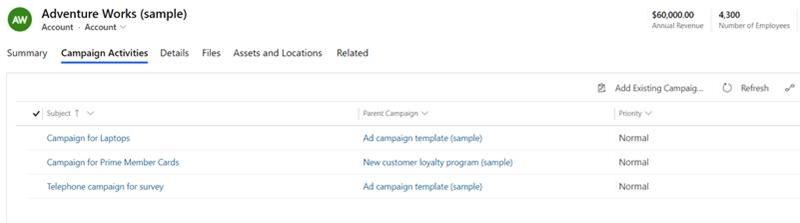

## User is getting timed out when trying to delete a static marketing list

**Reason**

Deletion of a static marketing list with a large number of members (more than 50,000) takes a lot of time, and results into a time out.

**Resolution**

It is recommended to first remove all members from the marketing list by using [Remove using Advanced Find](create-marketing-list-using-app-marketing-sales.md#remove-using-advanced-find), and then delete the marketing list. For the better performance of application and avoid time outs, remove the members in the marketing list in groups of 10,000 at a time. For example, if there are 20,000 members in a marketing list and you want to remove the members. Remove 10,000 members first and then remove the other 10,000.

### See also

[Frequently asked questions](faqs-sales.md)  
[Dynamics 365 Sales troubleshooting guide](troubleshooting.md)  

[!INCLUDE[footer-include](../includes/footer-banner.md)]
