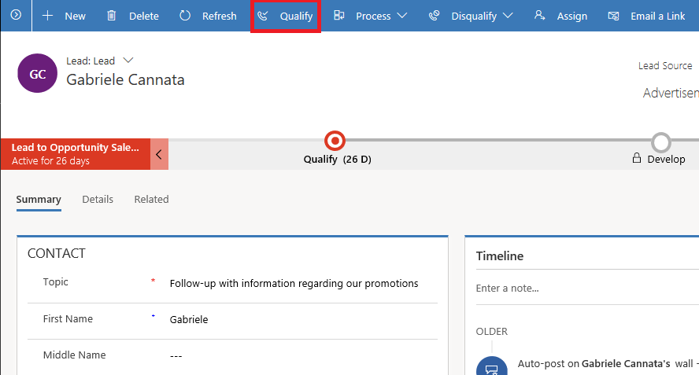
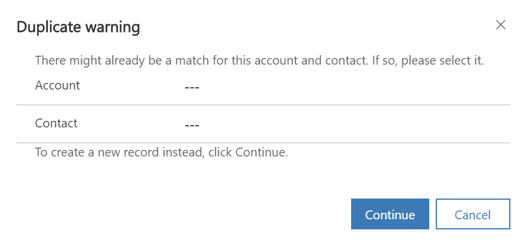
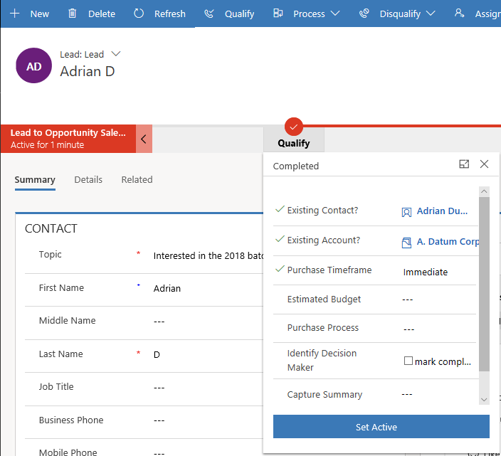
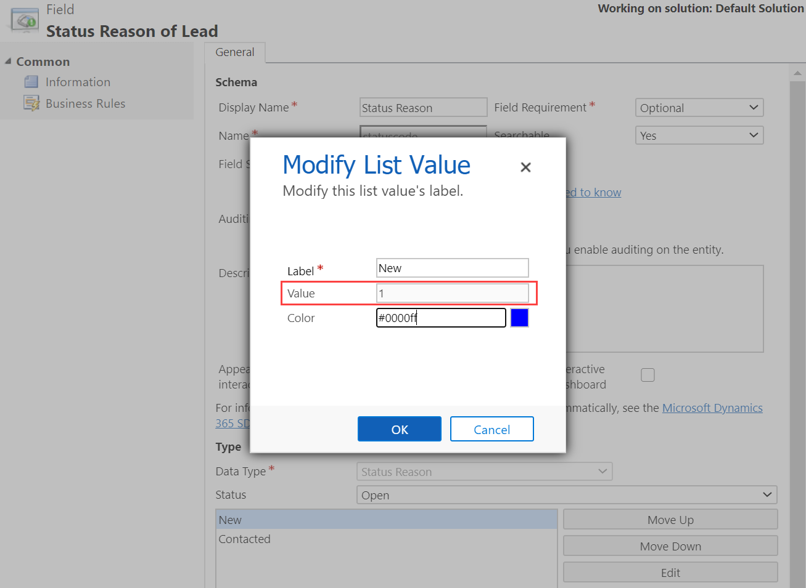
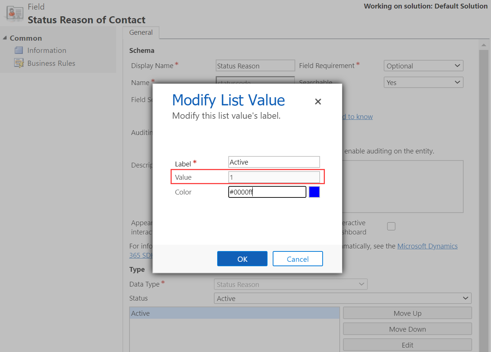
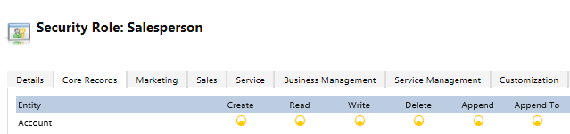
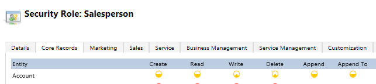
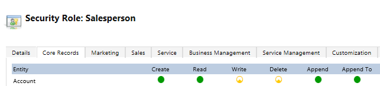

# Troubleshooting the Lead entity 

This article helps you troubleshoot and resolve issues related to the Lead entity.

**On this page:**
- [Issue: I can't qualify a lead](#cant_qualify_lead)
- [Issue: Insufficient permissions or Access denied error when a user is trying to qualify a lead](#insufficientpermissions)
- [Issue: The **Qualify lead** command is not available on the Lead record](#qualify-lead-not-available)
- [Issue: Account or contact-related fields aren't populating on the Lead form](#account-contact-fields-not-populating)

## Lead qualification issues and resolution (salespeople)

### How do I convert or qualify my leads?

You qualify a lead when you determine that the lead you've nurtured has a potential to turn into business. When you qualify a lead, it becomes an opportunity.

To qualify a lead, select **Qualify** on the command bar of the lead record.

> [!div class="mx-imgBorder"]  
> 

You can also qualify a lead from the list of leads. Go to **Sales** > **Leads**. Select the lead you want to qualify and on the command bar, select **Qualify**.

### Issue: I can't qualify a lead.

There are multiple errors you can get while qualifying a lead. 
1.  [Duplicate warning – There might already be a match for this account or contact. If so, please select it.](#duplicate)
2.  [To move to the next stage, complete the required steps](#CompleteSteps)
3.  [Active stage is not on 'lead' entity](#NoActiveStage)
4.  [Access denied or Insufficient permissions](#AccessDenied)
5.  [The lead is closed. You cannot convert or qualify a lead that is already closed.](#LeadClosed)
6.  [Invalid status code error](#invalid-status-code) for a contact or an opportunity
7.  [Can't proceed to the next stage when I select **Next stage** on the business process flow.](#cant-proceed-to-next-stage)

The following sections describe each of these errors and how you can resolve them.

#### 1. Duplicate warning – There might already be a match for this account or contact. If so, please select it.

> [!div class="mx-imgBorder"]  
> 

**Reason:**

When the lead is qualified to an opportunity, a corresponding account or contact is created. There might already be a match for this account or contact.

**Resolution:**

In the **Duplicate warning** dialog box, select the existing account or contact to avoid creating duplicates. To create a new record instead, select **Continue**.

> [!NOTE]
> When you qualify a lead through the Leads grid, the system creates an account or contact even though a duplicate record exists. By design, the rule that detects the duplicate records gets disabled. However, when you qualify a lead through the lead record form, the duplicate detection rule works. The rule prompts you with a warning to resolve the conflict if any duplicate records for account or contact are found.

#### 2. To move to the next stage, complete the required steps.

**Reason:** 

You haven't filled in data in all the business-required fields in the current stage of the process stage.

**Resolution:**

Fill in data in all the mandatory fields in the current stage, save the record, and then try qualifying the lead again.

#### 3. Active stage is not on 'lead' entity

**Reason:**

The lead that you're trying to qualify isn't in the Active state. This might happen when an already qualified lead has been reactivated.

**Resolution:**

1. Open the lead record.
2. On the process stage, select the **Set Active** button.

    > [!div class="mx-imgBorder"]  
    > 

 
#### 4. Access denied or Insufficient permissions

**Reason:**

You don't have sufficient permissions on the lead record. 

**Resolution:**

Ask your system administrator to grant you the necessary permissions.
If there's no error, and you're still not able to qualify a lead, contact the technical support.

#### 5. The lead is closed. You cannot convert or qualify a lead that is already closed.

**Reason:** 

You are trying to qualify or disqualify a lead that's closed. 

**Resolution:**

Make sure the lead that you're trying to qualify or disqualify is open and not already qualified or disqualified. You can do this by selecting the My Open leads or Open Leads view.

#### 6. Invalid status code error for a contact or an opportunity.

**Reason:**

When you qualify a lead, some of the attributes in the mapping of 1:N (one-to-many) relationships between **Lead to Contact** or **Lead to Opportunity** are copied from the Lead to Contact or Lead to Opportunity entities.

Status codes are defined as an option set. This issue occurs when a user adds a new option to the option set in the Lead entity, but not to the option set in the target entity.

For entity mapping to work, option sets&mdash;such as status codes&mdash;should be the same between lead and contact or lead and opportunity, because the lead qualification process copies the status code value from lead to contact or from lead to opportunity. If the status codes don't match, the process fails.

**Resolution:**

Ensure that the status codes of Lead and Contact entities, or Lead and Opportunity entities, are the same.

**To see the status codes of the Lead entity and the target entity**

1. In the Sales Hub app, go to **Settings** > **Customizations** > **Customize the System**.

2. Expand the Lead entity node, and select **Fields**.

3. Find the **statuscode** field, and double-click to open it.

4. Double-click a status to see its value.

    > [!div class="mx-imgBorder"]
    > 

5. Repeat steps 2 through 4 to see the status code for the target entity (for example, Contact).

    > [!div class="mx-imgBorder"]
    > 

**To see mappings**

1. In the Sales Hub app, go to **Settings** > **Customizations** > **Customize the System**.

2. Expand the Lead entity node, and select **1:N Relationships**.

3. Open the required relationship, and select **Mappings** in the left pane.

4. Scroll to see the mapping.

    > [!div class="mx-imgBorder"]
    > 

5. If you don't see the required mapping, select **New** to create it.

> [!NOTE]
> - If you're still getting the error, remove the mapping of the status code between the Lead entity and the target entity (Account, Contact, or Opportunity).
> - To add new status codes that have the same values, import the new option set values through a managed solution for the Contact or Opportunity entity.

#### 7. Can't proceed to the next stage when I select **Next stage** on the business process flow (lead to opportunity sales process).

**Reason:**

This is by design. When you haven't qualified the record, there will be no opportunity associated with it and you can't proceed to next stage.  

**Resolution:**
 
To resolve this issue, you must qualify the lead. Qualifying the lead automatically moves the lead to next stage (creating an opportunity). 

 
## Lead qualification issues and resolution (for system administrators)

 
### Issue: Insufficient permissions or Access denied error when a user is trying to qualify a lead.

How you resolve this error depends on the following ownership scenarios for the lead records. 

| Ownership scenario   |  Resolution steps       |
|--------------------- | -----------------       |
| The lead is owned by the user trying to qualify it. | <ol> <li> Make sure you have a system administrator role or equivalent permissions. </li><li> Go to **Settings** > **Security Role**.</li><li> Open the security role of the user.</li><li> On the **Core Records** tab, assign **Create**, **Read**, **Append**, and **Append To** permissions to the Security Role at User level on the following entities:<ul><li>  Account</li><li>Lead</li><li>Contact</li><li>Opportunity</li></ul>     <li> On the **Custom Entities** tab, assign Read access to any custom entity.</li><li> On the **Customizations** tab, assign **Read** access to **Attribute Map**, **Customizations**, **Entity**, and **Entity Map**.</li></ol> |
| The lead that the user is trying to qualify is in their business unit.  | <ol><li>Go to **Settings** > **Security Role**.</li> <li> Open the security role of the user.</li><li> Assign **Create**, **Read**, **Append**, and **Append To** permissions to the user's Security Role at Business Unit level on the following entities:<ul><li> Account</li><li>Lead</li><li>Contact</li><li>Opportunity</li></ul> <li> Assign **Read** access to any custom entity.</li><li>Assign **Read** access to **Attribute Map**, **Customizations**, **Entity**, and **Entity Map**.</li></ol>|
| The lead that the user is trying to qualify is in their organization.  | <ol><li>Go to **Settings** > **Security Role**.</li> <li> Open the security role of the user.</li><li> Assign **Create**, **Read**, **Append**, and **Append To** permissions to the user's Security Role at Organization level on the following entities:<ul><li> Account</li><li>Lead</li><li>Contact</li><li>Opportunity</li></ul> <li> Assign **Read** access to any custom entity.</li><li>Assign **Read** access to **Attribute Map**, **Customizations**, **Entity**, and **Entity Map**.</li></ol>|

During qualification of a lead, the records that (optionally) get created are: Opportunity, Contact, and Account. More information: [Qualify or convert leads](qualify-lead-convert-opportunity-sales.md) 

If the user is getting privilege-related errors even after assigning appropriate privileges as mentioned earlier in this section, it might be possible that they're missing privileges on some entities that are being accessed during creation of the account, contact, or opportunity records. For example, the user might be missing privileges on some custom entities that are accessed when some plug-ins or workflows run on some operation of the account, contact, or opportunity entities. 

To troubleshoot this further, follow these steps:

1. **Isolate the issue to creation of Opportunity, Account or Contact record:** Ask the user to try creating individual records of Account, Contact, and Opportunity and see if they get the same privilege-related issue on creation of these records. They might have privilege issues on one or more type of records, so it is important to perform this step for each record type. For example, they might not have appropriate privileges on Account and Contact entities.  

2. **Identify whether any plug-in/workflow registered on creation of entity is causing issues:** After isolating the issue to creation of a particular entity record, check whether any plug-in or workflow running on creation of these entity records is accessing some other entities on which the current user is missing privileges. For this, find out all the plug-ins or workflows registered on creation of entity records and deactivate them one by one to identify the plug-in or workflow causing the issue. Once you identify the plug-in or workflow causing the issue, deactivate it to unblock the record creation process. For more information about identifying all workflows registered for an entity, see [Deactivate custom workflow process](ts-oqoi.md#deactivate-custom-process). 

For more information about identifying plug-ins registered on creation of an entity record, see [Deactivate custom plug-in](ts-oqoi.md#deactivate-custom-plug-in). 

### Issue: The **Qualify lead** command is not available on the Lead record.

**Reason:**  

The out-of-the-box **Qualify lead** command is visible on the Lead form only if Account, Contact, Lead, and Opportunity entities are set as editable in the Unified Interface, and the Account, Contact, and Opportunity entities are available in Mobile offline. 

**Resolution:**

If the **Qualify lead** command isn't available, check the following:
- Account, Contact, Lead or Opportunity entities are set to read-only for mobile. If they are, clear the **Read-only in mobile** check box in entity customization so that the entity becomes editable for Unified Interface. More information: [Troubleshooting issues with the Unified Interface](ts-unified-interface.md)
- Check if the Account, Contact, and Opportunity entities are part of the mobile offline profile. If they aren't, add these entities to the profile and publish the changes. More information: [Enable entities for mobile offline synchronization](../mobile-app/setup-mobile-offline-for-admin.md#step-1-enable-entities-for-mobile-offline-synchronization)

## Automatic generation of contact or company-related fields

When you select an existing account or contact at the time of creating a new lead, the fields related to the account or contact are automatically populated. 
- For the contact-related fields to be automatically populated, the default fields such as Name, Job title, Business phone, Mobile phone, and Email must be empty.
- For the company-related fields to be automatically populated, the default fields such as Address, Website, and Company Name must be empty.

### Issue: Account or contact-related fields aren't populating on the Lead form.

**Resolution:** 

Verify that the On-load script in the Lead form has reference to 'LeadManagement/Lead/Lead_main_system_library.js' web resource. This web resource contains the script that automatically populates fields. If you've  customized the Lead form and used a web resource other than the out-of-the-box web resource, then this feature won't work. Contact your system administrator.

Even if you have a custom lead form, the automatic generation of fields works if the Lead form has reference to 'LeadManagement/Lead/Lead_main_system_library.js' web resource.

### Issue: Unable to autopopulate Website and Address fields on the Lead form.

**Resolution:**

This is by design. In the lead form, after selecting the existing account, only Company Name is autopopulated.

### See also

[Dynamics 365 Sales troubleshooting guide](troubleshooting.md)  

[!INCLUDE[footer-include](../includes/footer-banner.md)]