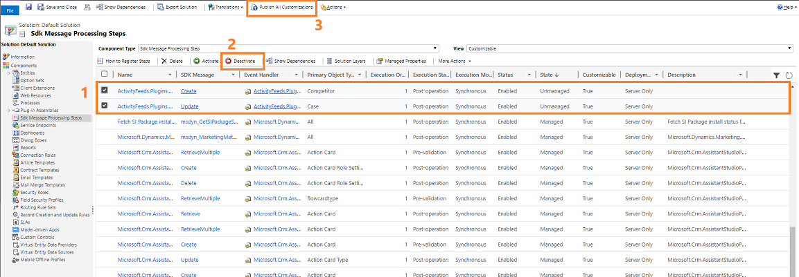
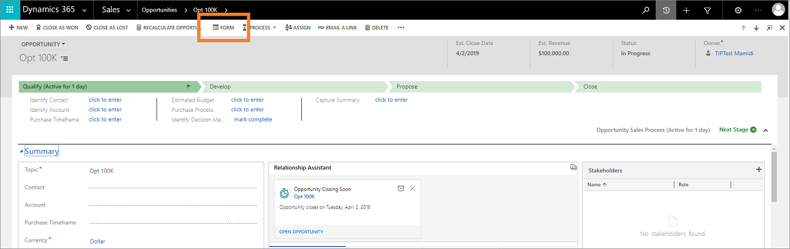
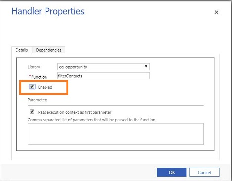
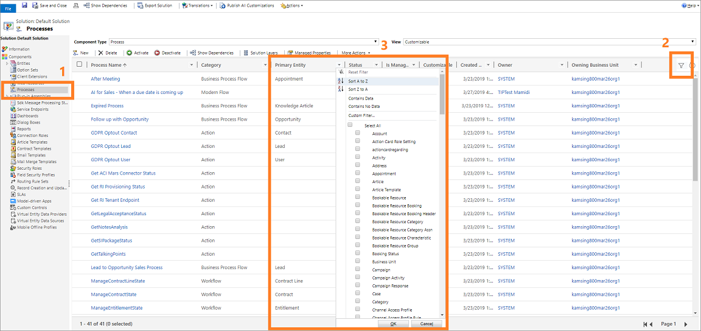

# Troubleshooting common issues across multiple entities 

This article helps you troubleshoot and resolve common issues across multiple entities like opportunity, quote, order, or invoice.

## Issue: Error or unexpected behavior while working on entities 

While working on entities (such as opportunities, quote, order, invoice, quote product, and order product), you observe unexpected behavior or an error in [!INCLUDE[pn_sales_business_doc_name](../includes/pn-sales-business-doc-name.md)]. The following are some of the errors that you might encounter while working on opportunities and this might be same for other entities:

- "Extended Amount is wrong after revising quote"- this error might have occurred due to Custom Plugin.
- "Error while saving the opportunity" - this error might have occurred due to Custom JavaScript.
- "Error while close opportunity" - this error might have occurred due to Custom Workflow.

These issues might occur due to improper customization of the application. You must verify these customization and resolve them. Perform the following verification methods to identify which customization is causing the issue and then resolve:

- [Deactivate custom plug-in](#deactivate-custom-plug-in)
- [Disable custom JavaScript](#disable-custom-javascript)
- [Deactivate custom workflow process](#deactivate-custom-process)

### Deactivate custom plug-in

1. Go to **Settings** > **Customizations** > **Customize the System**.
2. Select **Sdk Message Processing Steps**. 

   A list of available Sdk message processing steps is displayed.
3. Select the **Filter** icon, select the column **Primary Object Type Code (Sdk Message Filter)**, and then select the entity for which the error is occurring.
    
    > [!div class="mx-imgBorder"]
    > 

4. Select the **SDK Message Processing Steps** that are coming from the solutions owned by you. 

    > [!NOTE]
    > To view your custom SDK Message Processing Steps: 
    > a. Go to **Settings** > **Solutions** and then open the solution.  
    > b. Select **SDKMessage Processing Steps**. Verify the values are selected as:  **Component Type** to **SDK Message Processing Step** and **View** to **All**.

5. Select **Deactivate**.
6. Publish the customizations.
 
    > [!div class="mx-imgBorder"]
    > 

7. Verify the issue and if it doesn't occur, then the issue is with the custom SDK Message Processing Steps. Resolve the issue.

> [!NOTE]
> If the issue occurs, activate the **SDK Message Processing Steps** that you deactivated now and try to [Disable custom JavaScript](#disable-custom-javascript) or [Deactivate custom workflow process](#deactivate-custom-process).

### Disable custom JavaScript

1. Open the form editor of the entity in which the error is occurring. In this example, we are selecting the entity as Opportunities and the default solution form.

    > [!div class="mx-imgBorder"]
    > 

2. Select **Form Properties** on the form editor.

    > [!div class="mx-imgBorder"]
    > 

    The **Form Properties** dialog opens.

3. On the **Events** tab, select the control **OnLoad** from the **Events** drop-down list. 

   > [!div class="mx-imgBorder"]
   > 

4. Choose the custom **JavaScript** files that are coming from the solution owned by you.

   > [!NOTE]
   > To view your custom JavaScript:  
   > a. Go to **Settings** > **Solutions** and then open the solution.  
   > b. Select **WebResources**. Verify the values are selected as:  **Component Type** to **WebResources** and **View** to **All**. 
   > c. Select **Filter** icon to enable filter options for columns. Select **Type** and set the filter as **Script (JScript)**. 
   >> [!div class="mx-imgBorder"]
   >> 

5. Select **Edit**. In this example, we have selected the custom JavaScript file **eg_opportunity** to edit.
   
    > [!div class="mx-imgBorder"]
    >  

6. Clear the **Enabled** option and select **OK**.
 
    > [!div class="mx-imgBorder"]
    >  
 
7. Publish the customizations.

8. Verify the issue and if it doesn't occur, then the issue is with the custom JavaScript. Resolve the issue.

> [!NOTE]
> If the issue occurs, enable the JavaScripts that you disabled now and try to [Deactivate custom plug-in](#deactivate-custom-plug-in) or [Deactivate custom workflow process](#deactivate-custom-process).

### Deactivate custom process

1. Go to **Settings** > **Customizations** > **Customize the System**.
1. Select **Processes**. These process include Workflow, Business Process Flow, and Business Rule.
   A list of available processes is displayed.
3. Select the **Filter** icon, select the column **Primary Entity**, and then select the entity for which the error is occurring.
    
    > [!div class="mx-imgBorder"]
    > 

4. Choose the processes that are coming from the solutions owned by you.

    > [!NOTE]
    > To view your custom Processes: 
    > a. Go to **Settings** > **Solutions** and then open the solution.  
    > b. Select **Processes**. Verify the values are selected as:  **Component Type** to **Processes** and **View** to **All**.

5. Select **Deactivate**.
6. Publish the customizations.
 
    > [!div class="mx-imgBorder"]
    >  

7. Verify the issue and if it doesn't occur, then the issue is with the custom processes. Resolve the issue.

> [!NOTE]
> If the issue occurs, activate the **Processes** that you deactivated now and try to [Deactivate custom plug-in](#deactivate-custom-plug-in) or [Disable custom JavaScript](#disable-custom-javascript).

### See also

[Dynamics 365 Sales troubleshooting guide](troubleshooting.md)  