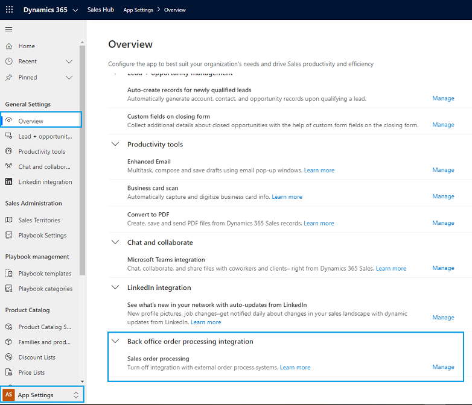

# Troubleshooting the Order entity 

This article helps you troubleshoot and resolve issues related to the Order entity.

## Issue: I don't see the Create invoice button on my order forms

Sales order processing integration connects Dynamics 365 Sales with an external, back-office order-processing application. When enabled, it allows a sales order created in Dynamics 365 Sales to be submitted and then synchronized with an external order processing application, where the lifecycle of the order continues. When the integration is enabled, users don't see the **Create Invoice** button on order records. If the integration is enabled unintentionally, you can disable it.  

**To disable sales order processing integration**

1. In the Sales Hub app, at the bottom of the site map, select **Change area** , and then select **App Settings**.

2. Under **General Settings**, select **Overview**. 

    When sales order processing is already enabled, users with the System Administrator role or equivalent permissions will see the **Back office order processing integration** setting on the **Overview** page.

    > [!div class="mx-imgBorder"]  
    > 
 
3. Select **Manage**. 

4. To disable the integration, switch **Sales order processing** to **Off**, and then select **Save**.

    > [!div class="mx-imgBorder"]  
    > 

    > [!IMPORTANT]
    > - The **Back office order processing integration** setting is visible only when sales order processing is already enabled. 
    > - After the setting is disabled, users will no longer see this setting. 
    > - This setting can be used only to disable sales order processing in case it was turned on unintentionally through some solution installation. This setting can't be used to turn _on_ sales order processing. To learn about turning on sales order processing, see [Enable sales order processing integration](developer/enable-sales-order-processing-integration.md).

### See also

[Dynamics 365 Sales troubleshooting guide](troubleshooting.md)  

[!INCLUDE[footer-include](../includes/footer-banner.md)]