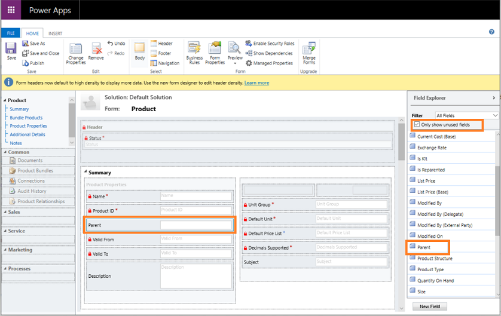

# Troubleshooting the Product entity

Follow the instructions in this article to troubleshoot the issues you might face while working with the Product entity in Dynamics 365 Sales.

<a name="reparenting_not_working"> </a>


## Issue: Reparenting isn't working, or the Parent field isn't visible

_Product reparenting_ allows you to change the parent of an existing product record so the child products will inherit the appropriate product properties. More information: [Change the parent of a product](change-product-parent.md)

If you don't see the **Parent** field on the Product form, it could be because you've customized the **Product Main** form by using the unmanaged solution. More information: [Solutions overview](/powerapps/maker/common-data-service/solutions-overview#managed-and-unmanaged-solutions)

In some cases, **Product** forms aren't merged properly and because of this, the required **Parent** field isn't added to the form.

To resolve this, you must add the **Parent** field back to the form. You can do this through customization or by using the solution import/export wizard. More information: [Export solutions](/powerapps/maker/common-data-service/export-solutions), [Import solutions](/powerapps/maker/common-data-service/import-update-export-solutions) 

**To add the Parent field through customization**

1.  In your app, select the **Settings** icon, and then select **Advanced Settings**.

    > [!div class="mx-imgBorder"]
    > 

    The **Business Management** page opens.

2.  On the navigation bar, select **Settings**, and then under **Customization**, select **Customizations**.

3.  Select **Customize the System**.

4. Under **Components** in Solution Explorer, expand **Entities**, and then expand the **Product** entity. 

5. Select **Forms**, and then open the **Product** form of type **Main** that's in the **Active** state.

6. In the form editor, select the **Parent** field from Field Explorer and drag it to the **Summary** section on the left side of the form editor.

    > [!div class="mx-imgBorder"]
    > 

7. Select **Save**, and then **Publish**.

**To add the Parent field through the solution import/export wizard**

In the unmanaged solution, add the following row in the Product main form:

 ```XML
<row>
<cell id="{faaa2942-4737-4721-9a19-7dcbf4eb2911}" showlabel="true" locklevel="0" colspan="2">
<control id="editableParentControl" classid="{270BD3DB-D9AF-4782-9025-509E298DEC0A}" datafieldname="parentproductid" disabled="false">
<parameters>
<DefaultViewId>{19d7f2e0-e427-40fb-85e8-53e7cef2b166}</DefaultViewId>
<IsInlineNewEnabled>false</IsInlineNewEnabled>
<DisableMru>true</DisableMru>
</parameters>
</control>
</cell>
</row>
```
<a name="decimal-supported-not-honored"> </a>
## Issue: List Price, Standard Cost, or Current Cost fields don't honor Decimal Supported field precision value.

**Resolution**

There's no relation between the **Decimal Supported** and the **List Price** field. The value defined in the **Decimal Supported** field doesn't impact the precision value of the **List Price** field. The decimal precision value on the **List Price**, **Standard Cost**, or **Current Cost** field is controlled by the **Pricing Decimal Precision** setting. By default, "**Pricing Decimal Precision"** is set to **2**. For more information about this setting, see [System Settings General tab](/power-platform/admin/system-settings-dialog-box-general-tab). For more information about decimal precision, see [Decimal precision in currency and pricing](decimal-precision-currency-pricing.md)


<a name="decimal-value-not-accepted"> </a>
## Issue: I get an error when setting the Quantity field to a decimal value in the Order Product, Quote Product, Invoice Product records.

**Resolution**

The **Quantity Selling Option** field of the price list item record decides whether the product or service can be ordered in whole, partial, or both types of quantities. To be able to enter decimal values in the **Quantity** field, make sure the **Quantity Selling Option** field isn't set to **Whole**. More information: [Define product pricing with price lists and price list items](create-price-lists-price-list-items-define-pricing-products.md) 


<a name="decimal-supported-value-error"> </a>
## Issue: I get an error while opening or saving a Product record when the Decimal Supported field has value > 2. 

**Resolution**
 
If the **Quantity On Hand** field is used on the form, the value for the **Decimal Supported** field must not be greater than the precision of **Quantity On Hand**.

To fix this, go to **Settings** &gt; **Customizations** &gt; **Entities** &gt; **Fields** &gt; **Quantity On Hand**. Make sure the **Precision** value is the same as the **Decimal Supported** value.


### See also

[Dynamics 365 Sales troubleshooting guide](troubleshooting.md)  


[!INCLUDE[footer-include](../includes/footer-banner.md)]
