# Troubleshooting entity views 

This article helps you troubleshoot and resolve issues related to entity views.

## Issue: I can't see data in certain columns in entity views

**Reason:**
This error is occurring due to mismatch of column names between the `layoutxml` and `fetchxml` in the view ODATA file (*OrgUrl*/api/data/*Dynamics 365 version*/savedqueries(*ViewId*)). 

**Resolution:**
To resolve this issue, you must remove and add back the column that is causing this error. This will ensure that the column names in `layoutxml` and `fetchxml` are matched.

> [!NOTE]
> Before you start resolving the issue, take note of the view for which this error is occurring.

1. Go to **Settings** > **Customizations** > **Customize the System**.
2. Select the entity > **Views** and select the view that has this error. In this example, we're selecting the entity **Account** and view as **Accounts Being Followed**.

    > [!div class="mx-imgBorder"]
    > 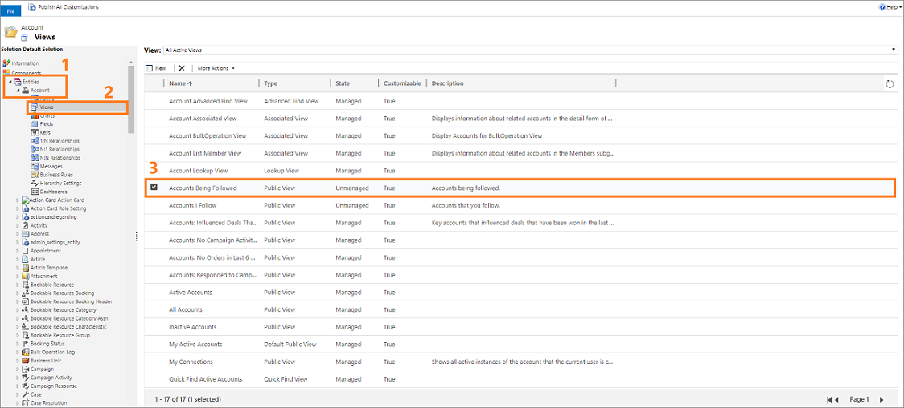

3. Select **More Actions** > **Edit**. 

    The view edit page opens.

    > [!div class="mx-imgBorder"]
    > 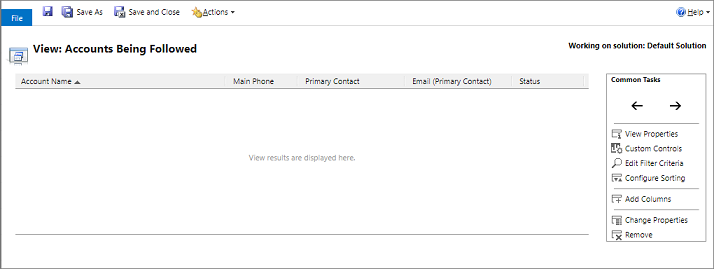

4. Select the column that is causing the issue and select **Remove**. In this example, we select the column **Email (Primary Contact)** to remove.

    > [!div class="mx-imgBorder"]
    > 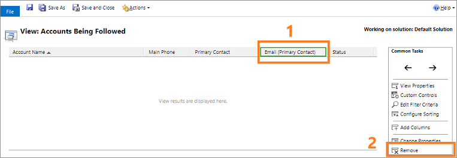

    The column is removed from the view.

5. Add back the column that you've deleted. Select **Add Columns** and readd the column that you removed. In this example, we're adding  the column **Email (Primary Contact)** that was removed.

    > [!div class="mx-imgBorder"]
    > 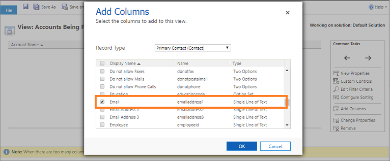
   
    The data in the columns is displayed properly.

## Issue: I can't see some records in the entity views

**Reason:**
This error is occurring due to the filtering of data on a view. 

**Resolution:**
To resolve this issue, you must edit or remove filters for the view. This will ensure that filters are applied properly for the view.

> [!NOTE]
> Before you start resolving the issue, take note of the view for which this error is occurring.

1. Go to **Settings** > **Customizations** > **Customize the System**.
2. Select the entity > **Views** and select the view that has this error. In this example, we're selecting the entity **Account** and view as **Accounts I Follow**.

    > [!div class="mx-imgBorder"]
    > 

3. Select **More Actions** > **Edit**. 

    The view edit page opens.

    > [!div class="mx-imgBorder"]
    > 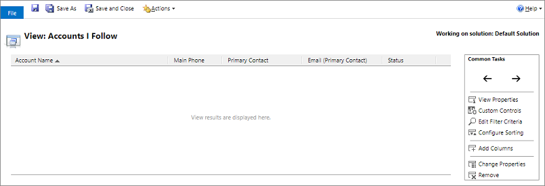

4. Select **Edit Filter Criteria** and recheck the filter condition either by updating or deleting.

    > [!div class="mx-imgBorder"]
    > 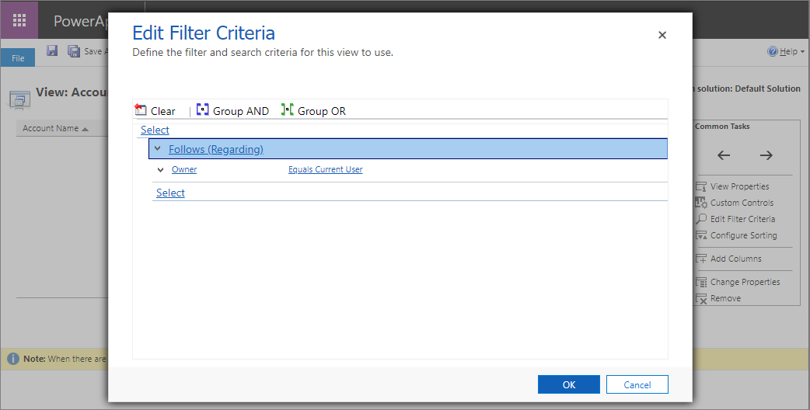
   
    The records in the views are displayed properly.

## Issue: I can't see some records in opportunity, quote, order, or invoice subgrids

While working on opportunity, quote, order, or invoice records, you might observe that some records are missing.

**Reason**

-   You might not see some records because of an error that occurred due to customization done to the subgrid.

**Resolution**

To fix the issue of incorrect customization, follow these steps to make sure your subgrid is configured correctly:

1.  In your app, on the nav bar, select the **Settings** icon, and then select **Advanced Settings**.

    > [!div class="mx-imgBorder"]
    > 

    The **Business Management** settings page opens in a new browser tab.

2. On the navigation bar, select **Settings**, and then under **Customization**, select **Customizations**. 

3. Select **Customize the System**.

4. Under **Components** in the solution explorer, expand **Entities**, expand **Opportunity**, and then select **Forms**.

5. Open the Opportunity form of type **Main**.

6. Double-click to select the **Connections** section in the **Product Line Items** section.

    > [!div class="mx-imgBorder"]
    > 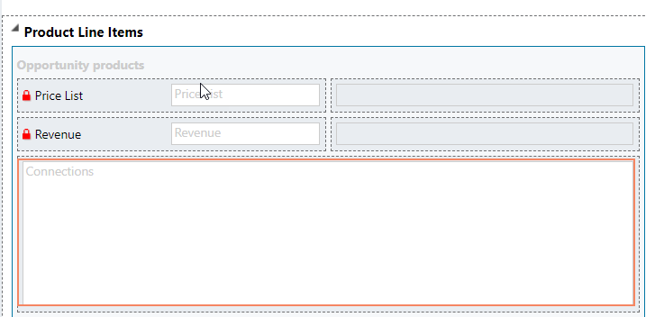

    The **Set Properties** dialog box opens.

    > [!div class="mx-imgBorder"]
    > 

7. On the **Controls** tab, double-click to select **Editable Grid**.

    > [!div class="mx-imgBorder"]
    > 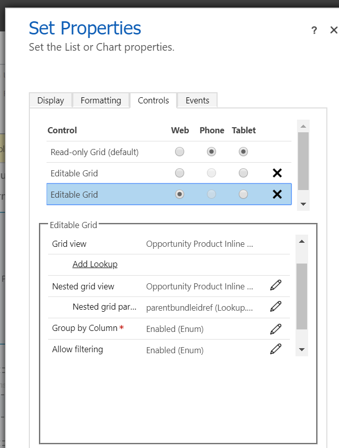

8. Make sure that all values are set correctly:

    -  Grid View: Opportunity Product Inline Edit View

    -  Nested Grid View: Select the pencil icon and fill in the following details:

        > [!div class="mx-imgBorder"]
        > 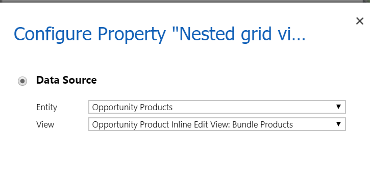

        -   Entity: Opportunity Products

        -  View: Opportunity Product Inline Edit View: Bundle Products

    -   Nested grid parent ID: parentbundleidref

    -   Group by Column: Enabled (Enum)

    -   Allow filtering: Enabled (Enum)

    -   Hide nested grid column header: Hide Column

        >[!NOTE]
        >If you're using product bundles and edit these bundled line items in the product grid, select **Hide nested grid column header** as **Show Column**.

## Issue: I can't update nested bundle items on the Product tab 

**Reason**

While working on an opportunity, when you update nested bundle items on the **Product** tab, the save icon is disabled. This error occurs because the header of the nested grid column is hidden under **Opportunity Product Inline Edit View** in customizations.  

**Resolution**

To resolve this issue, follow these steps to show the header of the nested grid columns for products on the opportunity form.

1.  In your app, on the nav bar, select the **Settings** icon, and then select **Advanced Settings**.

    > [!div class="mx-imgBorder"]
    > 

    The **Business Management** settings page opens in a new browser tab.

2. On the navigation bar, select **Settings**, and then under **Customization**, select **Customizations**. 

3. Select **Customize the System**.

4. Under **Components** in the solution explorer, expand **Entities**, expand **Opportunity**, and then select **Forms**.

5. Open the **Opportunity** form of form type **Main**.

6. In the **Product Line Items** section, double-click to select the **Opportunity products** section.

    > [!div class="mx-imgBorder"]
    > 
    
    The **Set Properties** dialog box opens.

    > [!div class="mx-imgBorder"]
    > 

7. On the **Controls** tab, double-click to select **Editable Grid**.

    > [!div class="mx-imgBorder"]
    > 

8. In the **Editable Grid** section, select the pencil icon next to **Hide nested grid column header**. 
    
    > [!div class="mx-imgBorder"]
    > 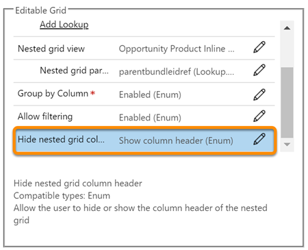

9. In the **Configure Property** dialog box, under **Bind to static options**, select **Show column header**.
    
    > [!div class="mx-imgBorder"]
    > 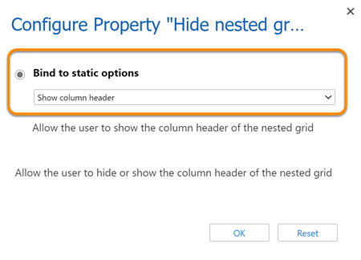

10. Save and publish the configuration.

## Issue: When I select Opportunities from the site map, I can't see opportunity records in the legacy web client while I can see them in Unified Interface 

**Reason**

Records are shown in the list based on entity views. The issue might occur when there's no public view marked as the default view for an entity.  

**Resolution**

Select one of the public views of the entity as default. This ensures the views are displayed as expected. To learn how to make a view as your default view, see [Specify a model-driven app default view](/powerapps/maker/model-driven-apps/specify-default-views)

> [!NOTE]
> If you still can't see the records, clear the browser cache and try again.

### See also

[Frequently asked questions](faqs-sales.md)  
[Dynamics 365 Sales troubleshooting guide](troubleshooting.md)  

[!INCLUDE[footer-include](../includes/footer-banner.md)]
