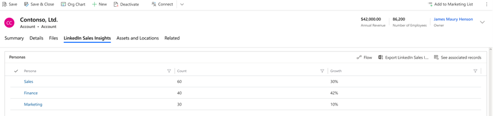

# Understand the LinkedIn Sales Insights tab

The **LinkedIn Sales Insights** tab in **Account** records provides information about the company and personas that are defined for the company within LinkedIn Sales Insights. When the solution is installed, two new entities are created in Dynamics 365 Sales:

- LinkedIn Sales Insights Company Profile (one company profile record related to each account)
  > [!div class="mx-imgBorder"]
  > 

- LinkedIn Sales Insights Personas (three persona records related to each account)
  > [!div class="mx-imgBorder"]
  > 

When CRM sync for LinkedIn Sales Insights is enabled, LinkedIn Sales Insights for Dynamics 365 brings data from all accounts that are matched in LinkedIn Sales Insights into account records in Dynamics 365. While configuring the data pipeline from LinkedIn, customers have the option to automatically update the data every 24 hours.

| Entities | Parameter information |
|----------|-----------------------|
| Company Profile |•  LinkedIn ID •  Company Page URL •  Company Name •  Industry •  Global Employee Count •  Global Employee Growth (%) •  Headquarters City •  Headquarters State •  Headquarters Country •  Company Website URL •  Last Update |
| Personas |•  Name •  Employee Count •  Employee Growth |

### See also

[Install or delete the LinkedIn Sales Insights solution](install-lsi-solution.md)     
[LinkedIn Sales Insights for Dynamics 365 Sales - Installation Guide](https://www.linkedin.com/help/sales-navigator/answer/a419445)
