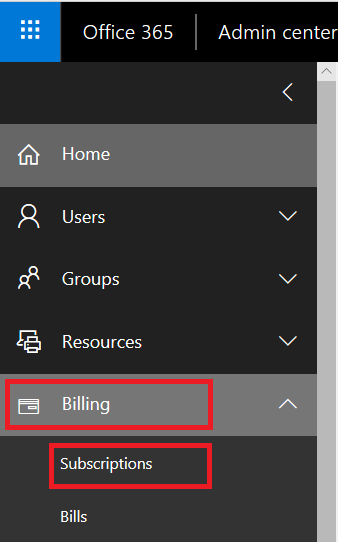
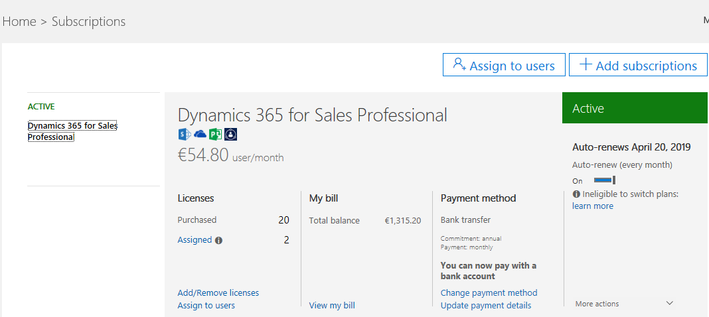
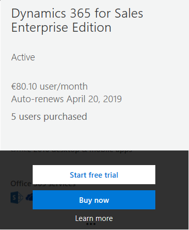
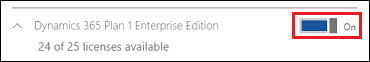
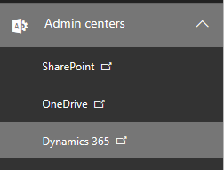

# Move from Dynamics 365 Sales Professional to Dynamics 365 Sales Enterprise

[!INCLUDE[pn-dyn-365-sales](../includes/pn-dyn-365-sales.md)] Professional is targeted at businesses that have simpler sales needs and do not require the full sales capabilities. However, if at any point you find your requirements growing, you can easily upgrade to [!INCLUDE[pn-dyn-365-sales](../includes/pn-dyn-365-sales.md)] Enterprise. 

The upgrade process involves three steps:

1. Purchasing a [!INCLUDE[pn-dyn-365-sales](../includes/pn-dyn-365-sales.md)] Enterprise subscription.

2. Assigning [!INCLUDE[pn-dyn-365-sales](../includes/pn-dyn-365-sales.md)] Enterprise licenses to the users.

3. Installing the [!INCLUDE[pn-dyn-365-sales](../includes/pn-dyn-365-sales.md)] Enterprise edition solution.

4. Deleting the [!INCLUDE[pn-dyn-365-sales](../includes/pn-dyn-365-sales.md)] Professional solution. 

## Purchase Dynamics 365 Sales Enterprise Edition subscription

1. Sign in to Office 365 at admin.microsoft.com with the Dynamics 365 account that has admin permissions.

2. Select **Billing** > **Subscriptions**.

   > [!div class="mx-imgBorder"]
   > 

   You’ll see the active subscriptions. 

   > [!div class="mx-imgBorder"]
   > 

3. Select **Add subscriptions**.

   The **Purchase Services** page opens. You’ll see a tile for [!INCLUDE[pn-dyn-365-sales](../includes/pn-dyn-365-sales.md)] Enterprise Edition.

   > [!div class="mx-imgBorder"]
   > 
 
4. In the **[!INCLUDE[pn-dyn-365-sales](../includes/pn-dyn-365-sales.md)] Enterprise Edition** tile, move your mouse over the Ellipses icon and select **Buy Now**, and then follow the steps to purchase new licenses. 

   > [!div class="mx-imgBorder"]
   > 

## Assign licenses to your users

After you’ve purchased the licenses, assign the licenses to users. 

1.	On the Microsoft 365 admin center, select **Users** > **Active users**.

2.	Select multiple users, and then select **Edit product licenses**. 
    
   > [!div class="mx-imgBorder"]
   > 

3.	Select **Replace existing product license assignments**, and then select **Next**. 

4.	Turn on the license for your Dynamics 365 Sales plan. 

   > [!div class="mx-imgBorder"]
   > 

5.	Select **Replace**, and then select **Close** twice. 

6.	Review the license status on the **Active users** page and make other assignments as needed. 

   > [!div class="mx-imgBorder"]
   > 

## Install Dynamics 365 Sales Enterprise solution

1.	In the Microsoft 365 admin center, select **Admin Centers** > **Dynamics 365**.

   > [!div class="mx-imgBorder"]
   > 
    
    The **Dynamics 365 Administration Center** opens.

2.	On the **Instances** tab, select your production instance, and on the product instance tile, select the **Manage your solutions**  icon.

   > [!div class="mx-imgBorder"]
   > 

3.	On the **Manage your solutions** page, select **Dynamics 365 Sales Application**, and on the tile, select **Install**.

After you complete these steps, your organization will be effectively upgraded to [!INCLUDE[pn-dyn-365-sales](../includes/pn-dyn-365-sales.md)] Enterprise.

## Delete the Dynamics 365 Sales Professional solution

1.	Make sure that you have the System Administrator or System Customizer security role or equivalent permissions.

2.	Sign in to Dynamics 365. 

3.	Select **Settings** > **Solutions**. 

4.	Select the [!INCLUDE[pn-dyn-365-sales](../includes/pn-dyn-365-sales.md)] Professional solution and select **Delete**. 

    > [!NOTE]

    > When you delete this solution, the Sales Pro app module is deleted, and any configuration specific to this app module such as its site map and form preferences are also lost.

> [!IMPORTANT]
> 
> As per contractual agreement, you can't mix and match Enterprise and Professional users on the same instance. If you plan to keep Professional licenses, make sure you abide by the contractual requirements. More information: [Microsoft Dynamics 365 Licensing Guide](https://go.microsoft.com/fwlink/?LinkId=866544)

### See also

[Dynamics 365 Licensing Update](https://docs.microsoft.com/dynamics365/licensing/update)
