# Use Sales Hub on the mobile app

Access your Sales Hub data while you're on the go using Dynamics 365 for phones or Dynamics 365 for tablets on your mobile device.

The Sales Hub app works the same whether you're using it on your mobile device or using it on a web browser on your computer.

Before you can start using the app, you need to install the Dynamics 365 for mobile app on your device device. 

[!INCLUDE[proc_more_information](../includes/proc-more-information.md)] [Install Dynamics 365 for phones and tablets](../mobile-app/install-dynamics-365-for-phones-and-tablets.md).

## Basic Navigation

1.	When you sign in, you'll see the MyApps page with all your apps listed. 
2.	Select **Sales Hub**.

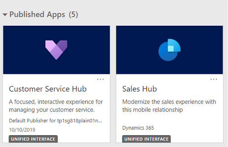

**The navigation bar**

Use the nav bar to get to your work area, create a new record, search, or do other tasks. To access more commands, tap 

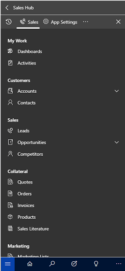

**Favorites and recently used records**

The Favorites and Recently Used sections provide quick access to your records, views, and dashboards. 

- To access these sections, choose the **Menu**  button on the nav bar, and then choose the **Favorites and Recent**  button.

- To pin an item as a favorite, from the list of **Recently Used** items, tap the pin. This will pin and move the item to **Favorites**.

  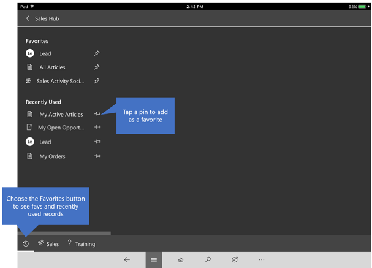
  
## How to use the Dynamics 365 for phones mobile app on the go  

Dynamics 365 for phones mobile app is designed to be your work assistant. The app helps you to engage with customers, close more deals, and acts as your office assistant.

Here are a few tasks that you could perform on your day-to-day activities using the Sales Hub app module on the Dynamics 365 for phone mobile app:

- [Plan for your day](#plan-for-your-day)

- [Attend meetings with information at your fingertips](#attend-meetings-with-information-at-your-fingertips)

- [Take notes in a meeting](#take-notes-in-a-meeting)

- [Update deals and customer information after a meeting](#update-deals-and-customer-information-after-a-meeting)

- [Search contact or account](#search-contact-or-account)

- [Add and qualify lead](#add-and-qualify-lead)

- [Generate and share quotes and order](#generate-and-share-quotes-and-order)

- [Manage your to-do list](#manage-your-to-do-list)

- [Work offline when you have intermittent connectivity](#work-offline-when-you-have-intermittent-connectivity)

### Plan for your day

As you start your day and to know how busy your day is, go to **My Appointments**. The **My Appointments** feature provides insights on your meetings, travel, and free time. With this information, you can plan for the day ahead by reviewing who you will be meeting during the day, where you need to travel, and how much free time you have left.

To view your appointments, follow these steps:

1. Open **Sales Hub** app on your mobile device.

2. Select Site map > **My Activities** >  **My Appointments**.

### Attend meetings with information at your fingertips

During your travel, open any appointment in the calendar to view more details such as the start time, duration, and description of the meeting. The following image is an example of appointment details. 

> [!div class="mx-imgBorder"]
> 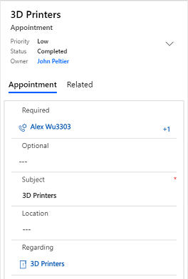

Further, select the **Regarding** field to view which opportunity or account the meeting is about. As you view the opportunity or account, review the timeline of notes and past activities to ramp-up on past context.

> [!div class="mx-imgBorder"]
> 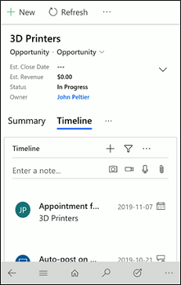

### Take notes in a meeting

It's no longer necessary for you to open a laptop to add notes to an opportunity. The Sales Hub mobile app allows you to quickly add notes to an opportunity through your mobile device. 

To add notes to an opportunity, follow these steps:

1. Open **Sales Hub** app on your mobile device.

2. Select Site map > **Opportunities** >  **My Opportunities**.

3. On the opportunity, go to timeline section and add a note. 

    > [!div class="mx-imgBorder"]
    > 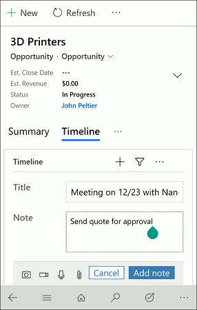

4. (Optional) If the customer is showing interest in additional products, go to **Product line items**, select **More options** > **+ Add Product** and then select a product from the catalog or enter a product.

    > [!div class="mx-imgBorder"]
    > 

5. (Optional) If you have met a new stakeholder at the customer’s offices, go to the **Stakeholder** section, select **More options** > **+ New Connection** and add the stakeholder. You can also add the contact from an account record.

    > [!div class="mx-imgBorder"]
    > 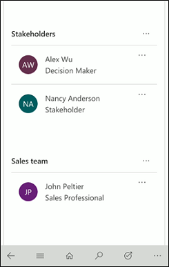

### Update deals and customer information after a meeting

After you step out of a meeting, you can quickly update information about the deal or the opportunity.

Follow these steps:

1. Open **Sales Hub** app on your mobile device.

2. Open the opportunity from the relevant appointment

    OR
    
    Select Site map > **Opportunities** >  **My Opportunities**.
    
3. On the opportunity, you can update the forecasted revenue or move to the next stage. 

    > [!div class="mx-imgBorder"]
    > 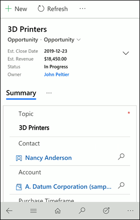

4. To create a follow-up appointment for the opportunity, go to **Appointments** tab and the select **More options** > **+ New Appointment**.

    > [!div class="mx-imgBorder"]
    > 

    On the quick create appointment page, enter the necessary information and save.

    > [!div class="mx-imgBorder"]
    > 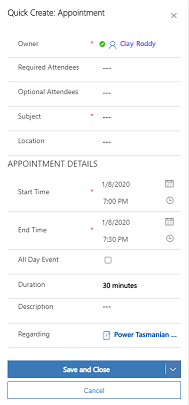

    Once the appointment is complete, you can open the appointment and mark as complete.

### Search contact or account

You can search and find information about a contact or account referenced in a meeting. Follow these steps:

1. Open **Sales Hub** app on your mobile device.

2. Select Site map > **Customers** >  **Contacts**.

    For accounts, select **Accounts**.

    > [!div class="mx-imgBorder"]
    > 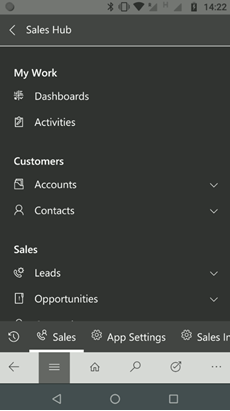

3. On the contacts page, select **More options** > **Search**. 

    The search page opens.

4. In the search, enter the name you want to search and the results are displayed. 

    > [!div class="mx-imgBorder"]
    > 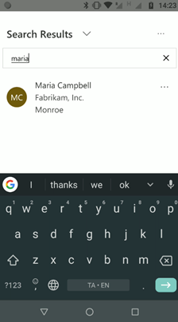

5. Select and open the contact to view more information.

### Add and qualify lead

When you met a new lead at an event and you can immediately add the lead through the app and qualify to make sure your team has visibility over the progress right away. 

Follow these steps to add and qualify the lead:

1. Open **Sales Hub** app on your mobile device.

2. Select Site map > **Sales** >  **Leads**.

3. On the leads page, select **More options** > **+ New**.

    > [!div class="mx-imgBorder"]
    > 

4. Enter necessary information and save the lead.

5. To qualify a lead, open the lead and select  **More options** > **Qualify**.

    > [!div class="mx-imgBorder"]
    > 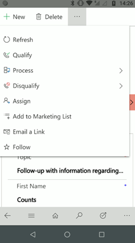

### Generate and share quotes and order

After a successful meeting, you can quickly generate a PDF of the quote from an opportunity or a PDF of the order related to an account and share it with the customer who requests it.

Follow these steps:

1. Open **Sales Hub** app on your mobile device.

2. Select Site map > **Opportunities** >  **My Opportunities**.

3. Open the opportunity for which you want to generate PDF of quote and select **More options** > **Quote**. 

    > [!div class="mx-imgBorder"]
    > 

4. In the quote section, select **More options** > **+ New Quote**. A quote is generated.

    > [!div class="mx-imgBorder"]
    > 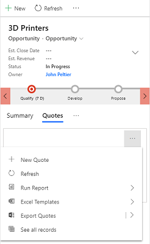

5. On the quote page, select **More options** > **Email as PDF** > **Print quote for customer**.

    An email opens with the quote as attachment.

    > [!div class="mx-imgBorder"]
    > 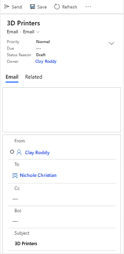

6. Send the email.

### Manage your to-do list

Before you wrap up the day, make sure your opportunity status is reflected correctly in the dashboards. 

> [!div class="mx-imgBorder"]
> 

Quickly review pending tasks and close the ones you got to during the day. Follow these steps:

1. Open **Sales Hub** app on your mobile device.

2. Select Site map > **My Work** > **Activities**.

3. On the activities page, select **My Tasks** view.

    > [!div class="mx-imgBorder"]
    > 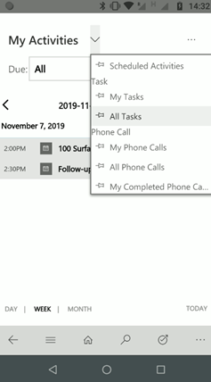

    Review your tasks and close the tasks that you have completed.

### Work offline when you have intermittent connectivity

The Sales Hub on Dynamics 365 for mobile is available in offline mode if you have intermittent connectivity. Select the **Enable Mobile Offline** option in the app module properties to access the Sales Hub app offline. 

You must also add users for offline access by associating a mobile offline profile to their user records before they work offline. You can use the **Sample Sales Scenario** mobile offline profile that is shipped out-of-the-box or create your own profile. For more information, see [Set up mobile offline synchronization to allow users to work in offline mode on their mobile device](../mobile-app/setup-mobile-offline-for-admin.md).

To learn more on how to work offline on your mobile device, see [Work offline on your mobile device](../mobile-app/work-in-offline-mode.md).

The following table lists the actions that are supported in online and offline mode for entities:

| Entity	| Actions supported online | Actions supported offline |
|---------|--------------------------|---------------------------|
| Appointment | - New - Edit and Save - Mark Complete - Close Appointment - Process - Email a link - Convert to opportunity - Delete - Assign - Word templates - Add to Queue - Queue Item Details - Flow - Word Templates - Run Report | - New - Edit and Save - Mark Complete - Convert to opportunity - Delete |
| Opportunity | - New - Close as won - Close as lost - Recalculate Opportunity - Create PDF - Email as PDF - Assign - Email a link - Delete - Process - Unfollow - Flow - Word Templates - Run Report - Edit and Save - Add product lines (both existing products and write-in products, through sub-grid) - Add related contacts (through sub-grid) - Add activities (from timeline or through sub-grid) - Add notes (from timeline) | - New - Close as won - Close as lost - Delete - Edit and Save - Add product lines (both existing products and write-in products, through sub-grid) |
| Account | - New - Deactivate - Connect - Add to Marketing List - Assign - Email a Link - Delete - Create PDF - Email as PDF - Process - Follow - Flow - Word Templates - Edit and Save - Add related contacts (through sub-grid) - Add activities (from timeline or through sub-grid) - Add notes (from timeline) | - New - Delete - Edit and Save |
| Contact | - New - Deactivate - Connect - Add to Marketing List - Assign - Email a link - Delete - Process - Follow - Flow - Word Templates - Edit and Save | - New - Delete - Edit and Save |
| Lead | - New - Delete - Qualify - Process - Disqualify - Assign - Add to Marketing List - Email a Link - Follow - Flow - Word Templates - Run Report - Edit and Save | - New - Delete - Qualify - Disqualify - Edit and Save |
| Quote | - New - Delete - Look Up Address - Activate Quote - Create PDF - Email as PDF - Get Products - Process - Assign - Email a Link - Flow - Word Templates - Run Report - Edit and Save - Add product lines (both existing products and write-in products, through sub-grid) | - New - Delete - Edit and Save - Add product lines (both existing products and write-in products, through sub-grid) |
| Order | - New - Delete - Create Invoice - Create PDF - Email as PDF - Process - Fulfill Order - Cancel Order - Recalculate - Look Up Address - Use Current Pricing - Assign - Email a Link - Flow - Word Templates - Run Report - Edit and Save - Add product lines (both existing products and write-in products, through sub-grid) | - New - Delete - Edit and Save - Add product lines (both existing products and write-in products, through sub-grid) |
| Invoice | - New - Delete - Look Up Address - Invoice Paid - Cancel Invoice - Recalculate - Get Products - Lock Pricing - Create PDF - Email as PDF - Process - Assign - Email as Link - Flow - Word Templates - Edit and Save - Add product lines (both existing products and write-in products, through sub-grid) | - New - Delete - Edit and Save - Add product lines (both existing products and write-in products, through sub-grid) |
| Task | - Mark Complete - Close Task - Process - Delete - Email a Link - Assign - Add to Queue - Convert To - Queue Item Details - Flow - Word Templates - Run Report - Edit and Save | - New - Mark Complete - Delete - Edit and Save - Convert to Opportunity |
| Phone Call | - Mark Complete - Close Phone Call - Process - Delete - Email a Link - Assign - Add to Queue - Convert To - Queue Item Details - Flow - Word Templates - Run Report - Edit and Save | - New - Delete - Edit and Save |

## Frequently asked questions

**Are custom fields on forms available offline?**

Yes, custom fields of all types are available to use offline. For lookup fields, only downloaded records can be referenced.

## Known issues

-	**Business Process Flows**: Business process flows are not supported for mobile offline. When you are offline, business process flows grids and views will not be available and rendered on records that are opened in offline mode. If a record containing a business process flow was loaded prior to going offline, business process flow functions, such as move next or move previous will not work. Business process flows support the ability to branch to a different set of stages, based on conditions defined on fields of the record. In offline mode, these conditions to determine the next set of stages in the business process flows will not be evaluated.

-	**Qualify a lead**: When a lead created in mobile offline is qualified and when you go online, the business process stage will still show the qualify stage. You will have to manually select **Next stage** to move the lead to next stage.

-	**Views**: Views are not supported for the following entities in offline mode:
    -	Email
    -	Task
    -	Appointment
    -	Phonecall
    
    Any views that have linked entities (related entity) that are not available offline are also not supported.

-	Adding stakeholders, competitors, and sales team to opportunities is not supported in offline mode.

-	Product suggestions (when adding product lines to opportunities, quotes, orders, or invoices) are not supported in offline mode.

- Product property related entities (DynamicProperty, DynamicPropertyInstance, DynamicPropertyOptionSetItem, and ProductSubstitute) are not enabled for offline out of the box. These entities must be enabled for offline and added to an offline profile if product properties are to be used in offline mode.

## General information on how to use the mobile app 

[!INCLUDE[proc_more_information](../includes/proc-more-information.md)] [Mobile Basics Guide](../mobile-app/dynamics-365-phones-tablets-users-guide.md).

### See Also  

[User Guide (Sales and Sales Hub)](../sales-enterprise/user-guide.md)