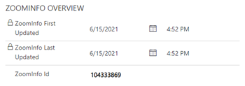

# Use ZoomInfo app data

The ZoomInfo app for Dynamics 365 helps the sales teams accelerate business growth with accurate contact and account information in their preferred Dynamics 365 Sales workflows.    
As a seller or sales manager, you can do the following tasks using the ZoomInfo data in Dynamics 365 Sales:    
-	Find and import B2B account, contact, and lead information   
-	Update data on existing leads, contacts, and accounts

## Prerequisites   
Before you start, be sure you've met the following prerequisite:   
-	The ZoomInfo app is installed on your Dynamics 365 Sales organization. More information: [Install ZoomInfo app](install-zoominfo-app.md)
-	You must have a license to use the ZoomInfo app.

## Access and understand the ZoomInfo data   
You can access the ZoomInfo application in the following ways:   
-	**Through Dynamics 365 app center**: The ZoomInfo app is available as part of Dynamics 365 published apps. The app for Dynamics includes custom forms with the ZoomInfo iframe built into account, contact, and lead forms. Also included in the left navigation are links to the ZoomInfo application and knowledge center.
-	**Customized experience**: The customized experience is available when an administrator customizes the existing environment by adding the same elements available in the ZoomInfo app experience to your Dynamics 365 Sales app and to standard or custom account, contact, and lead objects. More information: [Customize the ZoomInfo app](customize-zoominfo-app.md).  

To access and understand the ZoomInfo data, follow these steps:   

1.	Sign in to Dynamics 365 environment and choose one of the following options to open the ZoomInfo data.   
    -	Select the **ZoomInfo** app and on the left navigation pane, select **Accounts**, **Contacts**, or **Leads** depending on the record that you want to view the information.
    -	Select the **Sales Hub** app and on the left navigation pane, select **Accounts**, **Contacts**, or **Leads** depending on the record that you want to view the information.
 
    >[!NOTE]
    >We are using an account record as an example to explain the procedure.   

2.	Open an account record and the record opens with a default form. 
3.	Select the form selector dropdown and then choose **ZoomInfo Account**.

    > [!div class="mx-imgBorder"]
    > 
 
    The **Summary** tab of the **ZoomInfo Account** form includes a **ZoomInfo Overview** section that displays some metadata describing the ZoomInfo data for the selected account. The metadata includes, when the account was first updated, last updated with ZoomInfo data, and the unique ZoomInfo ID.

    > [!div class="mx-imgBorder"]
    > 

4.	Select the ZoomInfo tab to see the data of the account that is available in the ZoomInfo app.    

    > [!div class="mx-imgBorder"]
    > 

 
To understand more about each component of the ZoomInfo home page, see [Knowledge Center of ZoomInfo for Sales](https://university.zoominfo.com/pages/knowledge-center-zoominfo-for-sales-platform-features).

### See also

[Install ZoomInfo app](install-zoominfo-app.md)   

[!INCLUDE[footer-include](../includes/footer-banner.md)]
