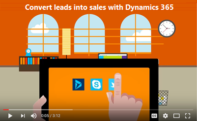

# User guide for Embedded intelligence

Applies to Dynamics 365 (online), version 9.0.2 

Using Embedded intelligence, you can continuously analyze the vast collection of customer-interaction data already stored in your [!INCLUDE[pn_dynamics_crm](../includes/pn-dynamics-crm.md)] and [!INCLUDE[pn_Microsoft_Exchange](../includes/pn-microsoft-exchange.md)] databases, to help you better understand your business relationships, evaluate your activities in relation to previous successes, and choose the best path forward. 

 

[Relationship assistant](../sales-enterprise/relationship-assistant.md)  

[Email engagement](../sales-enterprise/email-engagement.md)   

[Auto capture](../sales-enterprise/auto-capture.md)  
