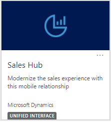
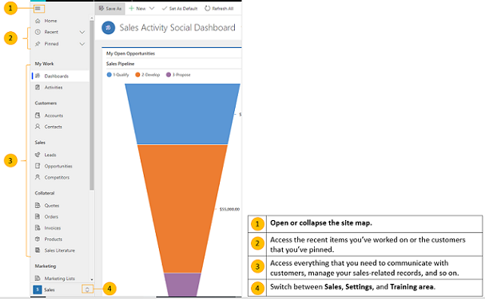

# Learn the basics of [!INCLUDE[pn-dyn-365-sales](../includes/pn-dyn-365-sales.md)]

Start here to onboard quickly and learn about the different offerings of Sales and their user interface.

## Go to the Sales apps 

1. Sign in to [!INCLUDE[pn-office-365](../includes/pn-office-365.md)], select the [!INCLUDE[pn-office-365](../includes/pn-office-365.md)] app launcher, and then select the icon for **[!INCLUDE[pn-dyn-365](../includes/pn-dyn-365.md)]**.

   > [!div class="mx-imgBorder"]
   >   

   > [!Note]
   > 
   > The apps available to you in the app launcher depend on your subscription.

2. To open Sales hub, select the tile for **Sales Hub** (Unified Interface).

   > [!div class="mx-imgBorder"]
   > 

## Navigate using the site map

The following image shows the site map or menu of the Sales Hub that helps you navigate to the different areas of the app.

  **Open or collapse the site map**.  
   Access the recent items you've worked on or the customers you've pinned.  
  Access everything that you need to communicate with customers, manage your sales-related records, and so on.  
 Switch between **Sales**, **Settings**, and **Training** area. 

   
## Understand the data in the app

Every day, you’ll work with different customer records and record types as you move customers through your business processes, collecting the data you need to fill in the fields for their records—and ultimately to win their business.

- What’s a record? In [!INCLUDE[pn-dyn-365-sales](../includes/pn-dyn-365-sales.md)], a **record** is a complete unit of information such as all the information about a single contact. You can think of it as a row in a table. For example, each time you add a new account to the app, you’re creating a new record in the Sales app.

- What’s a record type? Each record you add to the system belongs to a certain **record type**, such as an account, contact, lead, or opportunity.

## Quick create – Enter new records fast

The Quick Create command makes it fast and easy to enter almost any type of information into the system. The command is on the navigation bar (also referred to as the nav bar), so it’s always available whenever you need to enter new info into the system.

With Quick Create, you need to complete only a few fields. Later, when you have more time or more information, you can fill in more details.

1. On the nav bar, select the **New** button , and then select the item you want.  

   > [!TIP]
   > On a mobile device, from the nav bar, tap  and then tap **Quick Create Menu**.

2. Fill in the fields, and then select **Save**.

[!INCLUDE[footer-include](../includes/footer-banner.md)]