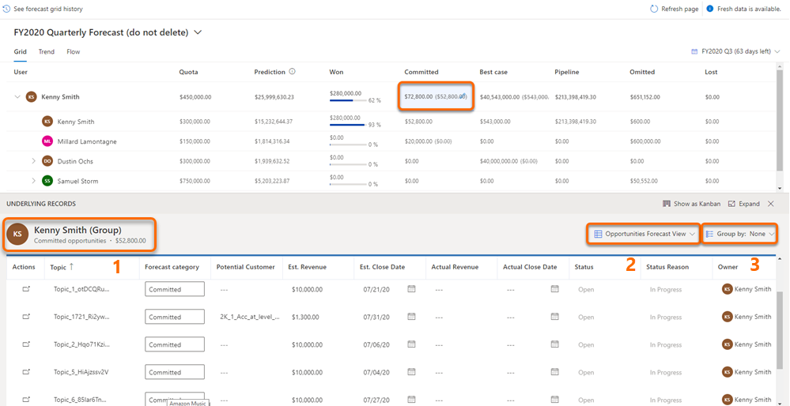
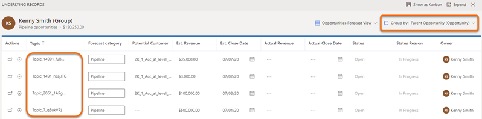
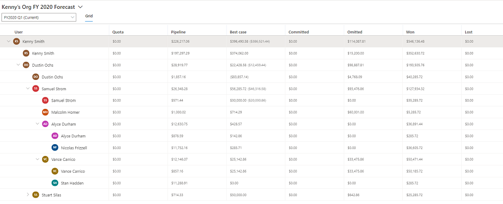
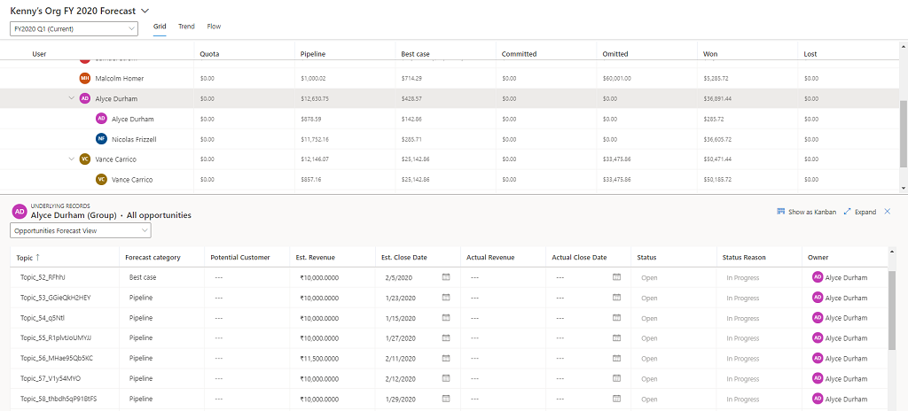
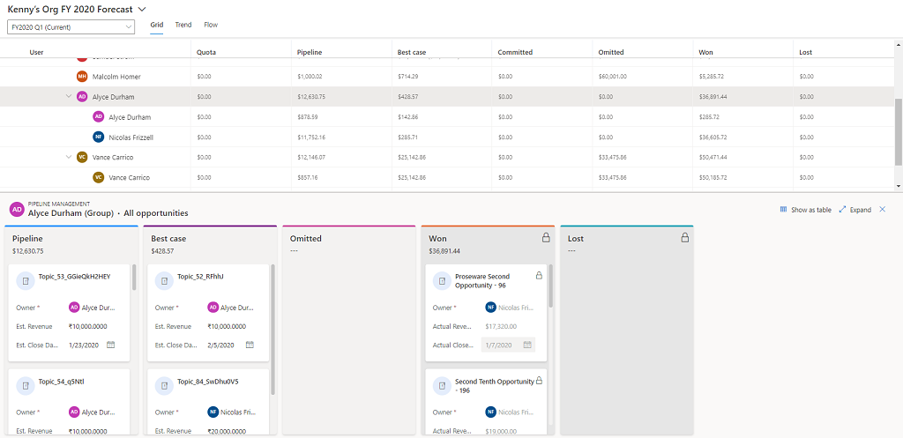

# View and manage underlying opportunities 

To understand which opportunities are affecting forecast values, select one of the following options: 

- Select a row to show all opportunities, regardless of forecast category.

- Select a cell to show only the opportunities that match the roll-up column value.

> [!NOTE]
> Underlying opportunities won't be displayed for **Quota** and simple column types, because no opportunities contribute to calculating their values; you manually upload these values through an Excel workbook.

The opportunities you see in the table depend on the role assigned to you in the hierarchy that was used to configure the forecast.

For example, Alyce Durham is a manager and Nicolas Frizzell reports to her. Nicolas can see only his underlying opportunities, while Alyce can see her own and Nicolas's underlying opportunities.

You can view and edit underlying opportunities in two ways:

- [View and edit in a table view](#view-and-edit-in-a-table-view)

- [View and edit in a kanban view](#view-and-edit-in-a-kanban-view)

## View and edit in a table view

With the enhanced grid, you can view and edit related entity records also. The following screen is an example of the enhanced grid view of underlying records:   

> [!div class="mx-imgBorder"]
> 

1. **General information**: You can identify whom the underlying records belongs to, and by their team or individual. Also, you can see the category of underlying records, such as won, committed, and pipeline along with its total value.

2. **View selector**: You can change the view of these records. By default, the view that was selected when the forecast was configured is displayed.

3. **Group by**: You can view and edit the records of related entity. Select the **Group by** option and choose a valid related attribute to view appropriate related entity records. 

    For example, opportunity split forecast is created based on the data model as illustrated below, where, opportunity split is the rollup entity and opportunity is the related entity.

    By default, when users open the underlying records grid the opportunities in the opportunity split (rollup entity) are listed. As the records of opportunity split are derived from opportunity (related entity), users might want to edit the records directly in opportunity (related entity). Therefore, users must select attributes of opportunity, which is the related entity in this data model.

    To support such scenarios, the **Group by** drop-down lists the related entity attributes of opportunity split (rollup entity), so that users can select relevant opportunity attribute, and then view and edit related opportunity records.    

    > [!div class="mx-imgBorder"]
    > 

    The following image is an example when you choose to group the records based on opportunity attribute from the related opportunity entity of an opportunity split forecast.

    > [!div class="mx-imgBorder"]
    > 

## View and edit in a kanban view

1.	Open a forecast. In this example, we're opening **Kenny's Org FY 2020 Forecast** for current quarter **FY2020 Q1**.

    > [!div class="mx-imgBorder"]
    > 

2.	Select a row or a cell for any level of the hierarchy for which you want to see underlying opportunities. 

    In this example, we're selecting **Alyce Durham**. Because she's a manager, all the underlying opportunities that are contributing to her team's forecast are listed. This view is opened in a table, by default.

    > [!div class="mx-imgBorder"]
    > 

    You can identify whether the selected opportunities belong to a team, an individual, a single cell value, or a full row by looking at the table heading. The format of the heading is described in the following table:

    | Heading format | Description |
    |----------------|-------------|
    | Username (Group) – All opportunities | All the opportunities across different forecast categories that the selected user and that user's team own. |
    | Username - All opportunities | All the opportunities across different forecast categories that the selected user owns. |
    | Username (Group) – Column name | The opportunities that the selected user and that user's team own for the selected forecast category. |
    | Username – Column name | All the opportunities that the selected user owns for the selected forecast category. |.

    You can change the view of these opportunities by using the view selector. By default, the view that was selected when the forecast was configured is displayed.

3.	Select **Show as Kanban**. 

    The table view changes into a kanban view and the order of columns is displayed based on the order that is defined in the option set in the application. All the underlying opportunities are displayed as cards in their respective forecast categories. Each card displays attributes that you can edit. In this example, the opportunity name, **Owner**, **Est. Revenue**, and **Est. Close Date** are displayed.

    > [!div class="mx-imgBorder"]
    > 

    > [!NOTE]
    > The opportunities in columns **Won** and **Lost** are locked. You can't edit these values directly, because multiple attribute values must be set to enter an opportunity as **Won** or **Lost**. However, you can select the name of the opportunity, and the opportunity will open in a new page where you can edit the opportunity, and then save and close it.

4.	To edit the opportunity, you can directly change the values for the attributes displayed on the card, and drag the cards from one forecast category to another.
    
    The changes are saved, and the opportunity is updated in Dynamics 365 Sales. The changes are also automatically applied in the forecast grid.

    > [!NOTE]
    > To edit more attributes for the opportunity, select the name of the opportunity. The opportunity will open in a new page, where you can edit it as required, and then save and close it.

### See also

[Project accurate revenue with sales forecasting](project-accurate-revenue-sales-forecasting.md) 
[View a forecast](view-forecasts.md)

[!INCLUDE[footer-include](../includes/footer-banner.md)]