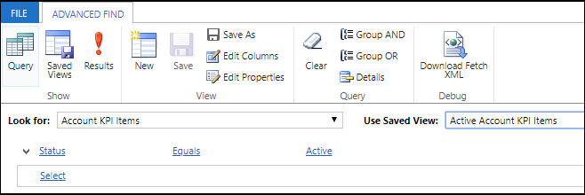
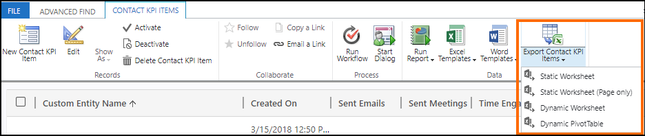

# View and export KPI data (GDPR)

View KPI data for contact, lead, and opportunity using system views, and export the data to an Excel file. The KPI data is stored in the following entities:

- **Contact KPI Items**
- **Lead KPI Items**
- **Opportunity KPI Items**

> [!NOTE]
> This topic is applicable only for the [Relationship Analytics](relationship-analytics.md) feature.

You can use the system views for these entities or create your own views to view the data.

1.  Go to **Advanced Find**.
1.  In the **Look for** list, select the record type as one of the entities mentioned earlier.
1.  Select a system view from the **Use Saved View** list or create a new view. 
    
1.  Specify the columns to include in the view by selecting **Edit Columns**, and then selecting the columns to display.
2. Select **Results** to view the data.

For detailed information about using Advanced Find, see [Create, edit, or save an Advanced Find search](/dynamics365/customer-engagement/basics/save-advanced-find-search)

After viewing the results, you can export data to Microsoft Excel, if required. You can do so by selecting the export to Excel option from the command bar.

For more information about exporting data from Dynamics 365 Sales to excel, see [Export data to Excel](/dynamics365/customer-engagement/basics/export-data-excel)

## See also

[Embedded Intelligence and GDPR](embedded-intelligence-gdpr.md)