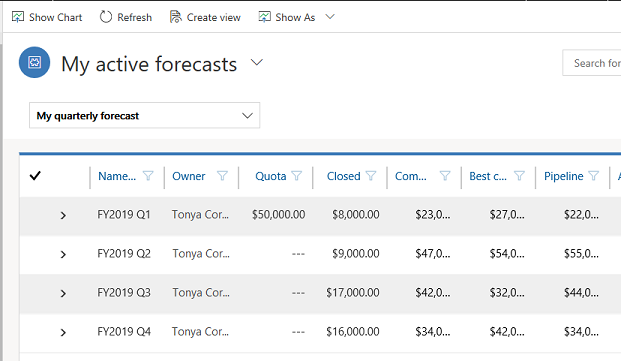
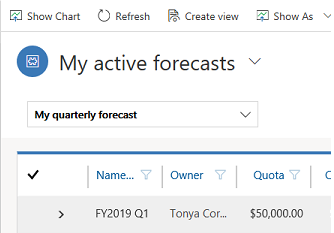
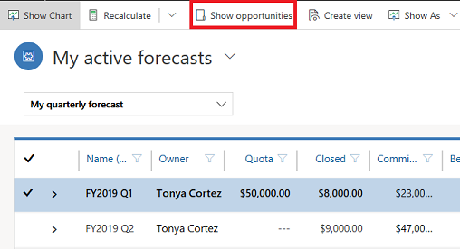
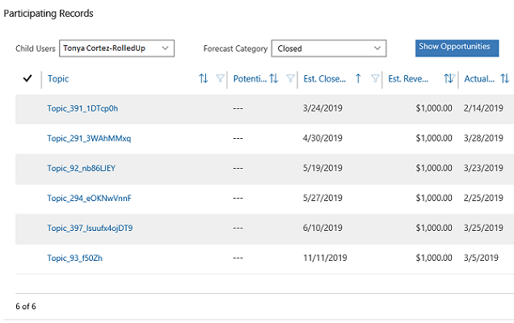
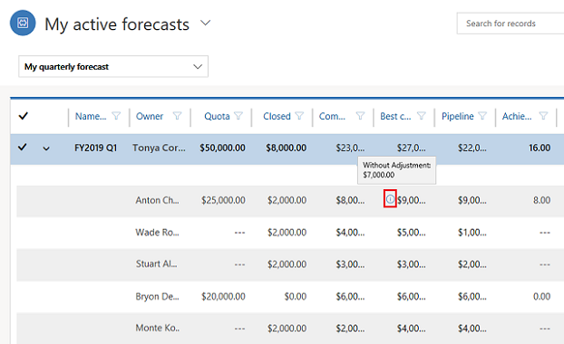

# View forecasts

Applies to Dynamics 365 for Customer Engagement apps version 9.1.x

[!INCLUDE [cc-beta-prerelease-disclaimer](../includes/cc-beta-prerelease-disclaimer.md)]

> [!IMPORTANT]
> - [!INCLUDE[cc_preview_features_definition](../includes/cc-preview-features-definition.md)]  
> - [!INCLUDE[cc_preview_features_expect_changes](../includes/cc-preview-features-expect-changes.md)]  
> - Microsoft doesn't provide support for this preview feature. Microsoft Dynamics 365 for Customer Engagement apps Technical Support won’t be able to help you with issues or questions. Preview features aren't meant for production use and are subject to a separate [supplemental terms of use](https://go.microsoft.com/fwlink/p/?linkid=870960).
> - To know more about the feature's availability in your region, see [When will the April 2019 features be enabled for customers who did not opt in to the preview?](/power-platform/admin/preview-april-2019-updates#when-will-the-april-2019-features-be-enabled-for-customers-who-did-not-opt-in-to-the-preview)

Track your forecasts to project what a sales person, team, or organization will sell against a given target or in a given period such as quarterly or monthly. If you are a sales rep, you can also track forecasts to know how you are doing toward the quota or targets that are set for you.

1.	Make sure you have the Sales Manager, Sales person, or Forecast user role or equivalent permissions.

2.	Select the site map icon , and check the lower left corner of the site map to ensure that you are in the **Sales** area. 

    > [!div class="mx-imgBorder"]
     

3. Select **Forecasts**.

    A list of forecasts is displayed. 

    > [!div class="mx-imgBorder"]
    > 

4.	In the drop-down list below the View drop-down list, select a forecast definition to see the forecasts for it. In this drop-down list, you’ll see the definitions that you own or the definitions of the forecast hierarchy that you are a part of.
 
    > [!div class="mx-imgBorder"]
    > 

    The forecasts are grouped by the forecast period. For example, if you selected a forecast definition that has the **Forecast period** set to **Quarterly**, **Fiscal year** to **FY 19**, **Start quarter** to **Q1**, and **Number of forecasts** to **4**, the forecasts that are generated will be grouped by four quarters, FY 2019 Q1, FY 2019 Q2, FY 2019 Q3, and FY 2019 Q4. 
 
    The forecast includes the following information:

    -	**Name**. Shows the forecast name. 

    -	**Owner**. Shows the owner of the records that are included in the forecast (participating records) or the name of the manager. Refer forecasts and sales hierarchy section for more details.

    -	**Quota**. Shows the quota value from the goal created for the owner and period. If the **Quota source** in the forecast definition is **Manual**, then this field is initially set to blank. For manual quota source forecasts, you can edit the **Quota** column inline.

    -	**Closed**. Shows the aggregated or rolled-up value of the actual revenue of all closed opportunities owned by a specific owner for the defined period.

    - **Committed**. For the specific period and owner, this column shows the aggregated or rolled-up value of estimated revenue of all open opportunities that have the forecast category set to **Committed**. This value can be edited inline.

    -	**Best case**. For the specific period and owner, this column shows the aggregated or rolled-up value of estimated revenue of all open opportunities that have the forecast category set to **Best case**. This value can be edited inline.

    -	**Pipeline**. For the specific period and owner, this column shows the aggregated or rollup value of estimated revenue of all open opportunities that have the forecast category set to **Pipeline**. This value can be edited inline.

    -	**% Achieved**. Shows the percentage of quota achieved based on closed revenue versus quota/goals.

## Forecasts and sales hierarchy

Forecasts are shown based on the sales team hierarchy. For example, if Wade Roque is a sales manager with five people reporting directly to him, and he is set as a manager in his direct reports' user records, he will see a forecast for himself and his five direct reports. 

> [!div class="mx-imgBorder"]
> 

If Wade Roque reports to Bert Hair, Bert will see his own forecasts along with Wade's rolled-up forecast. Bert will not see the forecasts of Wade's direct reports.

To see the rolled-up forecast for everyone in the hierarchy, expand a specific forecast.

The parent row (for the manager) shows values rolled up from all the child records (for the direct reports and manager themselves if the manager is also owning some participating opportunities).
 
## See the participating opportunities

To know which opportunities are contributing to a certain forecast 

1.	Select the top-level forecast row, and on the command bar, select **Show opportunities**.

    > [!div class="mx-imgBorder"]
    > 
 
    The Participating Records dialog box opens. It shows a list of opportunities that were used in forecasting.

    > [!div class="mx-imgBorder"]
    > 

2.	Use the **Child Users** and **Forecast Category** drop-down lists to filter out opportunities only for a specific user or opportunities in a specific category. 
 
## Adjust forecasts

While reviewing the forecasts, there can be a need to make adjustments without directly impacting the participating opportunities. For example, if the sales manager thinks that one of his direct report's best case opportunities might not result in $60,000, they can change the value in the forecast to a different value. When you save the forecast after making the adjustment, the changes are rolled up to the parent record.

An icon is shown against the adjusted column. When you point to the icon, the old value before the adjustment is shown.

> [!div class="mx-imgBorder"]
> 

 
## Refresh forecast values

If you expect that the underlying data (participating opportunities) has changed, you can refresh the forecast to show the recalculated values. To refresh, select the forecast (top level), and on the command bar, select **Recalculate**. 

When you recalculate: 

-	The aggregation and rollups for the underlying data are recalculated.

-	Any forecast metric or rollup query changes are considered.

-	Any target/quota changes or goal references are checked and updated.

-	Any other changes impacting the forecast values (excluding hierarchy changes) are refreshed.

The Recalculate option doesn’t change any value that was manually adjusted.

To ensure that the forecast reflects any hierarchical changes, on the command bar, select **Recalculate and refresh hierarchy**.

Recalculation happens in the background and you can continue to work while recalculation is happening. The column “Last recalculated on” in the Forecast list shows the date and time when the forecast was last recalculated successfully. If a particular forecast period’s recalculation is in progress, it would show an in-progress icon next to the date and time. Also, if there is an error in recalculation, it would show an error icon.

Apart from manual recalculation, the system also recalculates automatically at a specific frequency. This frequency is determined by the recurrence frequency of the goal rollup.

## See also
[Project accurate revenue with sales forecasting](project-accurate-revenue-sales-forecasting.md) 
[Create a forecast definition](create-forecast-definition.md) 
[Entity reference for manual forecasting](developer/reference/manual-forecasting-entity-reference.md)
