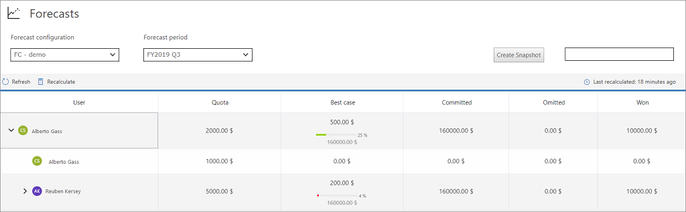
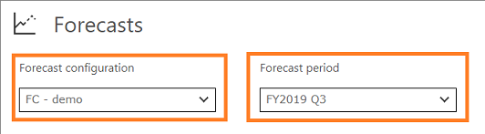
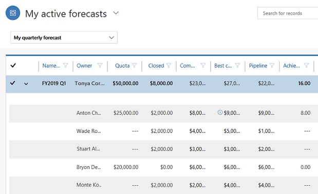
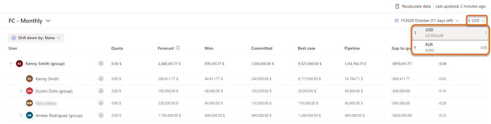

# View a forecast

Bottoms-up forecasting is the projection of what a salesperson, team, or organization will sell in a given predefined period (month or quarter). Sellers can also use forecasts to track their performance by using assigned sales targets or quotas.

**To view a forecast**

1.	[Review the prerequisites](project-accurate-revenue-sales-forecasting.md#review-prerequisites).

2.	Sign in to the Sales Hub app.

3.	At the bottom of the site map, select **Change area** , and then select **Sales**. 
 
    > [!div class="mx-imgBorder"]
    > 

3. Under **Performance**, select **Forecasts**. 

    > [!div class="mx-imgBorder"]
    > 
    
4.	On the grid page, do the following:

    -	Select a forecast from the drop-down list. Any forecasts for which you have permissions will appear here.

    -	Choose the forecast period you want to see. Options in the drop-down list reflect the number of forecast periods defined in the forecast configuration. The default is the current period.

 
    > [!div class="mx-imgBorder"]
    > 

5. The forecast grid displays all relevant columns as defined in the forecast configuration. The totals are aggregated by user or by territory, at each level of the hierarchy and for each period according to the forecast column attributes.

    For example, if you're using the out-of-the-box **Forecast category** on an org chart forecast, the grid will display the following information:

    -	**Users**: Shows the hierarchy of users as defined by the **Manager** field. To learn more, see [Forecasts and sales hierarchy](#forecasts-and-sales-hierarchy). 

    -	**Quota**: A target amount set for a specific owner over a given time frame. The progress bar is calculated against this value. 

    -  **Committed**: Shows the aggregated (rolled-up) value of estimated revenue for all open opportunities that have the forecast category set as **Committed** (high confidence). This value can be adjusted during forecast.

    -	**Best case**: Shows the aggregated (rolled-up) value of estimated revenue of all open opportunities that have the forecast category set as **Best Case** (medium confidence). This value can be adjusted during forecast.

    -	**Pipeline**: Shows the aggregated (rolled-up) value of estimated revenue for all open opportunities that have the forecast category set as **Pipeline** (low confidence). This value can be adjusted during forecast.

    -	**Omitted**: Shows the aggregated (rolled-up) value of excluded revenue for all open opportunities that have the forecast category set as **Omitted**.

    -	**Won**: Shows the aggregated (rolled-up) value of revenue that's generated for all won opportunities that have the forecast category set as **Won**.

    - **Lost**: Shows the aggregated (rolled-up) value of revenue that's lost for all lost opportunities that have the forecast category set as **Lost**.

    > [!NOTE]
    > The permissions granted during the forecast configuration affects who can view the forecast values. To learn more, see [Provide viewing permissions](provide-permissions-forecast.md).

## Forecasts and sales hierarchy

Every forecast is attached to an organization-defined hierarchy that rolls up the values level by level. If the **Org chart forecast** template is used, the forecast is created based on the sales team hierarchy as defined by the manager role on the **User** record. Similarly, if the **Territory forecast** template is used, the hierarchy is based on the **Territory manager** lookup field.

For example, you created a forecast by using the **Org chart forecast** template. The hierarchy is defined based on the **User** record. If Alyce Durham is a sales manager with one direct report, and she's designated as manager in her direct report's **User** record, she'll see a forecast for herself and her direct report. Because Alyce Durham reports to Samuel Strom, Samuel will see his own forecasts along with the rolled-up forecasts of his direct reports, including Alyce's.

> [!div class="mx-imgBorder"]
> 

To see the rolled-up forecast for everyone in the hierarchy, expand a specific forecast.

## Select a currency

When your sales teams are distributed across different geographies and viewing the forecast with organization's base currency might cause confusion for users in other geographies to analyze and understand forecast. The multi-currency selection option helps the sales teams to choose and convert the forecast data in real time based on the latest exchange rate to their convenient currencies defined in your organization, which help in better planning, organizing, and understanding the current forecast state.

>[!NOTE]
>The real time conversion of forecast data always takes place based on the latest exchange rate defined in your organization. 

For example, you have sales teams in the US and Europe. The base currency for your organization is defined as US Dollar and also, Euro is defined as one of the currencies. When you create forecast with multi currency enabled, sales teams open the forecast the data is displayed in Dollar. Sales teams in Europe can select currency as Euro and the forecast data is displayed in Euro. The conversion of currency happens in real time based on the current exchange rate. Also, manual adjustments can be made on the chosen currency. 

> [!div class="mx-imgBorder"]
> 

>[!NOTE]
>Administrator or forecast manager must enable the option to select currency. More information: [Enable multi-currency selection](forecast-configure-advanced-settings.md#enable-multi-currency-selection)

## Tasks you can do on the forecast grid

Using the forecast grid, you can do the following tasks:

- [View and manage underlying opportunities](view-and-manage-underlying-opportunities.md)

- [Adjust values in a forecast](adjust-values-in-forecast.md)

- [Maintain up-to-date forecast data](keep-forecast-data-up-to-date.md)

 
### See also

[Project accurate revenue with sales forecasting](project-accurate-revenue-sales-forecasting.md) 
[Configure a forecast](configure-forecast.md) 
[Analyze revenue outcome by using predictive forecasting](/dynamics365/ai/sales/analyze-revenue-outcome-using-predictive-forecasting) 
[Retrieve forecast and snapshot data using msdyn_ForecastInstanceActions for GDPR](/dynamics365/sales-enterprise/developer/referen/dynamics365/custom-actions/msdyn_ForecastApi)

[!INCLUDE[footer-include](../includes/footer-banner.md)]