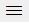
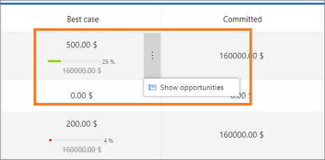
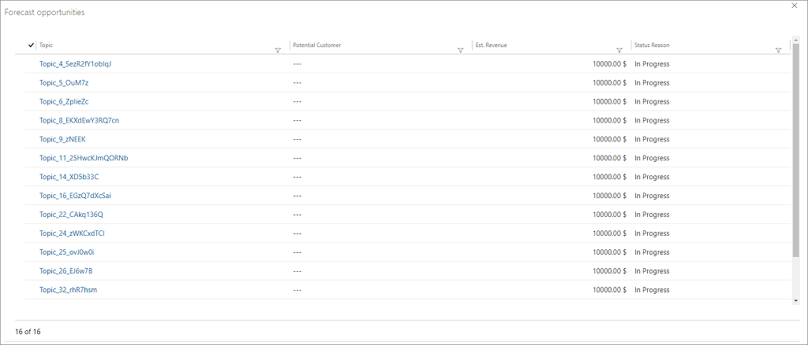
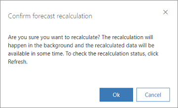

# View forecasts

[!INCLUDE [cc-beta-prerelease-disclaimer](../includes/cc-beta-prerelease-disclaimer.md)]

> [!IMPORTANT]
> - [!INCLUDE[cc_preview_features_definition](../includes/cc-preview-features-definition.md)]  
> - [!INCLUDE[cc_preview_features_expect_changes](../includes/cc-preview-features-expect-changes.md)]
> - [!INCLUDE[cc-preview-features-no-ms-support](../includes/cc-preview-features-no-ms-support.md)]

Forecasts help organizations, teams, and salespeople project anticipated sales against targets across a given time period such as quarterly or monthly. Sales reps can also use forecasts to track their performance with assigned sales targets or quotas.

> [!NOTE]
> You’ll only be able to view a forecast if you appear in its hierarchy.

1.	Select the site map icon , and check the lower left corner of the site map to ensure that you are in the **Sales** area. 

    > [!div class="mx-imgBorder"]
     

3. Under **Performance**, select **Forecasts**.

    The forecasts view page displays. 

    > [!div class="mx-imgBorder"]
    > 
    
4.	On the **Forecasts** home page, select the following:

    - **Forecast configuration**: Select a forecast from the drop-down list. Any forecasts where you appear in the forecast hierarchy will show here. 

    - **Forecast period**: Set the forecast period. Options in the drop-down list reflect the number of forecast periods defined in the forecast configuration.
 
    > [!div class="mx-imgBorder"]
    > 

5. The forecast grid displays quota information and calculated totals as defined in the forecast configuration. The totals are aggregated by user for each period according to the forecast column attributes. If the *org chart forecast* template is used with the out-of-the-box **Forecast category** option set, the grid will display the following information:   

    -	**Users**: Entities at all levels of a given forecast’s hierarchy (including a top-level *owner* and all subordinate levels). For example, owner of the records that are included in the forecast participating records or the name of the manager. To learn more, see [Forecasts and sales hierarchy](#forecasts-and-sales-hierarchy). 

    -	**Quota**: A target metric set for a specific owner over a given timeframe. Other calculations, such as revenue generation progress, are measured against quotas. 

    -	**Best case**: Shows the aggregated (rolled-up) value of estimated revenue of all open opportunities. This value can be edited inline during forecast configuration (the field becomes editable when selected.)

    -  **Committed**: Shows the aggregated (rolled-up) value of estimated revenue for all open opportunities with forecast category set to **Committed**. This value can be edited inline during forecast configuration (field becomes editable when selected). 

    -	**Omitted**: Shows the aggregated (rolled-up) value of excluded revenue of all open opportunities with forecast category set to **Omitted**.

    -	**Won**: Shows the aggregated or rolled-up value of revenue generated of all won opportunities with forecast category set to **Won**.

    - **Lost**: Shows the aggregated or rolled-up value of revenue lost of all lost opportunities with forecast category set to **lost**.

## Forecasts and sales hierarchy

If using the out-of-the-box *org chart forecast* template, the forecast will be based on the sales team hierarchy as defined by the manager role on the User record. For example, if Wade Roque is a sales manager with five direct reports, and he is designated as manager in his direct reports' user records, he will see a forecast for himself and his five direct reports. 

> [!div class="mx-imgBorder"]
> 

If Wade Roque reports to Bert Hair, Bert will see his own forecasts along with Wade's rolled-up forecast. Bert will not see the forecasts of Wade's direct reports.

To see the rolled-up forecast for everyone in the hierarchy, expand a specific forecast.

The parent row (for the manager) shows values rolled up from all the child records (for the direct reports and manager themselves if the manager is also owning some participating opportunities).
 
## See the participating opportunities

To view the underlying opportunities that contributed to a forecasted amount, go to the user row, hover the cursor over a column, select the vertical ellipsis, and select **Show opportunities**.

> [!div class="mx-imgBorder"]
> 
 
The **Forecast opportunities** dialog box opens. It shows a list of opportunities that were used to calculate the forecast value.

> [!div class="mx-imgBorder"]
> 

## Adjust forecasted values

Adjustments allow sales managers the ability to use their own assessments when reviewing their team’s forecasts. For example, if the sales manager thinks that one of their direct report's best case opportunities might not result in $60,000, they can change the value in the forecast to a different value. Upon saving the adjustment, the changes are rolled up to the parent record and up the hierarchy. 

To make adjustments, a forecast column must be marked as editable. To do so, a forecast maker must specifically identify the editable columns during forecast configuration and enable the option **Allow adjustments**. Once completed, the selected columns will be available for adjustments.

Select the field and the field becomes editable. Enter the value to adjust. In this example, the **Best case** column is configured as editable and you can see the value $500 is adjusted to $1,000.

> [!div class="mx-imgBorder"]
> 

 
## Refresh forecast data

The forecast data is kept up to date by automatic recalculation at regular intervals. If you are actively interacting with the forecast, a recalculation is retriggered when the data is found to be more than 10 minutes old. After the recalculation, you will be prompted to refresh the forecast grid to show the updated forecast data.

If you are not actively interacting with the forecast, the data is recalculated every hour. The Last recalculated label on the command bar shows the time when the forecast was last recalculated successfully

If you know that the underlying data has changed, you can select **Recalculate** to manually recalculate, and then refresh to view the updated values. When you recalculate: 

-	The aggregation and rollups for the underlying data are recalculated.

-	Any target/quota changes are checked and updated.

-	Any other changes impacting the forecast values (excluding hierarchy changes) are refreshed.

-	Only the current forecast period is recalculated.

> [!NOTE]
> The Recalculate option doesn’t change any value that was manually adjusted.

To recalculate and refresh the data in the forecast manually, follow these steps:

1. Select **Recalculate** on the command bar.

    > [!div class="mx-imgBorder"]
    > 

2. On the confirmation message, select **Ok**.

    > [!div class="mx-imgBorder"]
    > 

    A notification appears at the bottom of the screen confirming the recalculation. Recalculation happens in the background and you can continue to work while recalculation is happening.

    > [!div class="mx-imgBorder"]
    > 

3. After the application recalculates the forecast data, a notification appears to refresh the data. On the notification, select **Refresh page**.

    > [!div class="mx-imgBorder"]
    > 

    > [!NOTE]
    > You can cancel the notification and refresh the data later. Select **Refresh** on the command bar.

    The data in the forecast reflects the latest opportunity and hierarchical changes.

## See also

[Project accurate revenue with sales forecasting](project-accurate-revenue-sales-forecasting.md)

[Configure a forecast](configure-forecast.md)

[Entity reference for manual forecasting](developer/reference/manual-forecasting-entity-reference.md)
