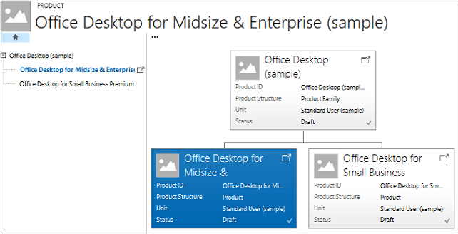

# View product hierarchy (Sales)
<!--note from editor: I don't think you really want this topic edited? If that 's wrong, please let me know.-->
A product hierarchy gives you a visual snapshot of the products your organization sells. It makes it easy to see what products are available to sell and how they are connected. With this information at your fingertips, you can take whatever actions you need to on any product from a single place and improve your chances of a sale.  
  
1. [!INCLUDE[proc_sales_products](../includes/proc-sales-products.md)]  
  
2. In the list of products, open a product, product family, or bundle whose hierarchy you want to see, and on the command bar, select **View Hierarchy**.  
  
    You'll see the product in a tree structure and a visual organization of all products in the hierarchy.  
  
     
  
3. To find out more about a product, family, or bundle, select its corresponding **Open this record** button.  
  
   > [!TIP]
   >  You can also select a product and use one of the common command bar actions on the product, family, or bundle such as **Email a link** or **Edit**.  
  
### See also  
 [Set up a product catalog: Walkthrough](set-up-product-catalog-walkthrough.md)   
 [Create a product family](../sales-enterprise/create-product-family.md)

[!INCLUDE[footer-include](../includes/footer-banner.md)]