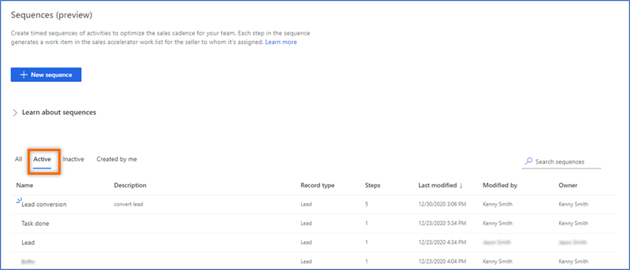

# View details of a sequence and its connected records

You can view the details of a sequence and the records connected with it. This view can also be used to remove records connected with the sequence.

**To view details of a sequence and its connected records**   
1. Sign in to your sales app.   
2. At the bottom of the site map, select **Change area** > **Sales Insights settings**.   
3. Under **Sales accelerator**, select **Sequence**.   
4. On the **Sequences** page, select the **Active** tab.    
    >[!NOTE]
    > You can assign records to sequences that are in active state only.

    > [!div class="mx-imgBorder"]
    >        
5. Select and open the sequence for which you want to assign records.      
    >[!TIP]
    >Alternatively, hover over a sequence, and then select **More options** > **View sequence**.    

    The sequence opens and on the **Manage sequence** tab, you can view the activities that are defined for the sequence.     

    > [!div class="mx-imgBorder"]
    >      
6. To view list of connected records, select the **Connected Lead** tab.    
  
### See also

[Create and manage sequences](create-manage-sequences.md)