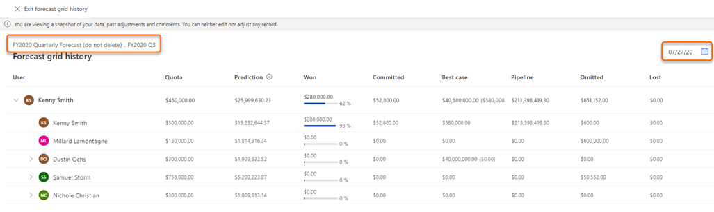
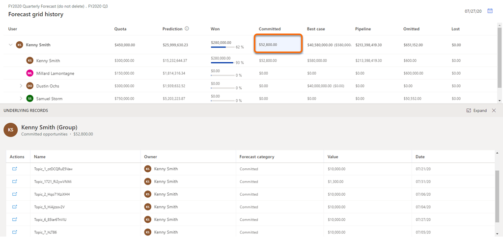

# View snapshots

You can view a snapshot to see and understand the data of the forecast at the moment in time when the snapshot was taken, including underlying opportunities. Also, you can compare the data between your current forecast and the snapshot to understand how the forecast is doing.

>[!NOTE]
>-	To view snapshot history, you must have at least one snapshot created for the forecast.
>-	The data displayed in the snapshot is view-only and can't be modified.

## Open and view snapshots

1.	Sign in to the **Sales Hub** app, and go to **Performance** > **Forecasts**.

2.	Select the forecast for which you want to view snapshots.

3.	Select **See forecast grid history**. 

    >[!NOTE]
    >The **See forecast grid history** option is inactive if there no snapshots available for the forecast.

    > [!div class="mx-imgBorder"]
    > 

    The latest snapshot for the forecast is displayed with information about forecast data at that point in time, along with name and date.

    The name of the snapshot is in the following format: *forecast name.recurrence name*. In this example, you can see that name of the snapshot is **FY2020 Quarterly Forecast (do not delete).FY2020 Q3**.

    > [!div class="mx-imgBorder"]
    > 

    The format for the date on which the snapshot is taken is displayed based on your personal settings. In this example, the date format is **MM/DD/YY** (**07/27/20**).
  
4.	To view a snapshot from a specific date, select the calendar icon and select the date.

    >[!NOTE]
    >If a date is inactive, there's no snapshot available for that date.

    > [!div class="mx-imgBorder"]
    > 
 
## View underlying opportunities

For a snapshot, you can view the underlying opportunities of a column or the users who are influencing the displayed budget amount at that point in time. By viewing the opportunities, you can analyze and understand how they're trending.

1.	Open a snapshot.

2.	To see the underlying opportunities that are defining the value of a column at that point in time, select the column or user. In this example, Kenny Smith's **Committed** column is selected and the underlying opportunities that are contributing the value are displayed.

    > [!div class="mx-imgBorder"]
    > 

3.	To view the details of an underlying opportunity, under **Actions** column, select the navigate icon corresponding to the opportunity. 

    The opportunity is opened in a new tab. The latest information will be displayed in the opportunity, not the information as of the date of the snapshot.

### See also

[About premium forecasting](configure-premium-forecasting.md) 
[Take snapshots automatically](manage-snapshots-forecast.md) 
[Analyze deals flow between snapshots](analyze-deals-flow-between-snapshots.md)
