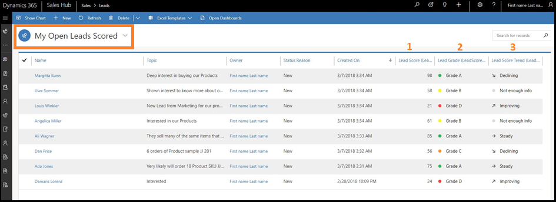
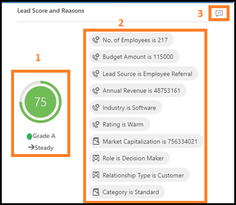
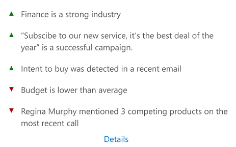
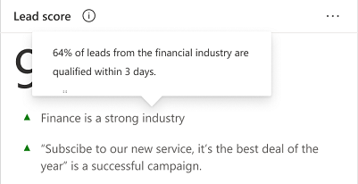
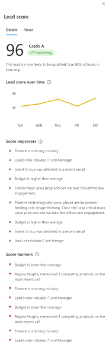
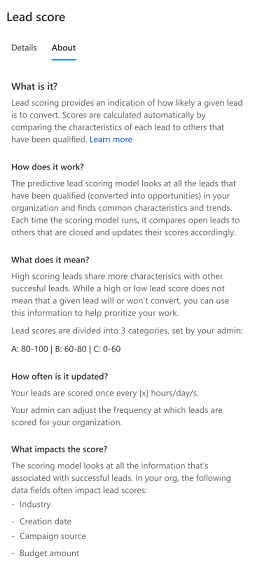

# Prioritize leads through scores

In a highly competitive market, it is important for you to spend time on quality leads to reach your sales targets. You must identify and prioritize leads to convert them onto opportunities. The predictive lead scoring of Dynamics 365 Sales Insights provides a scoring model to generate scores for leads that are available for you in your pipeline. The out-of-the-box model chooses top factors that influence the score. An administrator can view and modify the top factors that influence the scores by customizing the model. To learn more, see [Configure predictive lead scoring](configure-predictive-lead-scoring.md).

This model assigns a score between 0 to 100 for leads based on the signals from leads and related entities such as contact and account. Using these scores, you can identify and prioritize leads that have more chances of converting into opportunities. 

For example, say you have two leads - Lead A and Lead B - in your pipeline. The lead scoring model applies a score of 80 for Lead A and 50 for Lead B. By looking at the score, you can predict that Lead A has more chances of converting into an opportunity and you can engage it. Also, you can further analyze why the score of Lead B is low by looking at the top reasons influencing the score and deciding whether to improve this score.
 
> [!IMPORTANT]
> To enable Predictive lead scoring in your organization, contact your system administrator.
> [!INCLUDE[proc_more_information](../includes/proc-more-information.md)] [Configure Predictive lead scoring](configure-predictive-lead-scoring.md)

## Understand predictive lead scoring in views

The **My Open Leads Scored** system view is available when predictive lead scoring is enabled in your organization. This view provides a list of leads with different parameters including lead score, lead grade, and lead score trend. By analyzing these parameters, you can  identify and prioritize leads to convert into opportunities.

The following screen displays a typical view that consists of columns that can be used to analyze and prioritize the leads.

> [!div class="mx-imgBorder"]
> 

The numbered columns are:

1.	**Lead Score.** Specifies the value that represents the likelihood of the lead to convert into an opportunity on a scale of 1 to 100. A lead with a score of 100 has the highest likelihood of converting into an opportunity. 

    >[!NOTE]
    >The model calculates the score every 24 hours, therefore, the application may take up to 24 hours to display the score for new leads. 

2.	**Lead Grade.** Specifies a ranks or level of quality that is given to a lead based on the generated score. Leads with higher grade have more chances of converting into opportunities. The grades of a lead are categorized into A, B, C, and D with colors green, purple, yellow, and red, respectively, where Grade A (green) is the lead with the highest likelihood for conversion into an opportunity followed by Grade B (purple), Grade C (yellow), and Grade D (red). System administrators can define lead score ranges for a grade, depending on your organizational requirements.

3. **Lead Score Trend.** Specifies the direction in which a lead is trending such as **Improving** (up arrow), **Declining** (down arrow), **Steady** (right arrow), or **Not enough info**. These trends are displayed by comparing the present lead score with the previous score. For example, the score of a lead was 65 and the present score is decreased to 45. A down arrow is displayed in the **Lead Score Trend** column specifying that the lead is losing traction and needs some action from you to improve the score. 
 
## Understand lead scoring widget

In forms, the lead score widget displays the top positive and negative reasons that influence the score. These reasons come from the lead attributes and attributes from related entities. The reasons help you analyze and work on the lead to improve the score and convert the lead into a possible opportunity. The following image shows a typical **Lead score** widget.

> [!div class="mx-imgBorder"]
> 

Typically, the screen is organized into the following sections:

- [Basic information](#basic-information)

- [Top reasons](#top-reasons)

### Basic information

The information included in this section covers the lead score, lead grade, and score trend.

> [!div class="mx-imgBorder"]
> 

### Top reasons

The most important reasons&mdash;both positive and negative&mdash;that affect the lead score are listed here. You can use these reasons to analyze how you might convert the lead into an opportunity.

> [!div class="mx-imgBorder"]
> 

When you move your cursor over a reason, a tooltip displays an insight about what's causing the reason to be listed on top. You can work on this insight and take any necessary action to improve the lead.

In the following example, for the reason "Finance is a strong industry," the tooltip displays the insight "64% of leads from the financial industry are qualified within 3 days." 

> [!div class="mx-imgBorder"]
> 

The **Lead score** widget displays only the top five positive and negative reasons. To view all the positive and negative reasons that are affecting the lead score, select **Details**. 

The **Lead score** pane opens with a list of all score improvers (positives) and harmers (negatives), along with a graph that shows how the lead score is trending over time.

> [!div class="mx-imgBorder"]
> 

For more information about the lead score, select the **About** tab. The **About** tab helps you understand what the lead score is and how it works. Under **What does it mean?**, you'll find information about how lead scores are categorized by admins in your organization. Under **What impacts the score?**, you'll find the attributes that affect lead scores in your organization.

> [!div class="mx-imgBorder"]
> 

### See also

[Configure predictive lead scoring](configure-predictive-lead-scoring.md)
