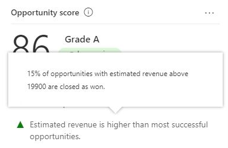

# Prioritize opportunities through scores

In a highly competitive market, it is important for you to spend time on quality opportunities to reach your sales targets. You must identify and prioritize opportunities to convert them into wins. The predictive opportunity scoring of Dynamics 365 Sales Insights provides a scoring model to generate scores for opportunities in your pipeline. The out-of-the-box model chooses top factors that influence the score. An administrator can view and modify the top factors that influence the scores by customizing the model. To learn more, see [Configure predictive opportunity scoring](configure-predictive-opportunity-scoring.md).

This model assigns a score between 0 and 100 for opportunities based on the signals from opportunities and related entities such as contact and account. Using these scores, you can identify and prioritize opportunities that have more chances of converting into wins. 

For example, say you have two opportunities - Opportunity A and Opportunity B - in your pipeline. The opportunity scoring model applies a score of 75 for Opportunity A and 55 for Opportunity B. By looking at the score, you can predict that Opportunity A has more chances of converting into a win deal and you can engage it. Also, you can further analyze why the score of Opportunity B is low by looking at the top reasons that are influencing the score and deciding how to improve this score.

> [!IMPORTANT]
> To enable predictive opportunity scoring in your organization, contact your system administrator.
> [!INCLUDE[proc_more_information](../includes/proc-more-information.md)] [Configure predictive opportunity scoring](configure-predictive-opportunity-scoring.md)

## Understand opportunity scoring in views

The **My Open Opportunities Scored** system view is available for you when predictive opportunity scoring is enabled in your organization. This view provides a list of opportunities with different parameters, including opportunity score, opportunity grade, and opportunity score trend. By analyzing these parameters, you can identify and prioritize opportunities to convert into win deals.

The following screen displays a typical view that consists of columns that can be used to analyze and prioritize the opportunities.

> [!div class="mx-imgBorder"]
> 

The numbered columns are:

1. **Opportunity Score.** Specifies the value that represents the likelihood of the opportunity to convert into a deal on a scale of 1 to 100. An opportunity with score of 100 has the highest likelihood of converting into a win deal.

    >[!NOTE]
    >The model calculates the score every 24 hours, therefore, the application may take up to 24 hours to display the score for new opportunities.

1. **Opportunity Score Trend.** Specifies the direction in which an opportunity is trending such as **Improving** (up arrow), **Declining** (down arrow), **Steady** (right arrow), or **Not enough info**. These trends are displayed by comparing the present opportunity score with the previous score. For example, the score of an opportunity was 65 and the present score has decreased to 45. A down arrow is displayed in the **Opportunity Score Trend** column specifying that the opportunity is losing traction and needs some action from you to improve the score.

1. **Opportunity Grade.** Specifies a ranks or level of quality that is given to an opportunity based on the generated score. Opportunities with higher grade have more chances of converting into win deals. The grades of an opportunity are categorized into A, B, C, and D with colors green, purple, yellow, and red, respectively, where Grade A (green) is the opportunity with the highest likelihood for conversion into a win deal followed by Grade B (purple), Grade C (yellow), and Grade D (red). The system administrator can define opportunity score ranges for a grade, depending on the organizational requirements. 

## Understand opportunity scoring widget

In forms, the opportunity score widget displays the top positive and negative reasons that influence the score. These reasons come from the opportunity attributes and attributes from related entities. The reasons help you analyze and work on the opportunity to improve the score and convert the opportunity into a possible deal. The following image shows a typical **Opportunity score** widget.

> [!div class="mx-imgBorder"]
> 

Typically, the screen is organized into the following sections:

- [Basic information](#basic-information)

- [Top reasons](#top-reasons)

### Basic information

The information included in this section covers the opportunity score, opportunity grade, and opportunity trend.

> [!div class="mx-imgBorder"]
> 

### Top reasons

The most important reasons&mdash;both positive and negative&mdash;that affect the opportunity score are listed here. You can use these reasons to analyze how you might convert the opportunity into a deal.

> [!div class="mx-imgBorder"]
> 

When you move your cursor over a reason, a tooltip displays an insight about what's causing the reason to be listed on top. You can work on this insight and take any necessary action to improve the opportunity.

In the following example, for the reason "Estimated revenue is higher than most successful opportunities," the tooltip displays the insight **15% of opportunities with estimated revenue above 19900 are closed as won." 

> [!div class="mx-imgBorder"]
> 

The **Opportunity score** widget displays only the top five positive and negative reasons. To view all the positive and negative reasons that are affecting the opportunity score, select **Details**. 

The **Opportunity score** pane opens with a list of all score improvers (positives) and harmers (negatives), along with a graph that shows how the opportunity score is trending over time.

> [!div class="mx-imgBorder"]
> 

For more information about the opportunity score, select the **About** tab. The **About** tab helps you understand what the opportunity score is and how it works. Under **What does it mean?**, you'll find information about how opportunity scores are categorized by admins in your organization. Under **What impacts the score?**, you'll find the attributes that affect opportunity scores in your organization.

> [!div class="mx-imgBorder"]
> 

### See also

[Configure predictive opportunity scoring](configure-predictive-opportunity-scoring.md)
