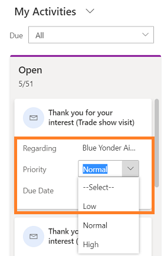

# Work with activities in the Kanban view (Sales Professional)

The Kanban view for activities helps salespeople to manage multiple activities quickly. Looking at the Kanban view, salespeople can quickly see the activities and the status they're in. In the Activity Kanban view, activities are represented visually with cards. The lanes represent the default statuses of activities. You can drag the activities to different lanes to move them from one status to another.

## Open a Kanban view

A Kanban view is available when the Kanban control is added to the Activity entity. If you don't see the Kanban view, check with your system customizer. 

To open the Kanban view:

1. In the site map, select **Activities**.
2. On the command bar, select the **More commands** icon , and select **Show As** > **Kanban**.

    > [!div class="mx-imgBorder"]  
    >  

    The activities are shown in the Kanban view.

      > [!div class="mx-imgBorder"]  
      >  

 
## Know your Kanban views

Here are some important things to know about your Kanban view:
-  At the top of each lane, the count of activities in that lane is shown. At any given point, only the first 10 records/cards are shown in any lane. For example, if there are a total of 30 open activities, the count shows 10/30. To see more cards, scroll down in the lane. When you scroll down, the count changes to show 20/30, and so on.

    > [!NOTE]
    > If there are more than 50,000 records in a swim lane, the count of records is shown as 50000+. 

-  Selecting the card title opens the activity main form. When you close the Main form, the whole Kanban view is refreshed.

-  The card fields are editable inline. You can quickly change details for the three fields of an activity record right from the card.

    > [!div class="mx-imgBorder"]  
    > 

-  When you select a different view or filter, cards in the lanes are refreshed to show the filtered activity records. For example, if you are currently using the All Activities view, and select the **Activity Type** filter to show only phone calls, the swim lanes are refreshed to show only the phone call activities.

-  You can use the **Search** box to filter the records/cards in the swim lane based on the search criteria. For example, if you enter the keyword "Discuss," it will refresh the Kanban view to only show the activity records where the title begins with "Discuss".

    > [!div class="mx-imgBorder"]  
    > 

-  You can drag a card and move it to other lanes. When you drag a card from one lane to another, the activity status changes:

    - The cards for the out-of-the-box activity types can be moved from Open to Completed and Canceled lanes. Once the card is moved to the Completed or Canceled lane, the activity status changes to closed, the activity card becomes inactive, and a lock is shown on the card. You can't change the fields on an inactive or locked card.

    - You can't reopen an inactive activity other than the Campaign Response activity. An inactive/locked card of Campaign Response activity can be moved back from Completed or Canceled lanes to the Open lane.

    - There's no restrictions on the movement of custom activity cards—they can be moved from any lane to any lane.
 
    - When you're dragging a card to move to another lane, the lanes where the card can't be dropped appear dimmed.

### See also

[Add the Kanban control to Opportunity or Activity entities](add-kanban-control-sp.md)  
[Manage tasks, appointments, email, or phone calls in Dynamics 365 Sales Professional](manage-activities.md)

[!INCLUDE[footer-include](../includes/footer-banner.md)]
