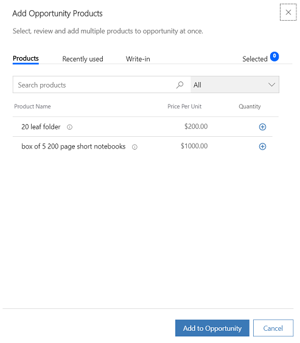
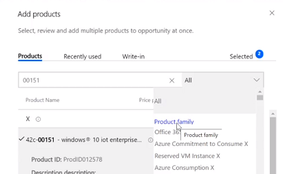
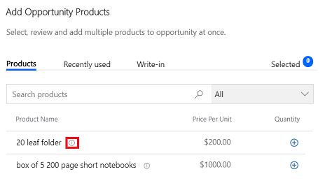
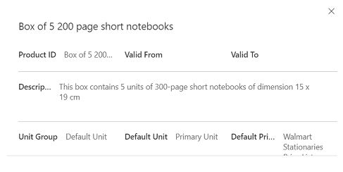
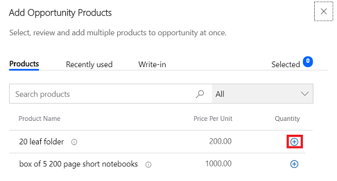
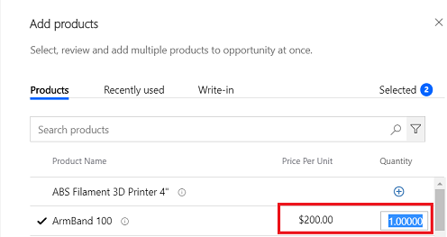
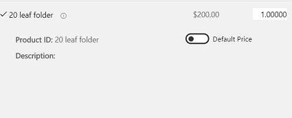
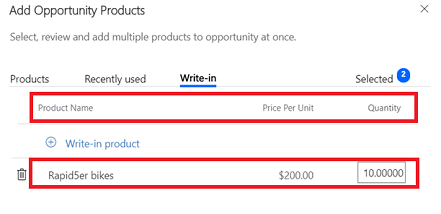
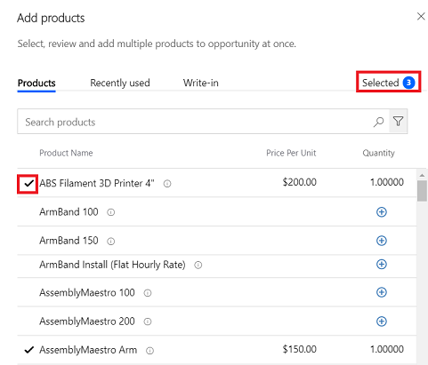
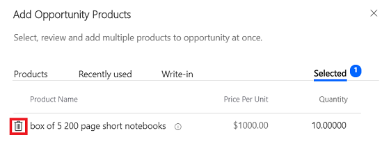

# Add products to an opportunity by using the enhanced experience (Sales Professional)

[!INCLUDE [cc-beta-prerelease-disclaimer](../includes/cc-beta-prerelease-disclaimer.md)]

For salespeople, it's important to be able to quickly update opportunities by adding products that their customers are interested in.

With the enhanced experience of adding products, salespeople can:

-  Quickly find products from the catalog based on free-text search, or filter products based on the product family or views.

-  See the most-recently-used list of products while adding multiple products.

-  View product details inline and compare products before selecting any, which helps them find the right product.

-  Select and add multiple products in one go.

-  Add write-in products by using as few clicks as possible.

-  Quickly specify the price and quantity of the products.

> [!IMPORTANT]
> - For salespeople to use the enhanced experience, a system administrator must enable it. If you don't see the enhanced experience, check with your system administrator. 
> - The enhanced "add product" experience is a preview feature. [!INCLUDE[cc-preview-features-definition](../includes/cc-preview-features-definition.md)]
> - [!INCLUDE[cc-preview-features-expect-changes](../includes/cc-preview-features-expect-changes.md)]
> - [!INCLUDE[cc-preview-features-no-ms-support](../includes/cc-preview-features-no-ms-support.md)]

**To add a product by using the enhanced experience**

1.  From the list of opportunities, open the opportunity to which you want to add products.

2.  Go to the **Product Line Items** tab.

3.  Select a **Price List**. The price list determines the cost of the product.

    > [!NOTE]
    > By default, you must select a price list to be able to add products to an opportunity; however, your administrator can change your organization settings to make the **Price List** field optional.

4.  If you want the estimated revenue of the opportunity to be calculated based on all the products added to the opportunity, set **Revenue** to **System Calculated**. If you want to use a custom estimated revenue, set it to **User Provided**.

5.  In the **Product Line Items** grid, select **Add products**.

    The Quick Create: Opportunity Product pane opens.

    > [!div class="mx-imgBorder"]  
    > 

    The form shows four tabs:

    -   **Products**. This tab lists all the products and product bundles that are in the **Active** or **Revised** state. Along with entering the product name, it's also possible for you to enter the price per unit and quantity. By default, 25 products are shown. Select **Load more** to see more products. On this tab, you can search and filter the list of products and select the one you want to add.

        If you've selected a price list for the opportunity, the product list is filtered to show only those product records that have the same price list associated.
    
    -   **Recently Used**. This tab lists the last 15 products that the currently logged-in user has recently added to any opportunity.
    
    -   **Write-In**. This tab lets you create and add a write-in product.
    
    -   **Selected**. This tab shows the count of the products selected to be added to the opportunity. Use this tab to verify or modify the final list of the items you've selected.

6.  Search for and select the products you want to add, and then select **Add to Opportunity**.
    
    More information:
    
    -  [Search for products](#search-for-products)
    -  [Filter products](#filter-products)
    -  [See product details](#see-product-details-applies-both-to-products-and-recently-used-tabs)
    -  [Select products to add](#select-products-to-add)
    -  [Review selected products](#review-selected-products)
    -  [Remove selected products](#remove-selected-products)

## Search for products

To search for a specific product from the list, on the **Products** tab, enter the keyword in the **Search** field, and then select the **Search** icon or select the Enter key. The products matching the search criteria are shown.

The Search capability searches for the keyword in the product names or the fields of Single Line of Text or Multiple Line of Text in the Quick Find View of the Product entity. The search is performed by using the 'Contain' search operator. This means that search results show all the products that contain the keyword in one of the supported fields.

Here's how the search results are ranked/ordered:

-  The records that have values that exactly match the keywords are shown first.

-   The records that broadly match the keywords are shown next. For example, if you enter **Windows 8.1** as the search keyword, it will search for product records that contain either Windows or 8.1 in the name or other supported fields.

## Filter products

Filters are available to enable you to further narrow down your search. 

The following filters are available:

-  Product family. Use this filter to see products in a specific product family
-  Views. Use this filter to see products in a specific saved view or user view. 

> [!div class="mx-imgBorder"]  
> 

> [!NOTE]
> Search and filters work in conjunction. For example, if you've searched for a keyword and 50 results are showing, you can use a filter on top of this to further narrow down this search.

## See product details (applies both to Products and Recently used tabs)

There are two ways you can see more details about the product:

-  Select the product name. The product line item expands to show more details such as the product ID, description, and so on.

   You can expand multiple products at once. When you want to compare multiple products before you add them, this method works best.

-  Select the information icon. The following additional details are shown: validity period, price list, unit, unit group.

    > [!div class="mx-imgBorder"]  
    > 

    A new pop-up window with the additional details opens.

    > [!div class="mx-imgBorder"]  
    > 

## Select products to add

-  To select an existing product to add, go to the **Products** tab or the **Recently used** tab. Select the **Plus** icon next to the product name you want to add, and then enter the quantity of product. 

    > [!div class="mx-imgBorder"]  
    > 

    -   If a product has a default price list associated with it, the **Price per unit** is populated in accordance with the associated price list. Enter the quantity. By default, the quantity is set to 1.

    > [!div class="mx-imgBorder"]  
    > 

    > [!NOTE]
    > If you want to override the default price, select the product name to expand the product line item, and then turn off the **Default Price** toggle.

    > [!div class="mx-imgBorder"]  
    > 

    -   If the product doesn't have an associated price list, enter the price per unit and quantity.

-  To add a write-in product, on the **Write-in** tab, select **Write-in product**, and then fill in the details in the **Product Name**, **Price Per Unit**, and **Quantity** columns.

    > [!div class="mx-imgBorder"]  
    > 
    
## Review selected products

When you select a product to add, a count is added to the **Selected** tab at the top of the screen. The count represents the number of products selected. In the **Products** tab or the **Recently used** tab, a check mark is shown for all the products that you've selected.

> [!div class="mx-imgBorder"]  
> 

## Remove selected products

You can easily remove products that you selected earlier but don't need anymore.

To remove a product from the selection, go to the **Selected** tab. For the product that you want to remove, select the **Delete product** icon.

> [!div class="mx-imgBorder"]  
> 

### See also

[Add products to an opportunity](add-products-opportunity-sp.md)  
[Enable the enhanced experience of adding products](enable-enhanced-add-product-experience-sp.md)

[!INCLUDE[footer-include](../includes/footer-banner.md)]