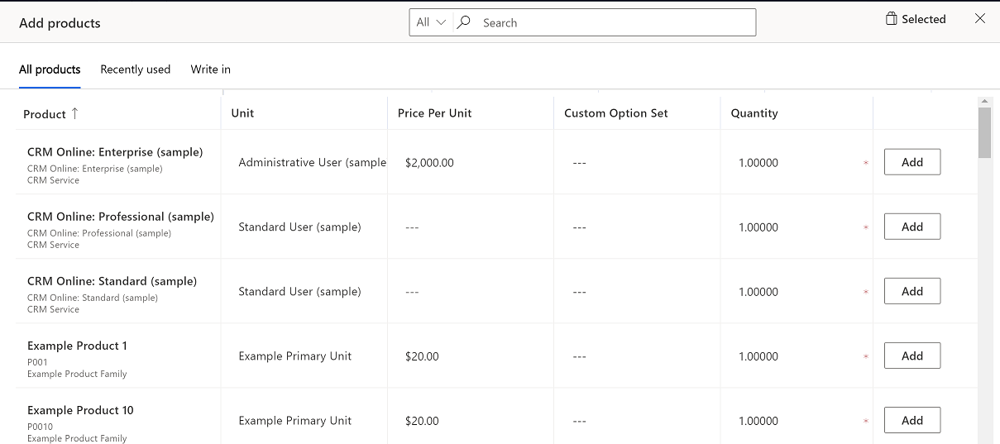

# Preview: Add products to an opportunity by using the enhanced experience

[!INCLUDE [cc-beta-prerelease-disclaimer](../includes/cc-beta-prerelease-disclaimer.md)]

As a salesperson, you want to be able to easily identify and add products from the catalog that best fit the opportunity at hand. With the enhanced experience of adding products, you can:

- Quickly find products from the catalog, based on free-text search.

- See matching products as you enter text in the search field.

- See the most recently used list of products while you add multiple products.

- View product details inline and compare products before selecting any, which helps you find the right product.

- Select and add multiple products at one go.

- Add write-in products by using as few clicks as possible.

- Specify price, quantity, and any other required information as configured by your system administrator.

[!INCLUDE [add-products-experience-on-mobile](../includes/add-products-experience-on-mobile.md)]

> [!IMPORTANT]
> - The enhanced "add product" experience is a preview feature. [!INCLUDE[cc-preview-features-definition](../includes/cc-preview-features-definition.md)]
> - [!INCLUDE[cc-preview-features-expect-changes](../includes/cc-preview-features-expect-changes.md)]
> - [!INCLUDE[cc-preview-features-no-ms-support](../includes/cc-preview-features-no-ms-support.md)]

## Add products to an opportunity

1. Open the opportunity to which you want to add products.

2. Go to the **Product Line Items** tab.

3. Select a **Price list**. 
   The price list determines the cost of the product and the products you can select.

4. Under **Revenue**, do one of the following:

   - To calculate the estimated revenue of the opportunity based on all the products added to the opportunity, select **System calculated**.

   - To use a custom estimated revenue, select **User provided**.

5. In the grid, select **Add products**.

   

   > [!NOTE]

   > The enhanced experience for adding products is only available if your system administrator has enabled the preview. If you see the form interface instead of a dialog box, contact your system administrator to enable the preview.
   >
   > The preceding image shows the default columns in the dialog box. The information displayed in the **Product** column is customizable, as are the columns that appear in the grid. If you need additional columns to populate data or you need more information so you can better identify the product, contact your system administrator.

6. Use one of the following options to identify and add products:

   - If you know the product names, simply search for them and add.
 
     > [!NOTE]
     > The products displayed depend on the price list that you've chosen, so if you don't see a product, ensure that the product is associated with the selected price list.

   - If you want to add products that you have recently chosen for another opportunity, open the **Recently used** tab.

   - If you want to add a product or service that is not in the standard product catalog but is specific to the opportunity, open the **write in** tab and create a product on-the-fly.
    > [!IMPORTANT]
    >Do not use the write in option for standard products and services that your organization offers.

7. In the **Price per unit** column, do one of the following:

   - If the product doesn't have an associated price list, enter the price manually.
   - If the product has a default price list associated with it, **Price per unit** is populated in accordance with the associated price list. 

     > [!TIP] 
     > If you want to override the default price of a product, request your administrator to add the **Price overridden** column to the grid. After the **Price overridden** column has been added, turn it on.

8. Enter the quantity you want, and then select **Add**.

9. Repeat steps 6 through 8 for each product you want to add.

10. When you're done, select **Save to opportunity**.

## Remove products from an opportunity

Remove products if you've selected them inadvertently or they're
no longer relevant for the opportunity. You can remove products in two circumstances:

- While adding products to the opportunity, by using the **Add products** dialog box
- After you've added products to the opportunity, on the **Products** tab

**To remove a product from the Add products dialog box**

1. In the **Add products** dialog box, select the **Selected** tab.

2. Next to the product you want to remove, select **Remove**.

**To remove a product from the Products tab**

1. Open the opportunity, go to the **Products** tab.

2. Select the products that you want to remove, and then select **Delete opportunity product**.
    The selected products will be removed from the opportunity after you confirm the deletion.

### See also

[Add products to an opportunity](add-products-opportunity-sp.md)  
[Enable the enhanced experience of adding products](enable-enhanced-add-product-experience-sp.md)

[!INCLUDE[footer-include](../includes/footer-banner.md)]
