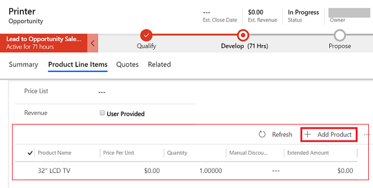

# Add products to an opportunity (Sales Professional)

A way that might help you increase your sales is to add all products that your customer might need. You can add product bundles or product families to make it easier for you to choose products for upsell and cross-sell. The product can be an existing product in the [!INCLUDE[pn-dyn-365-sales](../includes/pn-dyn-365-sales.md)] product catalog or an ad hoc product that you add as a write-in product. Any products added to an opportunity are automatically associated with quotes generated from the opportunity.

1. From the list of opportunities, open the opportunity to which you want to add products.

2. Go to the **Product Line Items** tab.

3. Select a **Price List**. The price list determines the cost of the product. 
  
    > [!NOTE]
    > By default, selecting a price list is required to be able to add products to an opportunity; however, your administrator can change your organization settings to make the Price List field optional.

4. If you want the estimated revenue of the opportunity to be calculated based on the total amount of products, set **Revenue** to **System Calculated**. If you want to use a custom estimated revenue, set it to **User Provided**.

5. In the **Product Line Items** grid, select **Add Product**.

    

6. In the **Quick Create:  Opportunity Product** form, do the following:  

    1.  **Select Product**: Set the switch to choose whether you want to add an existing product or create a new one:

        -  To use an existing product, in the **Existing Product** field, select **Lookup** to search for and add a product.

            > [!NOTE]
            > - When a price list is selected for the opportunity, the products listed in the **Existing Product** field are filtered by the price list. This means that only the product associated with the selected price list are shown in this field. 
            > - When a price list isn't selected, the **Existing product** field shows all active products (not filtered by the price list). You can change the view to look for other products by selecting the **Change View** icon. 
            > - By default, the product lookup will show the most recently used products. The most recently used products are not filtered based on the selected price list. 
            > - If a price list is selected, and you select a product that isn’t associated with the price list, you'll see an error. Select a product that's associated with the selected price list.

        -  To create a product, select **Write-In**, and then in the **Write-In Product** field, enter the name of the product.
    
    2.. **Unit**. Select a unit of measurement for this product.

    2.  **Price Overridden**: Set the switch to indicate whether to override price or use the default pricing. By default, this is the per unit price that is listed in the product catalog. To override the catalog price, set the switch to **Override Price**. When you override the price, you can specify a price that you want to charge for each unit of the product.   

    3.  **Quantity**: Enter the quantity of the product or service that will be included.  

    4.  **Manual Discount**: If you want to offer a discount to the product price, enter it here.  
    
    5.  **Tax**: If required, enter the appropriate tax amount.  
   
7. To save this product, and add more products, select **Save and Create New**.

The **Product Line Items** grid shows all the products that are associated with the opportunity. If you added an existing product from the product catalog, you can change the quantity and discount of the product inline in the **Product Line Items** grid. If you added a write-in product, you can also change the price of the product in addition to the quantity and discount.

Here are the actions you can take on the products added to the **Product Line Items** grid:

|To                                    |Do This                                                       |
|--------------------------------------|--------------------------------------------------------------|
|Edit properties of a product  |Select a product, and on the command bar, select **Edit Properties**. You can change details, such as the price, quantity, or discount of the added products.   You can also open the opportunity product record and view or change the properties of the product inline on the **Product Properties** tab. |
|Delete a product associated with the opportunity |Select the product, and on the command bar, select **Delete Opportunity Product**. |
|View products within a bundle | Select the **Chevron** icon  for the product bundle. You’ll see all the products that are included in the bundle. |
|See and add related products for cross-selling or upselling or to select an accessory or substitute product | Select a product, and on the command bar, select **Suggestions**. The Suggestions pane shows all the products that are defined as related products for the current product. Select the related products that you want to add, and then select **OK**. |
|See specific records together by moving a record up or down in the grid | Select a record, and on the command bar, use the **Up** or **Down** button. |

### See also  

[Create or edit opportunities](manage-opportunities-sales-professional.md)  
[Develop sales from lead-to-cash process](develop-sales-lead-to-cash-sales-professional.md)   
[Dynamics 365 Sales troubleshooting guide for administrators](../sales-enterprise/troubleshooting-admin.md)  

[!INCLUDE[footer-include](../includes/footer-banner.md)]
