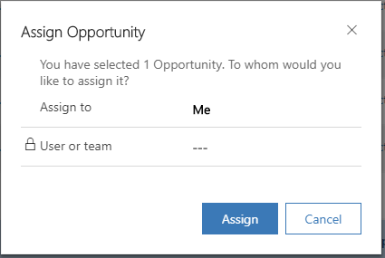

# Assign records to a user or team (Sales Professional)

If you would like another person in your organization to handle an account or contact for you, you can assign the record to that person.

You can also assign a record to a team, or to yourself.

1.  In the site map, select **Accounts** or **Contacts**.

2.  In the list of records, select the record that you want.

3.  On the command bar, select **Assign**.

4.  In the **Assign** dialog box, select the **Assign to** box to switch between **Me** and **User or Team**.

    > [!div class="mx-imgBorder"]
    > 

5.  If you have chosen to assign to **User or Team**, then in the **User or team** field, select the **Lookup** icon to select a user or a team.

6.  Select **Assign**.

## See also

[Learn the Basics](learn-basics-sales-professional.md)  
[Overview of Dynamics 365 Sales Professional](sales-professional-overview.md)

[!INCLUDE[footer-include](../includes/footer-banner.md)]