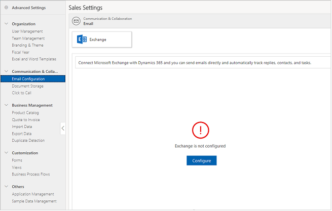

# Set up email in Dynamics 365 Sales Professional by integrating with Exchange

> [!IMPORTANT]
> This capability is introduced in the Dynamics 365 Sales Professional app version 9.1.0.0.

To store email and other messaging records in Dynamics 365 Sales Professional, you need to synchronize it with your email system.

Dynamics 365 Sales Professional uses server-side synchronization to synchronize your email system with Dynamics 365 Sales.

## What is server-side synchronization?

Using server-side synchronization makes messaging data available to a web browser, tablet, or smartphone that is running Dynamics 365 Sales Professional.

Server-side synchronization provides direct Dynamics 365 Sales Professional-to-email server synchronization. When you use Microsoft Exchange, you can synchronize email, contacts, tasks, and appointments.

Some features offered by server-side synchronization include the following: 

-  Email folder tracking. You can simply drag email to a folder to track it. Folder tracking works on any mobile device that supports Exchange, which
means you can track email from just about any device.

-  Support for Dynamics 365 App for Outlook. You can track incoming email with the new Dynamics 365 App for Outlook. Dynamics 365 App for Outlook works with Outlook on the web. So, all you need is a browser to track incoming email.

## Prerequisite for Exchange integration

To configure Exchange, you must have:

-   System Administrator or Sales Professional Manager role

-   Microsoft 365 subscription.

-   Exchange Online subscription

For more information about managing subscriptions, see [Manage Microsoft Dynamics 365 (online)
instances](https://go.microsoft.com/fwlink/?linkid=730725).

1.  In the site map, select **Sales Settings**, and then under **Standard settings**, select **Set up email**.

2.  If your organization has an Exchange subscription, skip to Step 5.

3.  If you don’t have a Microsoft 365 subscription, you’ll be prompted to purchase one. Select the link to purchase a Microsoft 365 subscription.

    > [!div class="mx-imgBorder"]
    > 

4.  After you purchase a subscription, go to **Set up email**. This time, Exchange is automatically detected and configured in the background.

    The following configuration happens in the background:

    -   The email server profile is set to Exchange Online (automatically created when a new Dynamics 365 instance is provisioned). The email server profile stores settings that are used by server-side synchronization to connect to an email server and process email for the associated mailboxes.

    -   Incoming email, outgoing email, appointments, contacts, and tasks are all set to use server-side synchronization

    -   Existing user mailboxes that have valid Exchange licenses are automatically approved. Approval of mailboxes is required for the mailbox to process email. The incoming and outgoing email configuration of the selected mailboxes is tested, and mailboxes are then enabled for processing email.

        > [!Important]
        > User mailboxes are automatically approved and enabled only when the primary email of the user is equal to the user's UPN (User Principal Name attribute).      

    -  For newly added users, you must manually test and enable the mailboxes.

    - Dynamics 365 App for Outlook is automatically enabled for all the users.

5.  If users are already created in your organization, the mailboxes of the users will appear in the **Mailbox** list. For more information about adding users, see [Manage users](manage-users.md).  

6. The mailboxes will be in the **Not Run** state initially. Select **Approve and Test mailboxes** to test the mailboxes and approve them.  

    > [!div class="mx-imgBorder"]
    > 

    > [!Note]
    > If an error occurs in a mailbox, an alert is sent to the user of the mailbox. You can also see the alert when you open the mailbox record. The **Test Run Status** column is set to **Failure** for the mailbox. Select the **Approve and test mailboxes** button to test and approve the mailboxes.

### See also

[Overview of Dynamics 365 Sales Professional](sales-professional-overview.md)  
[Admin settings overview](admin-settings-overview.md)

[!INCLUDE[footer-include](../includes/footer-banner.md)]
