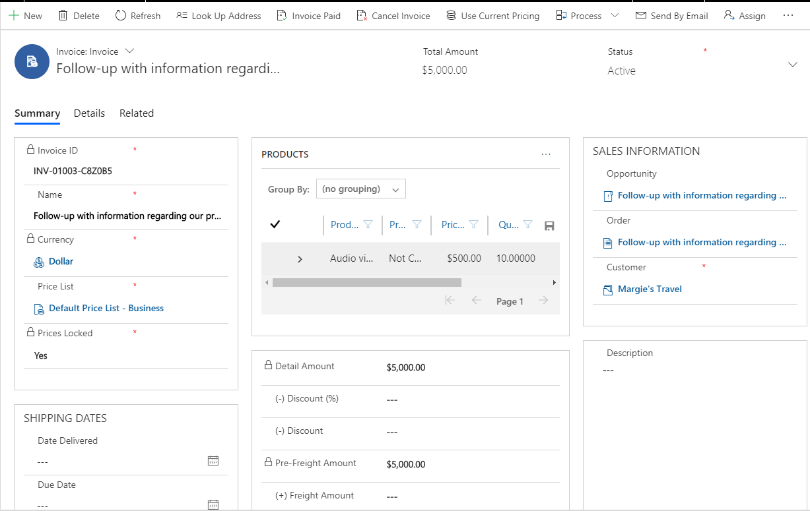
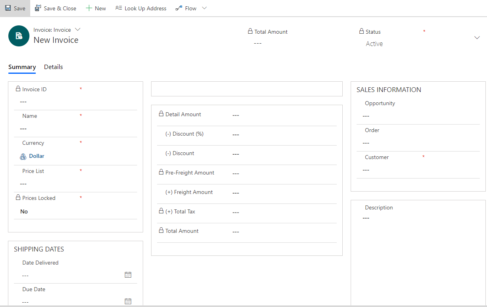

# Create and manage invoices in Dynamics 365 Sales Professional

Once your customer accepts a quote, you can create an invoice in Dynamics 365 Sales Professional to bill them for the upcoming sale.
You can also create an invoice that doesn’t generate from a quote.

## Create an invoice from a quote or an order

1.  In the site map, select **Quotes** or **Orders**.

2.  Select the quote or order that you want to create an invoice from.

3.  On the command bar, select **Create Invoice**.

    The Invoice form opens.

    > [!div class="mx-imgBorder"]
    > 

    > [!IMPORTANT]
    > If Dynamics 365 Sales is integrated with an external order processing application, you may see the **Submit Order** button instead of the **Create Invoice** button on the Order form command bar. This is because the integration allows an order created in Dynamics 365 Sales to be submitted, after which it is synchronized with the order processing app where the lifecycle of the order continues. A submitted order is locked for editing in Dynamics 365 Sales, except by an integration user. [!INCLUDE[proc-more-information](../includes/proc-more-information.md)] [Enable sales order processing integration](../sales-enterprise/developer/enable-sales-order-processing-integration.md)

4.  Review the contents of the invoice and make any additions or corrections before sending to your customer.

## Create a new invoice

1.  In the site map, select **Invoices**.

2.  Select **New**.

    The Invoice form opens.

    > [!div class="mx-imgBorder"]
    > 

3.  Add the invoice details.

4.  In the **Sales Information** section, select the customer you’re creating this invoice for. If the record doesn’t already exist, you can create a new one.

5.  Select **Save** at the top left to create the invoice record.

6.  To add products from your opportunity to your order, choose **Get Products** at the top of the screen, select your opportunity, and select **OK**.

    \-OR-

    In the **Products** section, select the **More Commands** icon, and then select **Add New Invoice Products**.

    > [!div class="mx-imgBorder"]
    > 

7.  In the **Quick Create: Invoice Product** form, enter the details:

    1.  In the **Select Product** button, select whether you want to add an existing product or create a new one:

        1.  To use an existing product, select **Lookup** to search for and add a product. Also, select a unit of measurement for the product.

        2.  To create a product, select **Write-In**, and then enter the name of the product.

    2.  Fill in details in the **Pricing** section:

        1.  Toggle the **Pricing** button to indicate whether you want to use the default pricing that is listed in the product catalog or override the price. For a write-in product, this field is set to **Override** Price.

        2.  If you’re adding a write-in product, in **Price Per Unit**, enter the price to be charged per unit for the product.

        3.  Enter the quantity of the product or service that will be included.

        4.  If you want to offer a discount to the product price, enter it in **Manual Discount**.

        5.  If required, enter the appropriate tax amount. You need to enter the tax amount when you add a product to a quote,
            order, or invoice. Dynamics 365 Sales Professional doesn’t automatically calculate tax for individual products. However, the
            total tax is calculated automatically based on the sum of the tax amounts for all of the individual products in a quote, order, or invoice.

2.  Select **Save and Close**.

## Lock or unlock prices of an invoice

**Lock Pricing** locks the price for a product in an open invoice. Even if the price changes in the product catalog, that invoice remains at the agreed price.

To lock a price:

1.  Go to the list of invoices and open the invoice that you want.

2.  To lock the price, on the command bar, select **Lock Pricing**. 

    \-OR-

    To use the price of a product from the product catalog, select **Use Current Pricing**.  

## Close an invoice

You close an invoice either by canceling the invoice or setting the invoice status as paid. To do this, open the invoice you want to close, and on the
command bar, select **Cancel Invoice** or **Invoice Paid**.

## Email an invoice

When you’ve added all the details to the invoice, send it to the customer.

To directly send an email to a customer with an invoice attached, open the invoice, and on the command bar, select **Send by Email**.

### See also

[Develop sales from lead to cash in Dynamics 365 Sales Professional](develop-sales-lead-to-cash-sales-professional.md)  
[Overview of Dynamics 365 Sales Professional](sales-professional-overview.md)
[Sales transactions in Dynamics 365 Sales Professional](understanding-sales-transactions-sales-professional.md)

[!INCLUDE[footer-include](../includes/footer-banner.md)]