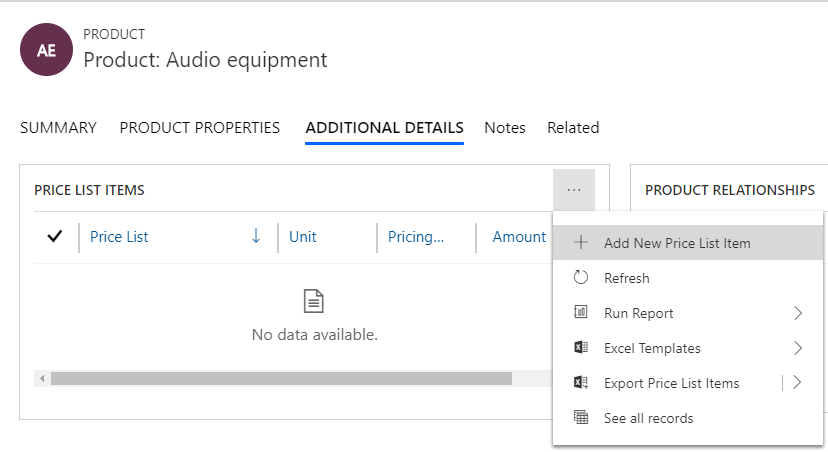
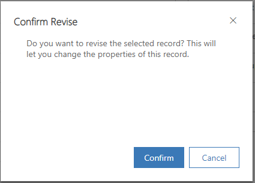
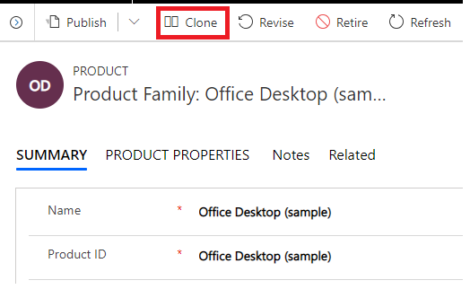
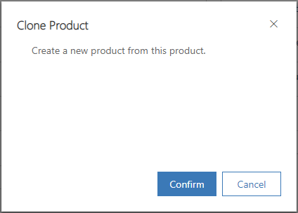
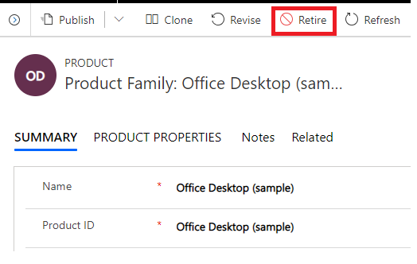
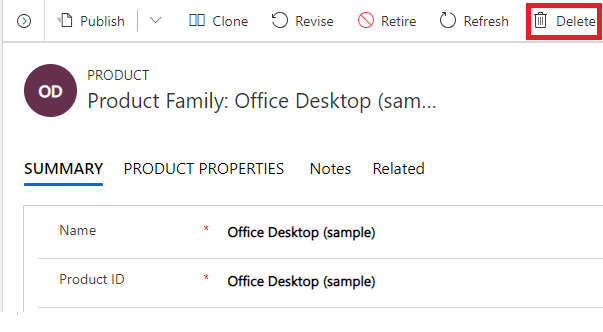

# Create products in Dynamics 365 Sales Professional

Products are the backbone of your business. The product catalog in Dynamics 365 Sales Professional is a collection of products and pricing information. Make it easier for your sales reps to increase their sales by creating a product catalog quickly.

1.  Make sure you have the Sales Manager Professional or a System Administrator role so you can add products in Dynamics 365 Sales Professional.

2.  In the site map, under **Setup**, select **Products**.

3.  Select **Add Product**.

4.  Fill in your information:

    -  **Name**.

    -  **Product ID**.

    -  **Parent**. Select a parent product family for the product. If you're creating a child product in a product family, the name of the parent product family is populated here. This can't be changed after the record is saved.

    -  **Valid From**/**Valid To**. Define the period the product is valid for by selecting a **Valid From** and **Valid To** date.

    -  **Unit Group**. Select a unit group. A unit group is a collection of various units a product is sold in and defines how individual items are grouped into larger quantities. For example, if you're adding seeds as a product, you might have created a unit group called "Seeds" and defined its primary unit as "packet."

    -  **Default Unit**. Select the most common unit in which the product will be sold. Units are the quantities or measurements that you sell your products in. For example, if you're adding seeds as a product, you can sell it in packets, boxes, or pallets. Each of these becomes a unit of the product. If seeds are mostly sold in packets, select that as the unit.

    -  **Default Price List**. If this is a new product, this field is read-only. Before you can select a default price list, you must complete all the required fields and then save the record. Although the default price list is not required, after you save the product record, it is a good idea to set a default price list for each product. Then, if a customer record does not contain a price list, Sales can use the default price list for generating quotes, orders, and invoices.

    -  **Decimals Supported**. Enter a whole number between 0 and 5. If the product can't be divided into fractional quantities, enter 0. The precision of the **Quantity** field in the quote, order, or invoice product record is validated against the value in this field if the product does not have an associated price list.

    -  **Subject**. Associate this product with a subject. You can use subjects to categorize your products and to filter reports.

       > [!div class="mx-imgBorder"]
       >  

5.  Select **Save**.

6.  To add price list items, go to the **Additional Details** tab. In the **Price List Items** section, select the **More commands** icon, and then select **Add New Price List Item**.

    > [!div class="mx-imgBorder"]
    > 

7.  To add product relationships, on the **Additional Details** tab of the product form, in the **Product Relationship** section, select the **More commands** icon, and then select **Add New Product Relationship.**

8.  In the **New Product Relationship** form, enter the following details, and on the command bar, select **Save and Close**:

    -   **Related Product**. Select a product that you want to add as a related product to the existing product record you're working on.

    -   **Sales Relation Type**. Select whether you want to add the product as an up-sell, cross-sell, accessory, or substitute product.

    -   **Direction**. Select whether the relationship between the products will be unidirectional or bidirectional. When you select unidirectional, the product that you select in **Related Product** will be shown as a recommendation for the existing product but not vice versa.

3.  On the Product form, select **Save**.

## Import products

You can also use import templates to bring bulk product data into Dynamics 365 Sales. More information: [Import data into Dynamics 365 Sales Professional](import-data.md).

## Revise a product

Keep the product inventory updated by quickly revising properties for the
products, as required, and republishing the information so that your sales agents can see the latest changes to the inventory.

1.  Make sure that you have one of the following security roles or equivalent permissions: System Administrator, System Customizer, Sales Manager, Vice President of Sales, Vice President of Marketing, or CEO-Business Manager.

2.  In the site map, select **Products**.

3.  Open an active product that you want to change, and on the command bar, select **Revise**.

    > [!div class="mx-imgBorder"]
    > 

4.  In the **Confirm Revise** dialog box, select **Confirm**.

    > [!div class="mx-imgBorder"]
    > 

    This will change the product status to **Under Revision**.

5.  After you're done making changes, on the command bar, select
    **Publish**.

    > [!TIP]
    > To revert the changes and continue with the last active version of the product, select **Revert**. This changes the status of the product back to **Active**.

## Clone a product 

When you're creating a new product, save time by cloning an existing one. This creates a copy of the original record with all the details except for the name and ID.

1.  Make sure that you have one of the following security roles or equivalent permissions: System Administrator, System Customizer, Sales Manager, Vice President of Sales, Vice President of Marketing, or CEO-Business Manager.

2.  In the site map, select **Products**.

3.  Select a product record that you want to clone, and on the command bar, select **Clone**.

    > [!div class="mx-imgBorder"]
    > 

    A confirmation dialog box appears.

    > [!div class="mx-imgBorder"]
    > 

4.  Select **Confirm**.

A new product record opens with the same details as the original one except for the name and ID.

## Retire a product 

If your organization doesn't sell a product anymore, retire it so that the product is no longer available to your sales agents.

1.  Make sure that you have the System Administrator or Sales Professional Manager role or equivalent permissions.

2.  In the site map, select **Products**.

3.  Open an active product that you want to retire, and on the command bar, select **Retire**.

    > [!div class="mx-imgBorder"]
    > 

4.  In the **Confirm Retire** dialog box, select **Confirm**.

    > [!div class="mx-imgBorder"]
    > 

## Delete a product

To stop selling a product, delete it.

> [!IMPORTANT]
> You can't recover a deleted record.

1.  Make sure that you have the System Administrator or Sales Professional Manager role or equivalent permissions.

2.  In the site map, select **Products**.

3.  Select a product record you want to delete, and on the command bar, select **Delete**.

    > [!div class="mx-imgBorder"]
    > 

4.  In the **Confirm Deletion** dialog box, select **Continue**.

    > [!div class="mx-imgBorder"]
    > 

### See also

[Develop sales from lead to cash in Dynamics 365 Sales Professional](develop-sales-lead-to-cash-sales-professional.md)  
[Admin settings overview](admin-settings-overview.md)

[!INCLUDE[footer-include](../includes/footer-banner.md)]