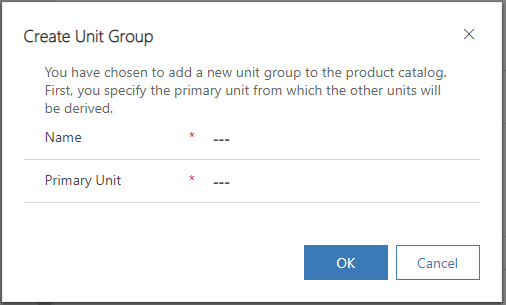
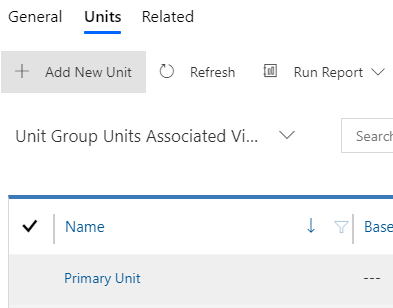
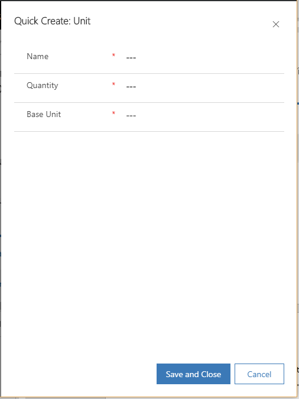

# Create a unit group and add units

Units are the quantities or measurements that you sell your products or services in. For example, if you sell gardening supplies, you might sell seeds in units of packets, boxes, and pallets. A unit group is a collection of these different units.

1.  Make sure that you have the System Administrator or Sales Professional Manager role or equivalent permissions.

2.  In the site map, select **Units**.

3.  Select **New**.

    The **Create Unit Group** dialog box opens.

    > [!div class="mx-imgBorder"]
    > 

4.  Fill in your information, and select **OK**:

    - **Name**. Enter a meaningful name for the unit group. In our example, you would type "Televisions."

    - **Primary Unit**. Enter the lowest common unit of measure that the product will be sold in. In our example, you would type "Piece." Other examples could include box, cartons, ounces, hours, or tons, depending on your product.

5.  To add units to the unit group, open the unit group you just created, select the **Related** tab, and then select **Units**.

    > [!div class="mx-imgBorder"]
    > 

 
6.  On the **Units** tab, you’ll see that the primary unit is already added. Select **Add New Unit**.

    > [!div class="mx-imgBorder"]
    > 

7.  In the **Quick Create: Unit** form, fill in the following, and select
    **Save**:

    - **Name**. Enter a meaningful name for the unit. In our example, you would enter "box."

    - **Quantity**. Enter the quantity that this unit will contain. For example, if a box contains two pieces, you would type "2."

    - **Base Unit**. Select a base unit. The base unit will establish the lowest unit of measurement for the unit you're creating. Using our example, you would select "Piece."

      > [!div class="mx-imgBorder"]
      > 

### See also

[Create a price list](create-price-list.md)  
[Create a product](create-products.md)

[!INCLUDE[footer-include](../includes/footer-banner.md)]