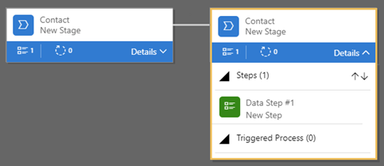
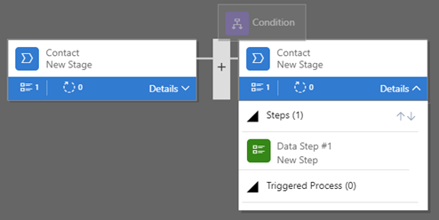

# Customize business process flows (Sales Professional)

> [!IMPORTANT]
> This capability is introduced in the Dynamics 365 Sales Professional app version 9.1.0.0.

With Dynamics 365 Sales Professional, you can help ensure that users enter data consistently and follow the same steps every time they work with a customer by creating a business process flow. For example, you might want to create a business process flow to have everyone handle customer service requests the same way, or to require that users get approval for an invoice before submitting an order. 

Business process flows use the same underlying technology as other processes, but the capabilities that they provide are very different from other features that use processes.

With business process flows, you define a set of stages and steps that are displayed in a control at the top of a form. Each stage contains a group of steps. Each step represents a field where data can be entered. Users advance to the next stage by using the **Next Stage** button. You can make a step required so that users must enter data for the corresponding field before they can proceed to the next stage. This is called “stage-gating.”

Business process flows appear relatively simple compared to other types of processes. This is because they do not provide any conditional business logic or automation beyond providing a streamlined experience for data entry and controlling entry into stages. However, when you combine them with other processes and customizations, they can play an important role in saving users time, reducing training costs, and increasing user adoption.

## Entities available for business process flows

Entities are sets of records. You can use the following entities to create business process flows in Dynamics 365 Sales Professional:

-   Account

-   Contact

-   Invoice

-   Lead

-   Opportunity

-   Quote

You can use the following entities in additional stages added to a business
process flow:

-   Account

-   Appointment

-   Contact

-   Email

-   Invoice

-   Lead

-   Opportunity

-   Phone Call

-   Product

-   Quote

-   Task

-   Team

-   User

## Create a business process flow

1.  Make sure you have the System Administrator or System Customizer security role or equivalent permissions.

2.  In the site map, select **Sales Settings**.

3.  Under **Customization**, select **Business Process Flows**.

    

4.  On the **Business Process Flows** page, select **Create New**.

5.  Enter a name for your business process flow in the **Name** field.

    The name of the process doesn’t need to be unique, but it should be
    meaningful for users who need to choose a process. You can change this later.

6.  In the **Entity** list, select the entity you want to base the process on.

    The entity you select affects the fields available for steps that can be added to the first stage of the process flow. You cannot change this after you save the process.

7.  Select **Launch Designer**.

    The new process is created, and the business-process flow designer opens with a single stage already created for you.  

    

  
### Add stages to your business process flow

If your users will progress from one business stage to another in the process:

1.  Drag a **Stage** component from the **Components** tab, and drop it on a **+** sign in the designer.

    

2.  To set the properties for a stage, select the stage, and then set the
    properties in the **Properties** tab on the right side of the screen:

    1. Enter a **Display Name**.

    2. If desired, select a **Category** for the stage. The category (such as **Qualify** or **Develop**) appears as a chevron in the  process bar.
    
        You can select from the following categories:

        -   Qualify

        -   Develop

        -   Propose

        -   Close

        -   Identify
    
        -   Research

        -   Resolve
        
        -   Approval

    3.  Select the **Relationship**, if applicable. The selections available for **Relationship** will vary by the entity selected for the stage. In some cases, there are no selections for **Relationship**.
    
        Enter a relationship when the preceding stage in the process is based on a different entity (record type). We recommend that you select a relationship because of the following benefits:

        -   Relationships often have attribute maps defined that automatically carry over data between records, minimizing data entry.

        -   When a user selects **Next Stage** on the process bar for a record, any records that use the relationship will be listed in the process flow, which promotes reuse of records in the process. In addition, you can use workflows to automate creation of records so that the user simply selects it, instead of creating one. This further streamlines the process.

    4.  When you're done changing properties, select **Apply**.

### Add Data Steps to a stage

1.  To see the **Data Steps** in a stage, choose **Details** in the lower-right corner of the stage.

    

2.  To add more steps, drag the **Data Step** component to the stage from the **Components** tab.

3.  Select the step, and then set properties in the **Properties** tab: 

    1.  Enter a name for the step.

    2.  If you want users to enter data to complete a step, select the appropriate field from the **Data Field** drop-down list.

    3.  Select the **Required** check box if users must fill in the field to complete the step before moving to the next stage of the process.

    4.  If you have more than one **Data Step**, select the sequence for the step.

    5.  Select **Apply** when you're finished.

### Add a branch (condition) to the process

1.  To add a branching condition, drag the **Condition** component from the **Components** tab to a **+** sign between two stages.

    

2.  Select the condition, and then set properties in the **Properties** tab.

3.  When you're finished setting properties for the condition, select **Apply**.

### Add a workflow

1.  To invoke a workflow, drag a **Workflow** component from the
    **Components** tab to a stage or to the **Global Workflow** item in
    the designer. Whether you add a workflow to a stage or to a **Global Workflow** item depends on the following:

    -   Drag it to a stage when you want to trigger the workflow on entry or exit of the stage. The workflow component must be based on the same primary entity as the stage.

    -   Drag it to the **Global Workflow** item in the lower-right corner of the designer if you want to trigger the workflow when the process is activated or when the process is archived (when the status changes to **Completed** or **Abandoned**). The workflow component must be based on the same primary entity as the process.

2.  Select the workflow, and then set properties in the **Properties** tab:

    1.  Enter a display name.

    2.  Select when the workflow should be triggered.

    3.  Optionally, in the **Workflows** box, search for an existing on-demand active workflow that matches the stage entity.

    4.  Select **Apply** when you're finished.

### Set process flow order

When you have more than one business process flow for an entity, you’ll need to set which process is automatically assigned to new records.

To set the order:

-   On the command bar, choose **Order Process Flow**.

For new records, or records that do not already have a process flow associated with them, the first business process flow that a user has access to is the one that will be used.

### Validate and save the business process flow

1.  To validate the business process flow, choose **Validate** on the command bar. Any errors in the business process flow are highlighted in red. You’ll need to correct them before you can save the business process flow.

2.  To save the process as a draft while you continue to work on it, choose **Save** on the command bar.

### Activate a business process flow

-   To activate the process and make it available to your users, choose **Activate** on the command bar.

### Edit a business process flow

You can edit existing business process flows, as needed. If your business
processes change, or you just want to make minor modifications, you can simply open the business process flow and change most properties.

Things you can change:

-   Stages or other components

-   Properties of existing components

-   Name

-   Description

Things you can't change:

-   Entity on which the process flow is based

-   System name for the business process flow

-   Owner

-   Category

To edit a business process flow:

1.  In the site map, select **Sales Settings**.

2.  Under **Customization**, select **Business Process Flows**.

3.  Select the name of the business process flow you want to edit in the
    **Process Name** column.

### Remove a component from your business process flow

1.  Select the component in the designer, and then select **Delete** at the top of the screen (or press the Delete key).

2.  In the **Delete Confirmation** dialog box, select **OK**.

3.  Optionally, select **Validate** to confirm that the deletion didn’t result in errors in your business process flow.

4.  Select **Save** to save your changes.

### Add components to your business process flow

To add additional stages and modify the properties of the components in your business process flow,
follow the steps about creating a business process flow earlier in this topic.  

### Create an image of your business process flow

You can easily create an image of your business process flow from within the designer. This can make it easier to share the process flow with others, or to print the process flow. The image is created in Portable Network Graphics (.png) format. Only the design canvas is captured in the image created. It will not capture the command icons or the **Components** and **Properties** tabs.

To create the image:

-   Open the business process flow you want to create an image from, and then choose **Snapshot** at the top of the screen. The .png file that is created shows up in the lower-left corner of the screen.

### See also

[Customize forms](customize-forms.md)  
[Customize views](customize-views.md)

[!INCLUDE[footer-include](../includes/footer-banner.md)]
