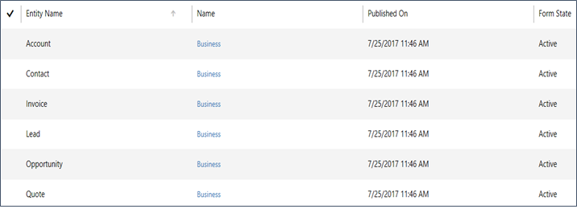

# Customize forms (Sales Professional)

> [!IMPORTANT]
> This capability is introduced in the Dynamics 365 Sales Professional app version 9.1.0.0.

In Dynamics 365 Sales Professional, forms provide the user interface that people use to interact with the data they need to do their work. It is important that the forms people use are designed to allow them to find or enter the information they need quickly. You can use the form designer to customize the forms included with Dynamics 365 Sales Professional to meet the specific needs of your organization.

>[!IMPORTANT]
>Only customizations done within the app are supported. You should not try to
>customize your forms outside of the app itself.

## How do forms relate to entities?

A form is a set of data-entry fields that matches the items your organization tracks for a specific entity. For example, your organization might have fields that track a customer’s previous orders and specific requested reorder dates.

When you publish a customized form, you are publishing an updated version of the entity associated with the form.

## What forms can you customize?

You can customize any of the following forms in Dynamics 365 Sales Professional:

-   Account

-   Contact

-   Invoice

-   Lead

-   Opportunity

-   Quote

To access the forms:

1.  In the site map, select **Sales Settings**.

2.  Under **Customization**, select **Forms**.

    

    You'll see the list of available forms.

    

    The page displays the date when the form was published, and whether the form is active or not.

4.  To open a form, just choose the form you want in the **Name** column, or select a form, and then choose **Edit** above the search field.

For more information on creating forms, see [Create and design forms](../customize/create-design-forms.md).

### See also

[Customize views](customize-views.md)  
[Customize business process flows](customize-business-process-flows.md)

[!INCLUDE[footer-include](../includes/footer-banner.md)]
